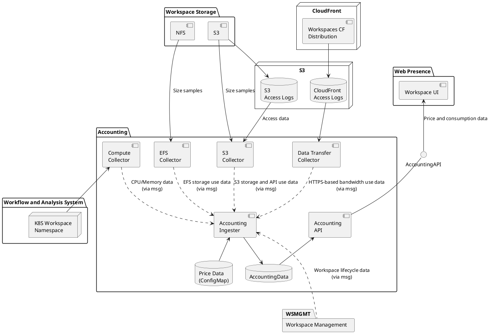

### 3.14 Accounting and Costing Services

**Figure 3-19 Accounting Service (arrows show data flows)** 

The Accounting Service consists of 

- Collectors, which collect specific billing data and send it to Pulsar. 
- The Ingester, which receives billing data from Pulsar and processes and records it. - The API, which serves accounting data over a read-only API. 
- A PostgreSQL database called ‘accounting’. 
- A Kubernetes ConfigMap, configured using Git and ArgoCD, which can set product and price information. 

#### 3.14.1 Ingester

On startup, the ingester ingests the price data ConfigMap. This describes the products available (name, SKU and priced unit such as GB-months) and optionally the prices. Accounting collectors specify the SKU for the data they are collecting. 

The Ingester receives messages of several types and updates the accounting database 

- Billing Events, which describe consumption of a certain amount of a resource (product) over a particular time window. All billing events are specific to a workspaces and product. These never cross day boundaries. 
- Resource Consumption Rate Samples, which are samples of the rate at which a resource is being consumed from which the Ingester will estimate Billing Events. These are typically storage consumption rates – a snapshot of the size of a data store in GB is a sample of the rate at which a storage product (priced in GB-months) is being consumed. 
- Workspace settings messages, which allow the Accounting API to know which Workspaces are in which Billing Accounts. 

#### 3.14.2 Collectors

The Collectors each function differently and the system is extensible to new Collectors. 

The Compute Collector uses data collected by Prometheus about CPU and memory consumption in workspace namespaces to generate (exact) Billing Events. 

The EFS Collector mounts the EFS volume holding workspace block stores and takes periodic samples of storage use. 

The S3 Collector generates two streams of data about workspace object stores. It uses AWS Athena to process S3 logs and generate Billing Events for the number of S3 API calls made and the egress bandwidth used by them (which is split according to destination – regional, inter-regional or internet). It also takes storage use samples and submits them as Resource Consumption Rate Samples. 

The Data Transfer Collector parses CloudFront access logs and generates Billing Events for data egress. This covers HTTPS-based access to workspace stores and is split according to destination. 

Collectors are designed to recover after downtime by recording their last processed position and/or generating data starting some period before their startup time. In the second case, Billing Events are generated with UUIDs which will be identical for identical (time period, product, workspace) tuples. The Ingester discards duplicate messages. This is not possible with Resource Consumption Rate Sample messages because the data is not available retrospectively, but Billing Events will still be generated through interpolation just with degraded accuracy. 

#### 3.14.3 API

The Accounting API service serves product, price and Billing Event data via a read-only API. The Workspace UI uses this to display per-Workspace resource consumption and, if set, costs. 

The Accounting Service listens for billing events on the messaging system – these events being output by platform components, such as the User Account Service (consumption of processing resources), Data Access services (consumption of data resources) and the Workspace Controller (workspace resources). The Accounting Service will maintain all such events in its database to support filtered queries \- used to report billing data, with this data being sufficient to generate invoices based on a UI provided by the web presence (invoice generation, payment records and payment processing are assumed external).
