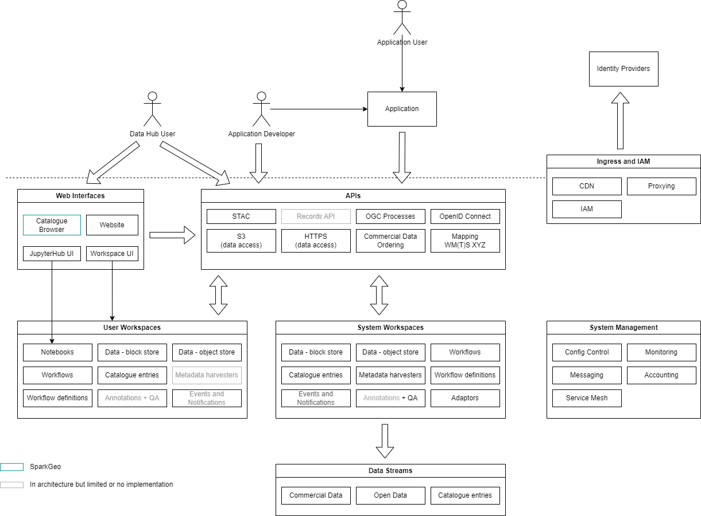
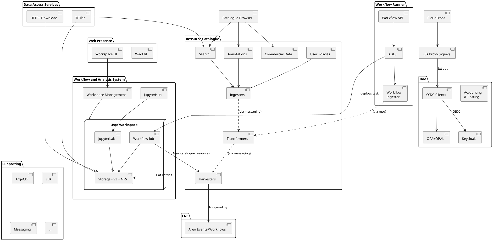

### 3.1 Architecture Overview

The architecture adopts a microservice approach for Kubernetes deployment – which is designed for scalability and service resilience. 

#### 3.1.1 Functional Layers

The high-level architecture is illustrated in Figure 3-1 Architecture Overview which introduces the EODHP capability organized across six levels: 

1) **Application End Users** - Users who use services created on top of EODHP by EODHP users, without necessarily know about EODHP itself.
2) **Hub Users and Applications** - Users who use EODHP directly, either for their own purposes or by creating applications which they use to provide services to Application End Users. 
3) **Ingress and Identity and Access Management** - Gatekeeping requests to the platform through identity and auth.
4) **Presentation** - Public-facing web user-interfaces and public service APIs.
5) **Workspaces and System Management** - The data and computation the Presentation layer provides access to, and the system management which controls it. A Workspace acts as conceptual container for the activities and assets of a specific group of collaborating users.
6) **Data Streams** - External data centres and providers with which the EODHP integrates and which provide data and metadata to EODHP users. 

This document concentrates on layers 3, 4 and 5, which are directly part of the platform. Note that this is a conceptual view and does not necessarily reflect how the system is broken into internal software components – for example, a single service may provide both an API and underlying processing within a workspace. 

**Figure 3-1 Architecture Overview**

**Applications** are services provided and maintained by **Application Developers**, usually in their own infrastructure. These could be client-side web applications, server-side web applications, APIs, downloadable software, or a variety of other types of service. 

**Ingress and IAM** controls entry of requests to the platform and manages users. This includes user registration, permission management, authentication, authorization and the distribution of requests to the correct internal components of EODH. 

**Web Interfaces** allow human users to access EODH services and **APIs** allow machine access. APIs use well-defined standards where available, such as STAC and OGC APIs. 

**User Workspaces** are conceptual containers, similar to tenancies, within which a group of collaborating users may store, access and catalogue data, and may run processing. They can also publish data, metadata and processing services to third-parties under the name of their workspace. They are used as a unit for billing and access management. **System Workspaces** technically rely on the same mechanisms, but are used for ‘official’ hub activities, such as publishing to the officially provided (non-user) areas of the catalogue or integrating with data streams. 

**System Management** controls and monitors the configuration and state of the system, and also gathers information required for billing. Except for **Accounting**, users do not interact directly with any of this functionality. 

**Data Streams** are collections of data and metadata provided to EODH users by data providers via an EODH integration. EODH facilities to find, visualize and use data are then available for those data streams. A data provider does not necessarily know they are an 

EODH data stream – for example, if EODH harvests a publicly available STAC Catalog – but typically will be collaborating in some form. 

#### 3.1.2 Components

EODHP can be decomposed into components, each typically being a specific piece of software executing as one or more instances. These provide the functionality at layers 3, 4 and 5 above. 

**Figure 3-2 Architecture Components (arrows denote dependency)**

Figure 3-2 provides an overview of the main components comprising the architecture, which are elaborated in the following sections. They are also briefly summarized here: 

- Data Access Services 
  - **HTTPS Download:** AWS Lambdas and nginx which allow HTTPS-based access to users’ files in workspace object and block stores. 
  - **TiTiler**: a WM(T)S and XYZ Tiles service which can serve visualizations of user and data streams’ data. 
- Web Presence: 
  - **Wagtail**: a CMS for static content, documentation and site structure. 
  - **Workspace UI**: a client-side app for users to manage their accounts and workspaces. 
- **Workspace Management**: APIs and server-side implementation for creating and managing the components that make up a user workspace. 
- **Workspace Storage**: S3 and NFS (AWS EFS) storage dedicated to a particular workspace. 
- Jupyter: 
  - **JupyterHub**: launches and manages instances of JupyterLab. 
  - **JupyterLab**: provides a Notebook interface of users to run code. 

- Resource Catalogue: 
  - **Search**: a customized stac-fastapi instance providing STAC access to the EODH catalogue, including user-defined catalogue entries which are namespaced to be ‘inside’ a particular workspace. 
  - **Annotations:** (implementation currently incomplete): a service to retrieve linked-data-based annotations on data in the catalogue. 
  - **User Policies:** a repository of user-set access policies that allow them to publish data from their workspaces. Accessible only internally within the platform. 
  - **Commercial Data**: a service for getting quotations for and for ordering commercial data. 
  - **Harvesters**: a variety of components which obtain catalogue data from sources inside and outside EODH. 
  - **Transformers**: services which transform raw catalogue harvested data into the form required by the catalogue services This includes only transformations which are invariant of the particular harvester or ingester involved. 
  - **Ingesters**: services which take transformed catalogue data and insert it into a particular catalogue service. 

- ENS 
  - **Argo Events+Workflows**: instances of Argo Events and Argo Workflows which are used to trigger harvesters which run on a schedule. This may expand eventually to a wider role, such as triggering workflows on data arrival. 

- Workflow Runner 
  - **Workflow API**: a service to accept and authorize workflow definition and execution requests, implementing the EODH model of workflows being owned by and potentially private to a particular workspace. 
  - **ADES**: the workflow execution engine from EOEPCA which is able to execution CWL-based user-defined workflows. 
  - **Workflow Ingester**: a service (technically a catalogue ingester) which allows workflows to be defined and added to the ADES via a definition in a catalogue harvest location. Most workflows are defined via a POST to the workflow API. 
  - **Workflow Job**: workflow-based processing requested by a user, running as one or more Kubernetes pods. 

- IAM 
  - **CloudFront** and **nginx** are used as a CDN and reverse proxy for all requests reaching the EODH Kubernetes cluster (and **CloudFront** is also used for requests going to AWS Lambda or to S3). These distribute requests to the correct destination and serve as the enforcement point for coarse-grained authentication and authorization requirements. 
  - **OIDC Clients** coordinate the login process with Keycloak (they are OIDC clients to Keycloak which, in turn, is an OIDC/OAuth2 client to external IdPs) and provide coarse-grained authorization decisions to nginx. 
  - **Keycloak** serves as an identity broker and repository of user data and roles. Roles are used only for administrative purposes such as allowing CMS editing and do not form a part of authorizing ordinary users’ activities. 
  - **OPA+OPAL** provides coarse-grained authorization decisions using Open Policy Agent. ‘Coarse-grained’ decisions are those that can be made using only information in caller’s tokens (primarily workspace memberships and scopes) and basic knowledge of the HTTP paths used in EODH. 
  - **Accounting and Costing** receives and stores resource consumption data about user workspaces, stores pricing data, and provides this data to users via APIs. 
- **Supporting** components provide various internal and system functions such as configuration control and monitoring.
