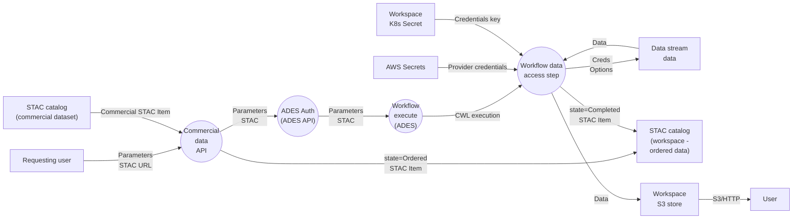

### 3.9 Data Access Services

#### 3.9.1 Summary

The data services allow users inside and outside the platform to access platform data through both data download interfaces and higher-level APIs. Specifically, this section describes: 

- HTTP(s) and S3 file-based download access to data which is stored in a workspace store. This data may be public or private to workspace members and may be being accessed from inside or outside the platform. 
- OGC protocol-based data access, particularly over the OGC Tiles API. 
- Access to commercial data. 

#### 3.9.2 Data Access for Files

The main components used to access data which already exists as files accessible to the user are shown in the deployment diagram below. 

```puml
actor User

package "Workspace Storage" as UserStorage {
  [S3] as S3
  [EFS] as EFS
}

node "Data Stream" {
  [Public Data] as PublicData
}

package "Resource Catalogue" {
}

package "Data Access Services" as DAS {
  [TiTiler]
  [EFS Proxy] as EFSProxy
  [S3 Lambdas] as S3Lambdas
}


User --> PublicData : HTTPS

User --> EFSProxy: HTTPS
EFSProxy --> EFS

User --> S3Lambdas : HTTPS
S3Lambdas --> S3

User --> S3 : S3 Protocol

User --> TiTiler : OGC API
TiTiler --> UserStorage
TiTiler --> PublicData
TiTiler --> "Resource Catalogue" : STAC
```

**Figure 3-9 Data Access Services**

##### 3.9.2.1 Workspace Storage: S3 (Object Stores)

As shown in the diagram, data in object stores can be accessed as files in two different ways – using the S3 protocol and using plain HTTPS. 

For S3 protocol access, a user can obtain temporary AWS credentials using the Workspace UI or API and then talk directly to AWS’s S3 service. These credentials last one hour and work for one workspace, which the user must be a member of. To achieve this, EODH’s Keycloak is added as a federated IdP to AWS IAM, allowing AWS access policies to refer to EODH users. Each workspace object store is an S3 access point with a policy restricting access to workspace members and to the workspace prefix within the underlying bucket. 

HTTPS-based access puts files at URLs such as `https://my-workspace.eodatahub workspaces.org.uk/files/workspaces-eodhp/object/name/in/store`. The request first arrives at CloudFront which is configured to forward it to S3. Two Lambda@Edge lambdas are associated with this CloudFront behaviour – one called when the request is received which performs access control checks (by calling auth-agent in the Kubernetes cluster), the other before a request is made to S3 and which rewrites the URL to refer to the expected location in the bucket. 

HTTPS-based access allows sharing of data using user-defined access policies. These are stored as JSON files in the workspaces-access-eodhp bucket, which is accessed by the first Lambda. These name paths which are to be made public and could be used later to provide more limited sharing. Additionally, files under the path `/files/workspaces/eodhp/public/` are automatically public. Unless the file is public, requests must be authenticated in one of the usual ways – cookies, API keys or Keycloak tokens (see Identity and Access Management). 

Access from within the cluster uses the same mechanisms. S3-based access from the cluster is preferable and uses an S3 gateway inside the EODH VPC. HTTPS-based access exits the cluster via the NAT service (incurring a charge) and returns via CloudFront. 

##### 3.9.2.2 Workspace Storage: EFS (Block Stores)

Workspace block stores are mounted into the workspace’s Notebooks and can be accessed as the home directory (also the initial working directory). 

Access from outside the cluster is possible using HTTPS and URLs such as `https://my workspace.eodatahub-workspaces.org.uk/files/workspaces/file/name/in/store`. Such URLs are forwarded by CloudFront and the cluster ingress to a pod containing nginx. This has the EFS workspaces volume mounted and serves files from it. Access control is performed by auth-agent at the main cluster nginx ingress, just as it is for most cluster actions. 

#### 3.9.3 TiTiler and OGC Tiles

As shown in Figure 3-9 an instance of TiTiler is used to serve EODH data over the OGC Tiles API and WMTS. TiTiler does not require pre-registration of data to be served and so generates the required API responses on-demand, fetching the underlying data from data supplier URLs, workspace stores and STAC catalogue as required. 

For WMTS support, the data must have a STAC catalogue entry with STAC Renders extension data included. 

The underlying data is specified by including the URL to the underlying dataset in the request or, for WMTS, appending /wmts to the Collection URL (eg, `https://eodatahub.org.uk/api/catalogue/stac/catalogs/public/catalogs/ceda-stac-catalogue/collections/sentinel2_ard/wmts`). 

TiTiler also mounts the workspaces EFS store and has been granted a Kubernetes service account linked to an AWS IAM role which has access to S3. TiTiler has been modified to understand EODH tokens and can authorize access to workspace files stored in these locations, allowing visualization of private data. 

#### 3.9.4 Adaptors

```puml
actor User

package "Workflow and Analysis System" as WAS {
  [Workspace Management] as WorkspaceMgmt

  node "User Workspace" as UWorkspace {
    [Crypto Key] as DSCredsKey
  }

  WorkspaceMgmt --> DSCredsKey : Writes
}

node "AWS Secrets Manager" as AWSSecrets {
  [Data Stream Credentials] as DSCreds
  WorkspaceMgmt --> DSCreds : Writes
}

User --> WorkspaceMgmt : Link Account
```
**Figure 3-10-a Account Linking**


```puml
actor User

package "Workspace Storage" {
}

node "Data Stream" {
  [Public Data] as PublicData
  [Commercial Data API] as CommercialDataAPI

  CommercialDataAPI -[hidden]-> PublicData
}

package "Resource Catalogue" as Catalogue {
  [Commercial Data] as Ordering
  [Ingesters]
}

package "Workflow Runner" as WR {
  [ADES API] as AdaptorAPIs
  [ADES]
  [Adaptors] as Adaptors

  AdaptorAPIs --> ADES
  ADES --> Adaptors
  Adaptors --> "Data Stream" : Orders
  Ordering --> CommercialDataAPI : Quotes
}


node "User Workspace" as UWorkspace {
  [Crypto Key] as DSCredsKey
}

node "AWS Secrets Manager" as AWSSecrets {
  [Data Stream Credentials] as DSCreds
}

Adaptors --> "Workspace Storage" : "Ordered Data"

User --> Ordering : Quotes and Orders
Ordering ---> AdaptorAPIs : "Order Workflow Invocation"

Adaptors --> DSCreds : Read Credentials
Adaptors --> DSCredsKey : Read Credentials' Key

Ingesters <-- WR : "Order Metadata"

User -[hidden]-> AdaptorAPIs
```

**Figure 3-10-b Adaptors**

Adaptors are a mechanism for using data in the platform which is not available from its upstream source over a simple file-based (HTTPS or S3) protocol by following asset links from STAC entries. For example, this may be necessary when: 

- The data is commercial and must be ordered from a data supplier (for which the EODH user will be billed). This is the only case the current adaptors support. 
- Data is being fetched from a source with its own request, queuing and download system such as the Copernicus CDS, or from archives that may be backed by tape.
- Data must be fetched from an interface which is not file-based such as a data cube interface or a coverage service. 
- Data is available over another protocol only, such as FTP. 
- Special handling is required to pass credentials or limit parallel requests to the provider. 

In principle, an Adaptor as described here could be used to create a dataset whose data is generated on-demand, although this is not the originally intended use for them. 

The adaptor itself is only one piece of an integration with a data supplier, particularly a commercial one, and handles only the process of obtaining data. Depending on the data provider the other pieces may include: 

- A custom catalogue harvester or proxy so that the upstream catalogue entries are available in the hub STAC APIs. 
- An account linking process provided by the Workspace Management components which allows the hub to access the credentials it needs to talk to the data provider on behalf of the requesting workspace. 
- An API (in the resource-catalogue-fastapi service in the Resource Catalogue’s Commercial Data component) to return quotes for proposed commercial data purchases and to invoke the underlying adaptor. 

Adaptors are called by appending /order to a commercial data STAC Item’s URL and POSTing parameters according to the OpenAPI documentation. Correspondingly, quotations are obtained by appending /quote. 

##### 3.9.4.1 Form of Adaptors

Adaptors are containerised workflows compatible with the Workflow Runner, most likely consisting of only one step. These are supplied in the normal way – container images and a CWL workflow definition – and deployed to the workflow runner as available OGC Processes. These are similar to any other workflow but with some particular requirements: 

- The Workflow is expected to accept inputs and produce STAC as described below. 
- The Workflow runs as a User Service, meaning that it runs in a special-purpose Workspace dedicated to the data stream it publishes. 
- This Workspace is granted special permissions so that the workflow can access the linked account credentials it needs to call the data provider API. This includes both the cryptographic key stored in a secret in the calling workspace and an encrypted credential stored in AWS Secrets Manager. 

##### 3.9.4.2 Calling Adaptors

Adaptors are invoked using the platform’s commercial data APIs, providing the required parameters such as processing options. These APIs are found by appending /order (or /quote) to the STAC Item URL for a commercial item. The ordering process is shown in Figure 3-11 Adaptor-based data retrieval data flow diagram.


**Figure 3-11 Adaptor-based data retrieval data flow diagram** 

The commercial data API (in resource-catalogue-fastapi) will authorize the request, validate it, retrieve the STAC Item for the ordered data and call the ADES API to run the adaptor workflow. It will also create an output STAC Item which is stored into an ‘ordered data’ catalogue in the calling workspace’s catalogue. This will become the metadata pointing to the data delivered by the provider but at this point has an ‘ordered’ status (compliant with the STAC Order extension) to say that the order has been placed but not yet delivered. 

The ADES API calls the ADES which executes the adaptor as a workflow. This will retrieve the linked account credentials for the calling workspace so that it can call the upstream data provider’s API. It will then receive the ordered data in response. This mechanism varies by provider, but for the Airbus and Planet providers involves the provider pushing the data into an S3 bucket in the platform. The adaptor then produces this data as a workflow output (so that the workflow system stores it into a workspace object store) along with a final STAC Item for it. This final Item includes asset references to this data that the user can follow to access it.
