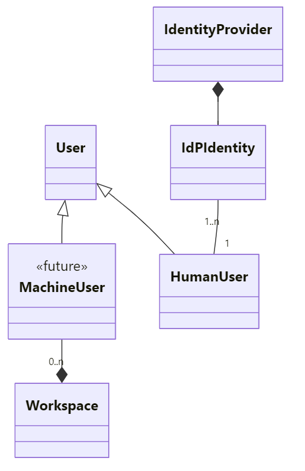
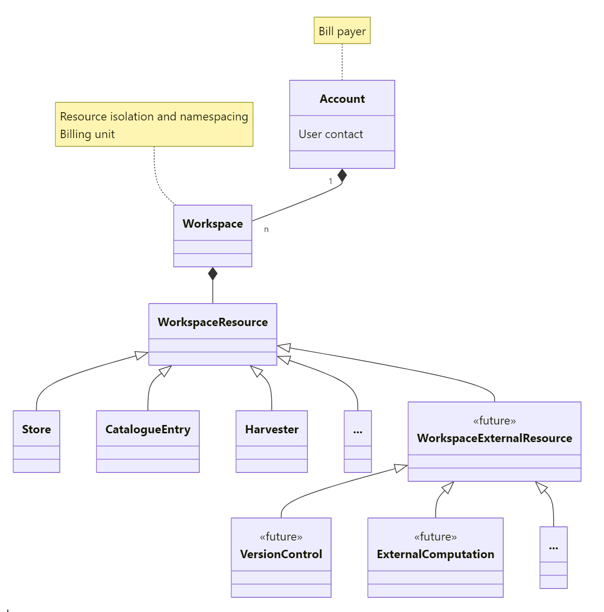
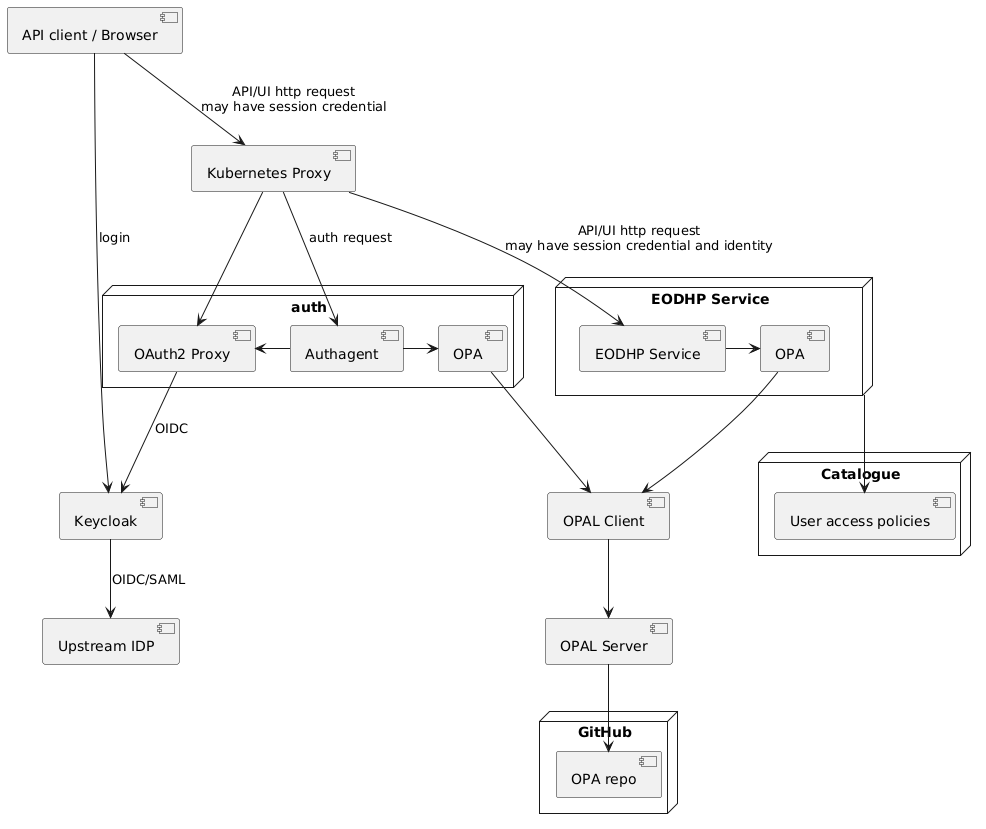
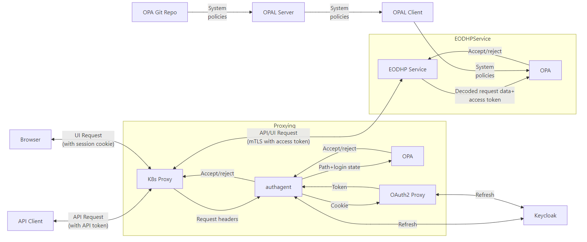
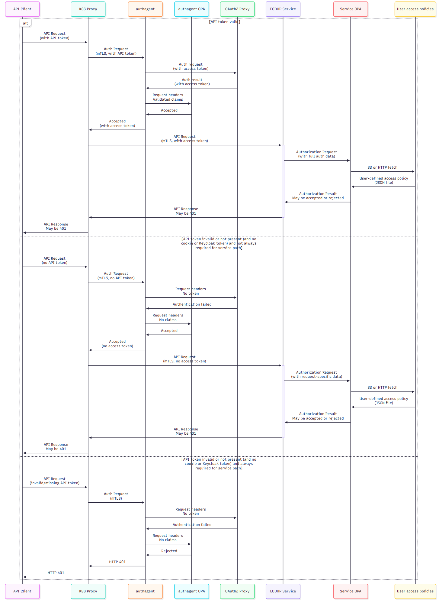
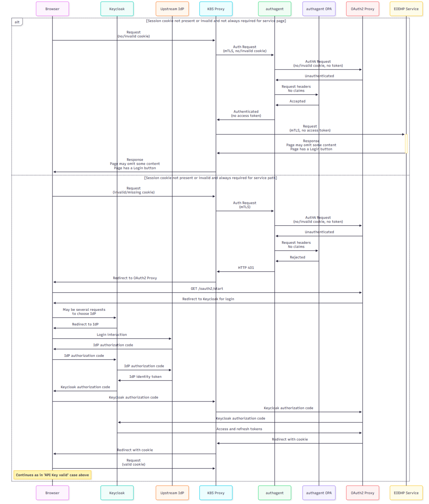
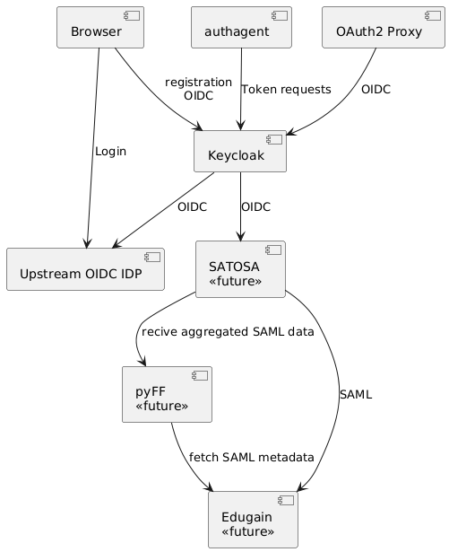

### 3.13 Identity and Access Management

#### 3.13.1 Model for Identities and Workspaces

##### 3.13.1.1 User Identities

Users will use external identities in the platform, current GitHub and Google identities. Identity providers are not fixed and new ones may be added. Identities are linked to EODH (Keycloak) users and multiple federated identities may be linked to a single user. 

Machine identities are anticipated to also exist in the future, for example for use when workflows are triggered by events. These identities will either be internal identities used by EODHP software components or will be linked to the workspace responsible for them. Users with sufficient privileges can create machine identities and assign privileges to them but they will always remain scoped to a specific workspace and unable to act outside it. Those users will also be able to obtain credentials used for access on behalf of that Machine User in the same ways as they can for their own User. 

**Figure 3-12 Model for Identities**

Users may have Keycloak roles but this is limited to granting access to platform administrative or management functionality by special users. 

Workspaces, defined below, can also be used as part of the identity with which an action is performed. This allows an allocation of costs to Workspaces and Accounts. It can also be used in authorization decisions (via the scoping of tokens), such as 

- always allowing a workspace's notebook to run the same workspace's workflows and not any other workspace's (private) workflows even if the user would normally have access, or 
- denying an action due to the associated Account not having a billing arrangement or being suspended. 

##### 3.13.1.2 Workspaces and Accounts

A logical view of these concepts is shown below: 

**Figure 3-13 Workspaces and Accounts**

###### 3.13.1.2.1 Accounts

An Account (or ‘Billing Account’ where this name may be confusing) represents a legal relationship between an EODH customer and the platform in which the account-holder agrees to be responsible for the use of the platform within the Workspaces it owns, often including paying for resource use. Each Account has one or more users as designated contacts who are responsible for agreeing to the EODH terms and conditions on behalf of their organization, ensuring payment and managing Workspaces. A more complex system with, for example, billing and technical contacts could be used later. Any systems for collecting payments will also be configured here. 

Individual charges applied to Accounts will always relate to a specific Workspace. An Account exists as a separate concept to a Workspace to allow a single invoice to be issued and a single account balance to be maintained for a customer organization with multiple Workspaces whilst still allowing individual project costs to be allocated to different budgets. 

New Accounts can be requested by any EODH user and they will initially be in an unapproved state. Until approved by an EODH administrator it will not be possible to create a Workspace within the Account. This is not inherent in the model or architecture, however, and future unapproved Accounts could be able to create limited Workspaces which can perform cost-free actions (like creating catalogue entries) or have a limited trial budget. There could also be an auto-created personal Account and Workspaces to allow future users to begin to use the platform, save favourited catalogue entries, etc, without needing to understand the Account and Workspace concepts. 

###### 3.13.1.2.2 Workspaces and their Resources

A Workspace is a set of resources within the platform, such as storage, catalogue entries, notebooks and CPU time, to which one or more users have access. Workspace resources in different Workspaces are isolated from each other and access is only permitted where explicit data publishing functionality has been used. Workspace resources that are part of the platform’s naming hierarchy, such as catalogue entries and workflows, are put in a Workspace-specific sub-Catalog so that Workspaces have independent namespaces for them. 

Workspaces are created by the Account contacts, who can configure their members and link commercial data accounts. All users attached to the Workspace otherwise have an equal level of access to these resources, at least for the initial platform. 

All user-defined or billable actions occur in a Workspace. For example, workflow executions are always attached to a Workspace, either as a call by a Workspace User or a User Service (where a Workspace publishes a service that can be called by other Users who are not Workspace members). All published data hosted by the platform will also be in Workspaces and special-purpose Workspaces for publishing officially supported data may be used for this. 

All actions by Workspace resources, including anything done by code running in notebooks and workflows, use identities composed of both the Workspace and the invoking User (which may be a Machine User) and using tokens scoped to the calling Workspace. This has the following motivations: 

- It allows for intra-Workspace access to be authorized based on the Workspace whilst still recording a responsible individual or process. This allows for a model in which Workspace resources are equally accessible to all Workspace users. This simplifies implementation, particularly in relation to resources like object stores which are authorized via AWS IAM Roles and block stores authorized using POSIX file permissions. It also means that one Workspace user cannot attempt to introduce code which, when run by another Workspace user, will access resources in another Workspace to which the first has no access. 
- It allows any calls outside the Workspace which are authorized based on individual user access rights to be recorded as coming from the Workspace. 
- It allows for any related charges to be billed to the Workspace and for quotas and similar to be managed per-Workspace. 
- It allows for actions by a Workspace which are not easily assignable to a specific human user. Harvesting of catalogue entries and execution of User Services are examples.
- It allows for use-cases such as a development and production Workspace where, despite the same users being attached to both, actions such as modifying public catalogue entries or replacing data used in production services can be refused if they originate from the development Workspace. 

Some examples of authorization based on Workspace and user might be: 

- Access to files using POSIX access or objects in non-public buckets using HTTPS or S3: always allowed as long as the Workspace of the request matches the Workspace owning the store 
- Calling a Workflow created within the Workspace with default access permissions: always allowed as long as the Workspace matches 
- Creating a catalogue entry: allowed as long as the Workspace is allowed to publish to the target catalogue subtree 
- Access to commercial data: allowed if the Workspace has access 

A particularly complicated case is the User Service. A User Service is a type of Workflow with a defining Workspace (which created the Workflow definition), a publishing Workspace (which published the Workflow as a User Service) and an invoking User and Workspace. The User Service runs stage-in and stage-out with the permissions of the invoking user and workflow steps with the permissions of the publishing Workspace. This allows for limited trust between the invoker and publisher, such as for certain types of application. The workflow can use private data in serving the invoker and the invoker grants access only to the input data. 

In the future workspaces could also be linked to external resources, such as Git service providers used for storing and version controlling notebooks, workflow definitions, catalog entry and harvesting configuration, and similar. This could also later include an AWS IAM user in a user's AWS account or an account in an external computing platform which could be used to provide additional compute resources for the workspace. 

#### 3.13.2 IAM Implementation Architecture

##### 3.13.2.1 Overview

###### 3.13.2.1.1 Structure and Components

The platform has a large set of possible interactions which require authentication and authorization and which the IAM architecture must support \- these are analyzed in detail in [03\. Data Flow and AuthZ, AuthN and Access Control Points and Methods.md](https://github.com/EO-DataHub/documentation/blob/deliveryversion/mvp/Architecture/IAM/03.%20Data%20Flow%20and%20AuthZ%2C%20AuthN%20and%20Access%20Control%20Points%20and%20Methods.md). The mechanism for access control varies, for example between services running in the Kubernetes cluster and for download access directly to object stores. However, there are general patterns and common elements which are described here. The components are shown in this diagram (arrows indicate dependency): 

**Figure 3-14 IAM Architecture Overview**

User identities are maintained by Keycloak, which provides an OIDC service to the cluster and in turn acts as an OIDC client to upstream identity providers like GitHub and Google. Users must register with the platform using one of the upstream IdPs (and so be added to Keycloak) before they can use non-public parts of the platform which they can do the first time they try to log in. Other system components do not interact directly with these upstream providers for IAM purposes. Keycloak also provides and validates access tokens when asked to do so by other parts of the platform and provides claims such as user identity and group membership. 

Requests to EODHP Services arrive through the Kubernetes proxy and are pre authenticated and pre-authorized by Authagent using nginx’s ‘auth\_request’ functionality. Authagent then either allows the request to pass through to the service, rejects the request or requires a redirect to OAuth2 Proxy for UI-based authentication. 

Authagent authenticates requests using one of three methods: cookies (see 3.13.2.3 Two Party Browser-based Access), API tokens (see 3.13.2.4 Two-Party External API-based Access) or OAuth2 tokens from Keycloak (3.13.2.5 Three-Party External API-based Access). Authagent then authorizes requests using an OPA sidecar and policies. Two of these apply only to ‘two-party’ access, meaning access involving only the hub and a hub user. The last applies to ‘three-party’ access involving the hub, a hub user and a (usually third-party) hub application. 

After authentication Authagent performs authorization. Authagent only authorizes based on limited request information, such as the path and user, and if necessary more fine-grained authorization (based on the decoded request and stored data) occurs when the request 

arrives at the target service. However, the authagent pre-authorization is always sufficient to detect when a browser-based request must be redirected for login. This means that other services do not need to be able to initiate logins. 

After passing through the proxy layer, requests from authenticated users will always have a valid Keycloak token attached regardless of whether tokens were used to authenticate the request made by the user. EODHP Services can then obtain the user information they need by decoding this, relying on mTLS with the proxy to know that the token is and remains valid. The services then use this information for authorization, in some cases using their own OPA sidecars and policies. 

Some services – third-party existing applications such as ArgoCD and Jupyter – are direct Keycloak clients and do not rely on Authagent for authN+Z. This is used where this is the most straightforward integration method and where three-party and API-based access is not required. 

OPA authorization policies are distributed from a central point and distributed to OPA sidecar instances. System-managed authorization policy is stored in the OPA Repo in GitHub and so provided centrally in the form of OPA Rego. It's then distributed using OPAL to the services which require it. 

Users can also provide authorization policies in JSON form through the Workspaces UI. These allow users to make their data, catalogue entries and workflows public and are intended to be extended later to more fine-grained permissions. These policies are ingested via the catalogue’s harvest pipeline and written to an authorization policy store in S3. Services obtain this information by directly fetching it from the object store or by ingesting it from the harvest pipeline. 

###### 3.13.2.1.2 User- and Workspace-scoped Tokens

Access may be ‘user-scoped’, where a token with a claim listing all of a user’s workspaces is used, or ‘workspace-scoped’, where the token is constrained to a single workspace. Workspace-scoped access should be used where the caller is acting ‘inside’ a workspace and must be used for any access which might incur charges. This provides an unambiguous workspace to bill. User-scoped access is used when a user is acting outside of a workspace (eg, to the public website or their account settings) or ‘on’ a workspace (eg, managing its members or generating API tokens for it). 

User-scoped access is more powerful in the sense that it can be used to modify workspaces, access user data and obtain workspace-scoped access. Actions by the workflows and notebooks of a workspace should always be workspace-scoped so that they always remain constrained to their containing workspace. 

Cookie-based access is always user-scoped. Two-party browser access requiring a workspace-scoped token – eg, to initiate a workflow – can obtain one via the APIs to use with an Authorization header. 

API tokens are always workspace-scoped. 

Three-party access is currently user-scoped. This could change in the future if we allow users to explicitly authorize an app to access only chosen workspaces. 

For details on the claims and scopes used in EODH tokens see [iam section of the eodhp-guide](https://github.com/EO DataHub/eodhp-guide/blob/main/iam/OIDC%20Scope%20Design.md) 

###### 3.13.2.1.3 Dynamic Structure - the Steps in a Typical Interaction

The data flow for the typical 2-party case with valid session credentials is shown in this data flow diagram: 

**Figure 3-15 Typical IAM Interaction \- Data Flow** 

This data flow diagram shows the data flow in a 2-party case in which: 

- An API or UI user with a valid session (API token, Keycloak token or cookie) makes a call to an EODHP API running in the Kubernetes cluster, such as the workflow or catalogue APIs. 
- The request goes first to the Kubernetes proxy, nginx, which first forwards the request headers to authagent. 
- Authagent: 
  - Checks if an API token is present and, if so, swaps it for a Keycloak access 
token (refreshing it if necessary). 
  - Makes an auth request to OAuth2 Proxy with the (potentially opaque) token or 
cookie attached and receives a validated token with a full set of claims. 
  - Authorizes passing the request to the main service by querying OPA. This is 
not necessarily a complete authorization (it does not have full request 
information) but will be enough to detect if a login is required but not present. 
  - Returns a success response to nginx, including the access token. 
- The proxy forwards the request to the underlying service in Kubernetes with the access token and the original credential removed. 
- The service decodes the request and does any final authorization, which may involve using an OPA sidecar. This may be based on information decoded from the request (like workflow identities). 
- The service processes the request and returns a response back through the proxy. 

This is also shown as the first case in the interaction diagram below, which shows an API request for various cases of valid, invalid, optional and required API token authentication: 

**Figure 3-16 IAM Interaction Diagrams for API Access** 

Where a browser is used and the browser already has a valid cookie the interaction is identical to that above (the cookie replaces the API token and the access token being sent from Authagent to OAuth2 Proxy). Where a browser is calling API endpoints, for example from JavaScript, the interaction is identical in the other cases as well. For requests for pages where there is no valid cookie, the cases are shown below (service OPA step is omitted to reduce the size of the diagram but still occurs): 

**Figure 3-17 IAM Browser-Based Interaction** 

###### 3.13.2.1.4 Relationship to EOEPCA

The planned EOEPCA IAM architecture uses similar foundations to that here, particularly including Keycloak and OPA, enforcement of coarse-grained authorization during ingress and more fine-grained authorization once requests reach individual services. However, the new EOEPCA IAM framework was not yet available for integration as part of EODHP. 

##### 3.13.2.2 Keycloak

Keycloak is used for identity federation and is the IdP to internal services, ie it's an OIDC provider available to the rest of the EODHP, brokering user identities from multiple upstream IdPs. Upstream IdPs may be OIDC, OAuth2 (like GitHub), or, in the future, SAML (Edugain, but see below). 

We use a Keycloak identity, which may be linked to multiple federated identities, to identify users internally. Workspace membership is implemented as Keycloak group membership. Keycloak can also be used for manual management of user permissions, particularly for permissions used by service administrators which are implemented through Keycloak roles. 

**Figure 3-18 Keycloak Integration Overview** 

In order to support Edugain in the future, a SAML-based federation of federations of multiple thousand identity providers, Keycloak could also be a relying party on SATOSA. pyFF (Python federation feeder) would then be used to aggregate the Edugain providers' SAML metadata in order to maintain SATOSA's knowledge of the Edugain IdPs. Proxying identity via SATOSA is required for this case because, although Keycloak supports SAML, Keycloak is not able to effectively register and manage the thousands of Edugain SAML entities or to discover the frequent changes which occur in a federation of this size. SATOSA and pyFF are used and maintained by Edugain users and should have better interoperability with it. 

Keycloak provides registration functionality and initiates browser-based login as an OIDC relying party to the IdPs. It's also used to issue tokens containing group and role claims which can be validated by other services in the cluster. Both authagent (for API keys) and OAuth2 Proxy (for browsers) act as clients to Keycloak in order to obtain these tokens. 

There are multiple IdP relying parties to Keycloak in the cluster. OAuth2 Proxy is the primary one that covers most EODH services. There are two instances – one for the eodatahub.org.uk domain and one for the eodatahub-workspaces.org.uk domain and its subdomains. Jupyter, ArgoCD and Grafana are separate clients to Keycloak. The ADES is also a client to Keycloak in order to issue tokens for workflows, particularly user services. 

Additionally, AWS IAM is a relying party to Keycloak, which makes EODH users available as federated users within AWS IAM. This allows the hub to issue AWS credentials for access to AWS services (particularly S3) whilst controlling access based on hub user identity. 

Unlike the previous default for EOEPCA, the authorization services in Keycloak are not used. There are two primary reasons for this choice: 

- There are numerous reports of poor performance with Keycloak authorization. OPA, by comparison, can operate in a distributed and low-latency manner. 
- Keycloak either permits a limited range of methods to express policies or requires a JavaScript policy to be built into a JAR file installed on the Keycloak server. Using OPA provides a standardized way to express policies and more options for distributing it. 

##### 3.13.2.3 Two-Party Browser-based Access

This type of access occurs when a hub user uses the hub web UIs, including API calls and workspace file access from the browser. This access is authenticated through a browser based OIDC-mediated login with the session maintained via a cookie. 

For this interaction, OAuth2 Proxy is the Keycloak client and uses the authorization code flow. Authagent will redirect users to the OAuth2 Proxy start endpoint when it detects that login is required but not active, as will the web presence when the ‘Sign in’ button is pressed. OAuth2 Proxy then initiates OIDC and receives the callback from Keycloak after authentication (which may be instant if the user still has a valid Keycloak session). OAuth2 Proxy generates and sets a cookie containing an opaque value and retains session information (including tokens encrypted with a secret in the cookie value) in Redis. Until it expires OAuth2 Proxy will validate the cookie when asked by Authagent, returning a JWT token which Authagent and nginx forward to the service which is the target of the request. OAuth2 Proxy is responsible for refreshing the underlying access token for as long as the cookie is valid. 

Because cookies are always user-scoped they cannot be used for chargeable actions such as initiating a workflow or buying commercial data. For this reason they can be exchanged for a short-lived workspace-scoped OAuth token by calling `/workspaces/{workspace id}/{user-id}/sessions`. 

##### 3.13.2.4 Two-Party External API-based Access

This type of access occurs after a hub user generates an API token for a workspace using the workspaces UI. This can be attached to an HTTP request as a bearer token and used with APIs and file access for that workspace. It is always workspace-scoped to the single workspace it was generated for. The intended use is for API calls from user scripts and notebooks, with CLI tools like curl, with local software such as QGis and with user 

developed services that do not access the hub on behalf of other hub users. A user can usually opt to use three-party access for these circumstances as well but two-party access avoids needing to understand OIDC, OAuth tokens, refresh mechanisms, etc., which are often confusing and complex. 

API tokens are issued by Authagent via its API. Authagent transparently obtains and refreshes an OAuth offline access token from Keycloak with the API token being swapped for this during ingress processing so that no other services need to interpret them. 

Authagent does not store the API token itself, which consists of a magic number and an encryption key used to encrypt the underlying tokens for storage in the Authagent database. 

##### 3.13.2.5 Three-Party External API-based Access

Three-party access occurs where an application written by one hub user calls hub APIs on behalf of another hub user. The same mechanism can also be used for two-party access where a user prefers an OAuth-based API. 

An application must be registered as a Keycloak client first. This can only be done by a hub administrator at present. Once registered the application can use OIDC and OAuth to obtain identity, refresh and access tokens. The access token can then be used with hub APIs as a bearer token. 

When Keycloak tokens arrive at EODH APIs, Authagent forwards them as part of the request headers to OAuth2 Proxy. OAuth2 Proxy determines that there is no cookie, finds the token, validates it and returns a token with a complete set of claims. Authagent returns this to nginx to pass to EODH services. 

##### 3.13.2.6 External Access to Workspace Files

HTTP-based read-only access to files in workspace stores, whether published from another user's workspace or for access to a user's own workspace, will be possible using the same cookie-based, OAuth token-based and API token-based authentication mechanisms described above. Access to public buckets will be possible in the same way without any authentication. 

To ensure that access does not need to travel through the cluster and its proxies, CloudFront is used in front of the S3 buckets. This requires the use of Lambda@Edge in order to authorize requests, ensuring that CloudFront only passes them to the bucket when access is permitted. This Lambda fetches access policies for workspace object stores from a trusted S3 bucket previously filled with user-set access policies by the harvest pipeline. 

S3-protocol access will be possible to workspace object stores only when the user is a member of the owning workspace. Keycloak is linked to AWS as a federated identity provider, thus presenting EODH users to AWS as federated identities. These users can then obtain temporary AWS credentials from the hub’s workspace APIs, which in turn obtains them from AWS's STS service. These credentials can then be used for S3 access with S3 clients. Access goes through the S3 Access Points defined for the workspace and AWS policies are set on them to allow access only for workspace members. 

HTTP-based block store access is provided using nginx running in the cluster. Authorization uses the same mechanisms described above as other services, with Authagent and OPA being the policy decision point. 

##### 3.13.2.7 Access from Workspaces

Workspaces, especially the workspace namespaces in Kubernetes in which notebooks and workflows run, run user-originated code. These must access the API endpoints of the platform and its object stores. This occurs in several ways: 

- For API access from workflows the workflow receives an API token in an environment variable. 
- For API access from notebooks the user must obtain an API token from the UI and write this into a file to read from the notebook. 
- For object store access the pods are granted access via a Kubernetes service account linked to AWS IAM. This results in tokens for S3 access being mounted into the containers. 
- For block store access the EFS access point for the workspace block store is mounted into the pods. This mounts only the subdirectory for the workspace so that access to other workspaces’ files is prevented. 

It’s anticipated that future work could alternatively use the service mesh and mTLS to recognize user workload identity so that no token is required for API access. 

##### 3.13.2.8 Intra-service Access

When EODH services communicate with each other they authenticate themselves as legitimate EODH internal services by being a member of a linkerd service mesh (which uses mutual TLS). Unmeshed services like notebooks and workflows cannot connect to internal API endpoints because they do not have client certificates. They can, however, connect to public APIs via CloudFront or via nginx, in which case the requests are subject to the usual authN and authZ mechanisms. 

This protects both API access and Pulsar messaging, to which user workloads never have access. 

Access from CloudFront to the cluster ingress is protected by a Let’s Encrypt TLS certificate requested by cert-manager. 

##### 3.13.2.9 Application Integration

Server-side and client-side applications that wish to make EODH API calls on behalf of end users must be registered as OIDC clients in Keycloak. This must be done manually by an EODH administrator. They may then obtain Keycloak tokens using OIDC and call hub APIs with them on behalf of their users. 

Stand-alone tools may ask their users for an API key. Alternatively, they may also be registered as OIDC clients and run a browser asking their user to log into EODH in order to obtain a token. 

The tokens obtained this way are used as bearer tokens with hub APIs in the usual ways described above. 

##### 3.13.2.10 User Services

User services are special workflows that run their stage-in and stage-out with the privileges of their caller but their main steps with the privileges of their publisher. This allows the stage-in and stage-out to access input and output locations private to the caller without the caller needing to trust the publisher with full workspace access. It also allows the workflow steps to access the publisher’s private data without this needing to be accessible to the caller. 

To achieve this the workflow runner (ades-fastapi specifically) is a Keycloak client able to obtain separate tokens for stage-in and stage-out using token exchange. 

##### 3.13.2.11 Specific Services

###### 3.13.2.11.1 Catalogue

The catalogue APIs can return specific entries, which the caller is authorized to access or not, and can perform searches, where the caller may see some matching result but not others. For this reason authorization has been built directly into EODH’s fork of stac-fastapi. 

STAC entries in the public and commercial sub-Catalogs are not subject to any access control, but by default entries in the user sub-Catalogs are accessible only to the publishing workspace. Specific STAC Catalogs and Collections within those can be made public 

through user-specified access policies (and, in the future, make accessible to specified other workspaces). When a STAC Collection is public then all of its items are also public. 

Catalogs may be made explicitly or implicitly public. When a user policy makes a Catalog public it becomes explicitly public and public access becomes the default for its descendent Catalogs and Collections (explicit policies for them may override this). Catalogs become implicitly public when a descendent Catalog or Collection is made public. In this case their public status is not inherited by their children by default. This ensures that a user who can access a public Catalog can also view metadata about all of its parents. 

When a user with no special access accesses a public Catalog only public children will be listed in the STAC records and search APIs for it. 

The user-provided access policies are loaded into stac-fastapi by the catalogue search ingester and stac-fastapi records them in Elasticsearch. 

###### 3.13.2.11.2 Wagtail

Wagtail is a client to Keycloak so that platform identities can be used for content editing – any hub user with the hub\_admin role can access the Wagtail content editor interface. However, fine-grained access permissions for editing content are managed inside Wagtail using its own permission model. 

