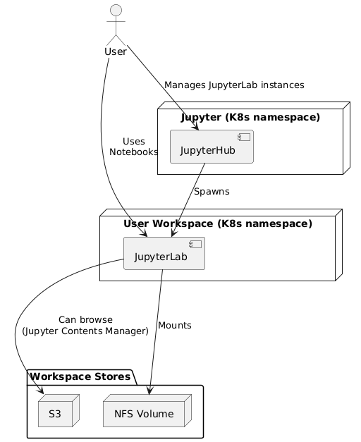

### 3.7 Jupyter

**Figure 3-7 Jupyter**

The EOEPCA Application Hub provides JupyterHub for spawning JupyterLab notebooks and shell access as workspace services. This means that the notebooks run in workspace namespaces whilst the hub uses its own. This allows for correct accounting of resource use by notebooks. When a user spawns a notebook they must choose both the notebook image to use and also the particular workspace to run it in. 

The notebooks use the workspace’s primary block store as the home directory for the notebook user. A Jupyter plugin, the S3 contents manager, makes the workspace object store available as a Jupyter contents manager, allowing the management of files and notebooks there using the Jupyter UI. This requires an AWS Lambda which creates a .s3keep file inside each ‘directory’ created in the object store. S3 contents manager (and, for empty prefixes, also the AWS S3 UI) will not show prefixes as directories without this file. 

