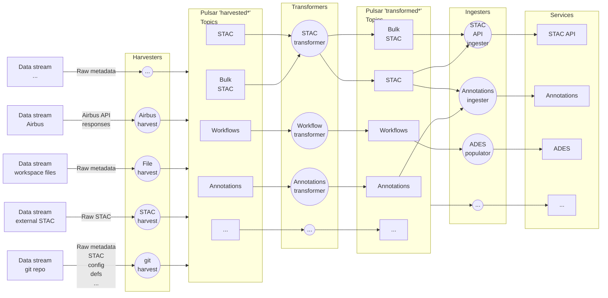
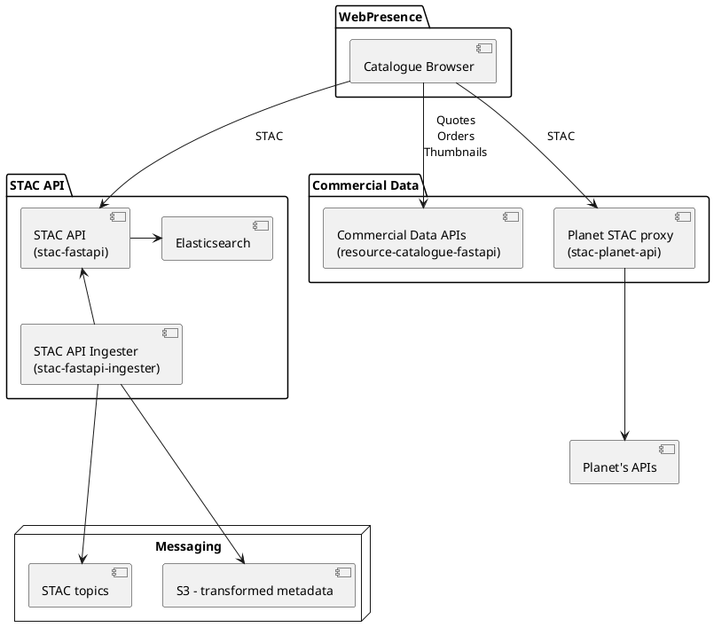
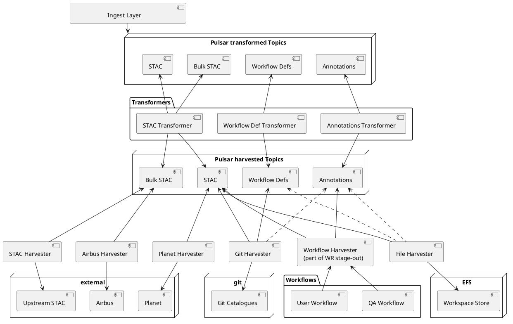

### 3.4 Resource Catalogue Implementation

The Resource Catalogue can be considered in four layers: services, ingest, transform and harvest. Harvesters, transformers and ingesters are known together as the harvest pipeline. Harvesters obtain catalogue metadata from its original sources, transformers modify it, ingesters load it into services and services provide functionality to users. 

This section describes the functioning of the components of the catalogue. The section [3.5 Resource Catalogue Contents](./resource-catalogue-contents.md) describes the structure of the catalogue contents and the options available for integrating a data source. 

#### 3.4.1 Harvest Pipeline Overview

**Figure 3-4 Harvest Pipeline Data Flow**

The harvest pipeline brings source metadata and configuration of many types into the system. Metadata is passed between steps by writing the potentially large metadata files themselves to S3 and then sending a Pulsar message which lists them. The layout of the files is significant: harvester outputs are stored under harvest-specific prefixes using the catalogue structure of the source, transformer outputs are stored under a single prefix using the EODH hierarchical catalogue structure. 

Harvesters are source-specific services which obtain source metadata and do source specific processing on it, for example converting proprietary formats to STAC. Harvesters must sort data by type and submit it to one of the type-specific ‘harvested’ topics in Pulsar. Bulk STAC and STAC are treated as different types so harvests of large amounts of metadata from Airbus and CEDA can be treated as lower priority than processes a user may be waiting for, such as the harvest of workflow outputs. There is no restriction on how many types of metadata a harvester may output, but protocol and implementation limitations typically limit this to one or two. 

Transformers are metadata-type-specific services which perform transformation of harvested metadata to make it suitable for EODH. Any processing which is neither source specific nor destination-specific happens at this stage. Transformers are also responsible for determining where in the EODH catalogue the metadata should go, such as within which STAC sub-Catalog. 

Ingesters are service-specific services which receive transformed metadata and update service datastores. There is no limitation on how many types of data they use but typically they use only one or two. 

Each step in the pipeline may use multithreading and multiple replicas, subject to limitations in the harvest source or ingester destination. Typically the multiple replicas use the same Pulsar subscriptions. However, it’s architecturally possible to run multiple instances of a service (such as multiple STAC APIs with multiple independent Elasticsearch clusters) and ingest all metadata separately into each one. 

#### 3.4.2 Services and Ingest

**Figure 3-5 Catalogue services and ingesters**

The Catalogue services expose the parts of the EODH API which find, describe and order data. The STAC API component provides the main part of the STAC APIs for finding and describing data, with the Planet STAC Proxy augmenting this with metadata for Planet’s STAC Items. Additionally, some commercial data thumbnails referred to from STAC are proxied by the Commercial Data APIs. The commercial data quotation and ordering APIs are provided by the Commercial Data APIs component.

##### 3.4.2.1 STAC API

This provides a dynamic STAC catalogue for all datasets known to EODH. This uses stac fastapi with the stac-fastapi-elasticsearch backend, including its free text search, query (for filtering on item properties), fields, sort and pagination extensions. Stac-fastapi has been extended in two respects: to support nested STAC Catalogs instead of a flat catalogue structure in which all Collections are inside a single root Catalog, and to support access control. 

See section 3.5 Resource Catalogue Contents for details on how nested Catalogs are used and organized into a hierarchical structure. Each STAC Catalog can act as an independent STAC API endpoint which contains all of its descendants, for example each one provides a search endpoint which returns only Items contained within it. See section 3.13.2.11.1 

Catalogue for details on the catalogue access control model. This model allows for public and private data to be stored in the same catalogue and integrates into its hierarchical structure. 

Internally, two sets of stac-fastapi instances are run. One set provides the public-facing service and has read-only access to Elasticsearch. The other is used by ingesters, has read-write database access and has the STAC Transaction API enabled to allow for catalogue modification. Additionally, the access control extensions allow for access policies to be posted to these instances. 

The STAC API Ingester populates the STAC API’s database with metadata that has been previously harvested from an EODH harvest source and transformed. 

##### 3.4.2.2 Commercial Data – Planet STAC Proxy

Due to the large size of the Planet catalogue, the individual items are not harvested into the EODH catalogue, only STAC Collections for each dataset. In order to integrate Planet metadata into the EODH catalogue APIs, the Planet STAC Proxy serves the STAC API endpoints under these collections by forwarding queries to Planet’s own APIs. It translates the results into STAC and returns them to users. 

This means that the higher-level search endpoints, such as the root Catalog’s /api/catalogue/stac/search endpoint, do not return STAC Items for Planet data. The Collections must be queried specifically at, for example, `/api/catalogue/stac/catalogs/commercial/catalogs/planet/search`. 

##### 3.4.2.3 Commercial Data – APIs

This is a stateless custom service which provides custom APIs for ordering commercial data (though they could also be used for non-commercial data available over order-based APIs). This serves API endpoints such as `/api/catalogue/stac/catalogs/commercial/catalogs/planet/collections/PSScene/items/20250717\_132418\_16\_253a/quote` and `/api/catalogue/stac/catalogs/commercial/catalogs/planet/collections/PSScene/items/2025 0717\_132418\_16\_253a/order` which can retrieve price quotes and place orders for specific commercial data items. 

This service contains provider-specific modules able to retrieve quotes from provider APIs. For details on the ordering process itself see 3.9.4 Adaptors. 

#### 3.4.3 Harvest and Transform

**Figure 3-6 Catalogue harvest layer. Arrows are dependencies, dashed lines not currently implemented.**

Harvesters support all required upstream sources from which catalogue metadata must be harvested and replicated into the EODHP. Specifically, these include: 

!!! todo "Add OpenCosmos Harvester"
    Add point for OpenCosmos Harvester

- A STAC Harvester which harvests from external STAC catalogs. This uses STAC APIs or HTTPS to retrieve STAC Collections and Items. It’s also capable of harvesting STAC from GitHub repos. 
- An Airbus Harvester which generates 1\) STAC Collections for Airbus datasets and 2\) harvests individual scene metadata from Airbus’s APIs to generate corresponding STAC Items. 
- A Planet Harvester which generates and updates STAC Collections for Planet data. Individual Items are not generated as this relies on the Planet STAC Proxy, but the Collections must still be updated with, for example, their current temporal extent. 
- A Workflow Harvester which receives the results of workflows which produce catalogue entries, including workflows which produce or extend datasets and workflows which produce QA-related annotations and reports. This is part of the ADES stage-out step in the workflow runner. 
- A Git Harvester which harvests metadata defined in Git repositories. Unlike the STAC Harvester which can harvest STAC from Git, this can harvest other kinds of metadata. This includes workflow definitions, access policies and STAC Harvester configurations. Annotations could be supported but are not currently. A harvester based on the Git Harvester is also used to harvest SPDX licence text from the SPDX public Git repo so that it can be referenced from catalogue entries without any CORS problems. 
- A File Harvester harvests STAC and access policies from a pre-defined location in workspace object stores (‘eodh-config’). This is triggered by an API call currently made by the workspace UI’s metadata loader. This harvester is intended to play a larger role in the future and could harvest files of more types, harvest automatically on file change, and harvest from any location so that catalogue structure always reflects the file structure (potentially including auto-generating catalogue entries for data files). 

Note that a ‘harvester’ is distinguished from a ‘harvest’. A harvester is the code or container capable of harvesting. A harvest is this code configured to harvest particular data, from a particular place and to a particular place in EODH. 

A typical flow for a harvester is: 

- Obtain new metadata records from the source, avoiding, if possible, records which are unchanged from previous harvests. 
- If these are non-STAC metadata for data then convert them to STAC. 
- Write them to the catalogue S3 bucket at a location which reflects their location in the source catalogue. 
- Send messages into the ‘harvested’ topics, each with a list of S3 locations which were changed or deleted. 

The S3 store for a particular harvest contains a reflection of the known state of the upstream catalogue with only source-specific processing applied. These files could be reloaded into the transformer at any time, either by reprocessing retained Pulsar messages or by regenerating them. Processing source metadata minimally before storing it here means that bad data from bugs in the transformation can be rectified without a full re-harvest, only a retransform. This is particularly important for harvesters like the Workflow Harvester which may only see their source metadata once. 

Messages from harvesters will be received by transformers, which make up the next step. These do any necessary transformation of metadata so that this does not need to be repeated across multiple harvesters or ingesters. For example, they may 

- rewrite the internal links (parent, child, self, etc) in STAC records so that they are correct for the platform, 
- update or add licence links to point to the platform copy of SPDX licences, or download a custom licence and link to an EODH copy of it, 
- calculate the correct destination within EODH’s catalogue hierarchy, 
- perform catalogue write access checks (not currently implemented or needed – users currently have too little control over harvesting to generate harvests with a destination outside their workspace Catalog), 
- add the STAC Render extension to records so that TiTiler can serve them over WMTS, - translate STAC to DCAT and NPL-style QA data to RDF so that both can be ingested by the annotations service. 

As with harvesters, transformers write catalogue metadata into S3 and send ‘transformed’ messages with lists of updated and deleted keys. Unlike harvesters, these files are in a single unified hierarchy (not one per source) and reflect the desired state of the EODH catalogue. So, for example, a STAC Item would be stored according to its destination location in the EODH catalogue, like `/catalogs/public/catalogs/ceda/collections/sentinel1-ard/items/item-id.json`, rather than its source location, `/collections/sentinel1-ard/items/item id.json`. 

#### 3.4.4 Future Evolution

!!! todo "Possibly remove"
    Possibly remove this section?

Additional harvesters can be added to support new sources of catalogue data, for example to harvest from Geonetwork servers or GUI-based editors. 

The file harvester could be extended to harvest STAC, access policies, workflow definitions, etc, from any location in workspace storage into the same location in the catalogue or workflow runner. This would create a common hierarchy across all components \- catalogue, workflows and file storage. A GUI-based browser could then be used to navigate this hierarchy, view and visualize all types of object, and modify them by modifying the underlying files. 

The annotations service could be completed and extended to hold metadata using formal vocabularies. This would allow a wider variety of search methods, such as facetted search, and for more sophisticated linking of datasets (eg, links to similar or related datasets or links to workflows designed to work with a dataset). This would be most appropriate if the catalogue grew very significantly in size. 

The annotations service could be extended to hold provenance data in PROV-O format and generated by other parts of the system. It could then offer querying APIs designed for navigating this information, for example to find all datasets which have used a particular source dataset. 

The annotations service could allow for user-generated annotations to be stored and served, either publicly or privately to the user. This takes advantage of the service’s ability to store information of different provenances and reliability outside of the main catalogue entries. Such annotations could include anything from simple tagging, to key-value data linked to points in images, to arbitrary graphs. 

The STAC API could be extended to also serve OGC Records API-compatible records for non-dataset/non-spatiotemporal metadata, such as records for workflows or notebooks. Whilst very similar the STAC and OAR APIs are not completely coordinated, but it is possible to serve APIs that work with OAR and STAC clients simultaneously (with STAC only APIs being ignored by OAR clients). See [this link](https://github.com/EO-DataHub/documentation/blob/main/APIs/01.%20Overview.md#correspondence-between-stac-ogc-records-and-ogc-features-api) for a more specific proposal. 

Harvester definitions and the harvest mechanism could be extended sufficiently to allow user-defined harvesting. For example, a user might create a harvest configuration to harvest an external STAC Catalog into a sub-Catalog in their workspace catalogue. Making a ‘harvest configuration’ a more sophisticated object in EODH would also allow for harvest status and control pages and for log browsing. This would be particularly useful for system operators who would then have a GUI for managing harvesting.
