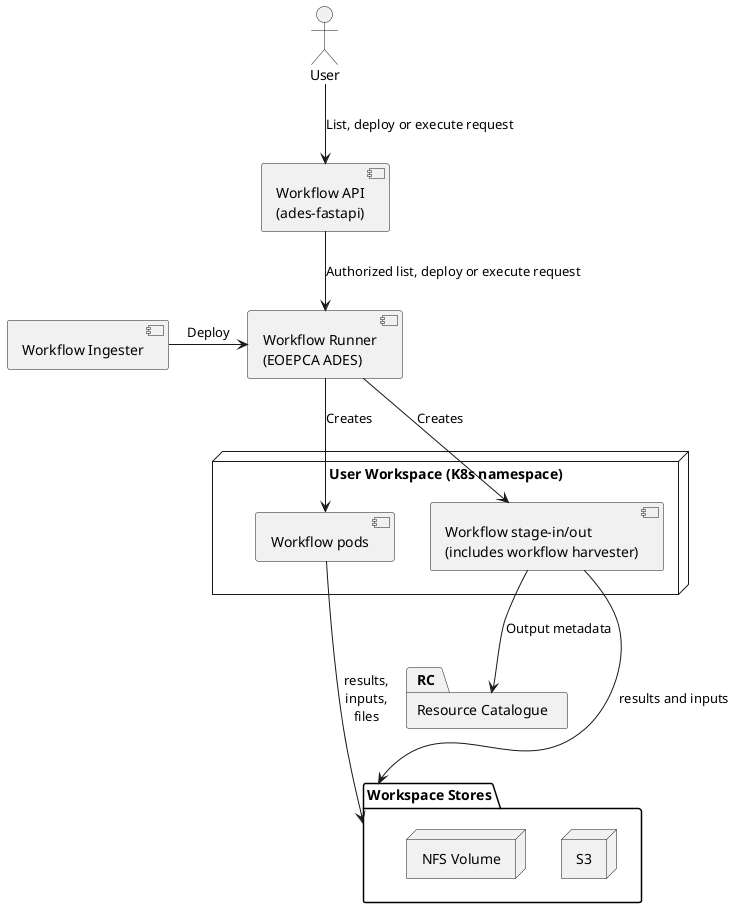

### 3.8 Workflow Runner

The Workflow Runner manages workflow-based user computational activity and capacity utilisation on the platform, including some download services activity. Workflows are OGC Best Practice for EO Application Packages comprising CWL and container images for each step. The Workflow Runner makes them available for execution via API calls using the OGC Processes API. 

Note: a component called the ‘Workflow and Analysis System’ used to exist and contain Jupyter, Workspace Management and the workflow pods (but not the rest of the workflow system). The first two are now their own components and workflow pods are now here. This change has no practical effect on users or developers. 

**Figure 3-8 Workflow runner**

The Workflow API exposes the OGC Processes API to users, passing requests onwards to the Workflow Runner itself. The Workflow API has several purposes: 

- To implement the EODH authorization model, allowing for public and private workflows and for user services. 
- To provide appropriate platform and AWS (for S3) access tokens to the workflow. - To integrate the Processes API into the EODH resource hierarchy. For example, a workspace’s process list can be found at `/api/catalogue/v1/catalogs/user/catalogs/\<workspace-name\>/processes` 

A future Workflow API (or an Execution Management Service between Workflow API and Workflow Runner) could also implement various other functions, such as capacity management, prioritization, account credit checks and the selection of alternative runner instances or types. 

The Workflow API submits execution requests to its chosen ADES (Application Deployment and Execution Service, an EOEPCA component with an existing implementation) at its chosen time. The ADES supports the OGC Best Practice for Application Packages, in combination with OGC API Processes Part 2 (DRU), in which a ‘workflow’ (process) is specified via a CWL (Common Workflow Language) document that is POSTed to the ADES for deployment and thus available for subsequent execution. The execution is initiated via the ADES OGC API Processes interface and the workflow executed as a Kubernetes Job within a target Kubernetes namespace using the Calrissian CWL executor. 

The workflow Job first runs a privileged stage-in step which fetches input data from recognized locations. These include public URLs but the stage-in can also use the credentials of the caller to fetch inputs from private workspace storage. The stage-in also generates STAC for these inputs. 

The workflow Job then executes the user-defined workflow steps, providing them with access to the workspace block store via a mount and the workspace object store via AWS credentials. These stores have access to their inputs and to a temporary storage area using AWS EBS. A trade-off is made here: EBS volumes have a fixed capacity limit and can run out of space, whereas an EFS volume (which was formerly used) has no limit but some workflows break when used with NFS. 

After the user-defined steps complete, a workflow stage-out step runs. This step: 

- Uploads workflow outputs into the execution workspace’s object store.
- Uploads to the licence bucket any licence files referenced from the output STAC.
- Acts as a catalogue harvester for workflow outputs: 
  - Processes and generates STAC for the outputs. This includes, for example, updating asset links to point to the final location into which the workflow outputs are stored. 
  - Processes any recognized annotations files (only NPL’s QA output is recognized). 
  - Emits a Pulsar message to the transformer with this STAC and annotation data. 

Workflow outputs are always catalogued into the workspace catalogue of the calling workspace. By default this will be an auto-generated job-specific sub-Catalog inside a processing-results sub-Catalog. However, workflows can control to some extent where exactly the output files and STAC are put within the EODH resource hierarchy by specifying ids and parent links in the STAC they produce. 

Finally, a Workflow Ingester (forming part of the ingester layer of the Resource Catalogue) can publish workflows that have been defined in files in harvest locations. This can be used with the Git Harvester to define workflows, particularly system-defined workflows, in Git repositories. 

#### 3.8.1 Private Workflows, Public Workflows and User Services

A workflow is a way to make a processing service available at an API endpoint. These endpoints may be public or private (or, in the future, subject to more fine-grained authorization). 

A distinction can be made between the *calling* workspace, the *execution* workspace and the *publishing* workspace. Frequently these are the same but in some cases they may differ. 

The publishing workspace is the workspace which created the API endpoint and provided the workflow definition. This is the workspace identified in the API path, eg in `/api/catalogue/v1/catalogs/user/catalogs/\<workspace-name\>/processes`. Conceptually another workspace type could exist, the *defining* workspace, which provides the workspace definition without publishing it. These two workspaces are always the same in the current EODH. 

The execution workspace is the workspace in whose namespace the workflow pods run, whose storage it has access to and whose account is billed. 

The calling workspace is the workspace used to trigger execution, to provide inputs and to which outputs are written. 

Several scenarios are supported in EODH: 

- **Private workflows**: This is the most typical and default case. The same workspace is in all three roles. A user with a workspace-scoped token must deploy the workflow definition to the workspace’s API endpoints, provide the inputs in the workspace, call the workflow, receive the outputs in the workspace and pay via the workspace’s bill.
- **Public workflows**: In this scenario, a user in the publishing workspace defines the workflow and makes it available within the publishing workspace’s API endpoints. This user creates an access policy to make the workflow public. A user in another workspace, which will be both the calling and execution workspace, calls the API endpoint. The workflow runs with access only to the calling/execution workspace’s storage, at the calling/execution workspace’s cost, and delivers outputs to the calling/execution workspace’s storage and catalogue. 
- **User services**: A user service is created by the publishing workspace defining the workflow, placing it at one of its API endpoints, and declaring it to be a user service via an access policy. A user with a token scoped to a different workspace, the calling workspace, may call this API endpoint, supply the inputs and receive the outputs. Unlike a public workflow, the execution workspace will be the publishing workspace. The workflow runs at the publisher’s cost, with access to the publisher’s data and the caller’s inputs. 

The final scenario is used for adaptors. It can also be useful for certain types of app, see 3.12 Apps, especially if a future hub supports more fine-grained authorization (to limit calling workspaces to customers of the publisher) or the billing of calling workspaces according to a pricing structure defined by the publisher. 

In terms of implementation: 

- Workspaces have write access to define workflows and access policies only inside their own workspace’s sub-Catalog. This makes them the publishing workspace. This is checked by the Workspace API and Workflow Ingester. 
- Callers executing a workflow must have a token scoped to a particular workspace so that the calling workspace is always unambiguous. The Workflow API checks that either the token’s workspace matches the workspace owning the API endpoint or that an access policy has made this endpoint public. 
- The Workflow API determines the three workspaces: 
  - the calling workspace from the token in the API call, 
  - the publishing workspace from the path in the API call, 
  - and the execution workspace from the calling workspace (endpoint not configured as a user service) or the publishing workspace (endpoint *is* configured as a user service). 
- The Workflow Runner ensures that 
  - The stage-in and stage-out use the permissions of the calling workspace when accessing input and output locations.
  - The stage-in and stage-out use the permissions of the execution workspace when providing data to or retrieving data from the user-defined workflow steps.
  - The user-defined steps run with the permissions of the execution workspace only. 

#### 3.8.2 Future Evolution

The ADES is architected to support extensible ‘workflow executor’ implementations. The out-of-the-box EOEPCA implementation uses Calrissian to execute workflows in Kubernetes (as described above). The Zoo-project that provides the implementation underlying the ADES is currently adding native ‘workflow executor’ support for HPC and for openEO DAG. These will be incorporated into future ADES releases and so can enhance the future offering of the EODHP. 

In the future, an EMS could be integrated and made aware of EOEPCA ADES instances running in other UK platforms or running in the cloud tenancies of users who wish to directly buy more capacity. The EMS decides where to run executions to bring processing closer to data or to where the user has access to computational capacity. 

This EMS, if integrated, could also integrate with AWS/Kubernetes APIs to automatically scale platform infrastructure according to expected demand. For example, it could start VMs with very large RAM only when a workflow requiring it is about to be executed. 

Should execution latency become problematic, for example because of interactive applications running short executions waiting for Workflow and pod startup, alternative executors to the ADES could be added which run persistently. The EMS would select the appropriate one. This is more similar to the current Copernicus CDS execution model. 

The EMS could implement quality-of-service rules such as ‘users of type X are permitted only Y simultaneous executions’ or ‘requests from priority users Z are treated as if they were 5 minutes older’, which both prevent overload situations and provide for fair access to resources. This could also provide for more sophisticated rules, such as prioritising interactive applications or limiting parallel access to certain upstream data sources. We successfully used such a QoS system for a similar purpose in the Copernicus Climate Data Store.
