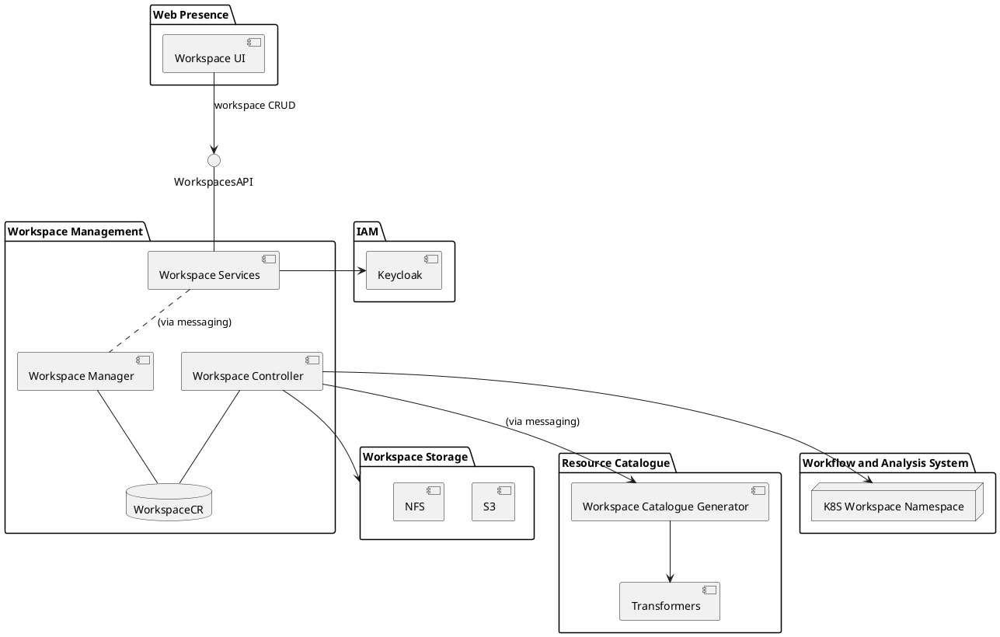

### 3.2 Workspaces and Accounts

#### 3.2.1 Workspaces Concept

From a user’s point-of-view, a Workspace is a container which contains everything they and their close collaborators ‘own’ within the hub. Members of a Workspace have equal access to everything contained within it, as does processing which runs within it. Workspaces may also publish some resources to a wider audience in which case they are published under the name of the Workspace. 

Workspaces are not a component that can be found within the system but rather the current Workspace is context that most components in the system must be aware. What a Workspace can contain is an extensible concept which currently includes 

- allocations of block and object storage, 
- a sub-Catalog in the system’s STAC Catalog (usually API endpoints under `/api/catalogue/stac/catalogs/user/catalogs/\<workspace-name\>`), 
- a collection of workflow definitions and the results of past execution, 
- currently executing notebooks and workflows, 
- links to commercial data provider accounts which the Workspace can use, - applications 
- a DNS subdomain. 

Workspaces may be intended to only ever have a single member, making it a so-called ‘personal workspace’, in which case the workspace typically has the same name or a similar name as the user. Alternatively, it may have multiple members, making it a ‘group workspace’. There is no technical difference between the two. 

A user with an active Account (see below) can create new Workspaces and choose a name. This name must be a valid DNS name component and be unique within EODH. This name is used widely within the system for DNS names, Kubernetes resource names, AWS resource names, subdirectories and in URL paths. 

Workspaces can also be created as part of the system deployment itself. These system workspaces are not inherently different to personal or group workspaces and can be used for hosting ‘official’ catalogue entries and data, for running system workflows such as commercial data ordering workflows and so on. One such workspace, called default\_workspace, is used for catalogue entries harvested or published by the platform itself, those outside the /api/catalogue/stac/catalogs/user sub-Catalog and accessible to all users. 

#### 3.2.2 Accounts and Billing Concepts

Workspaces are also self-contained units for billing. Any resource consumption which must be accounted for happens in a single specific Workspace and any charge incurred can be traced to a single Workspace. 

Users are not required to set up a billing arrangement individually for each Workspace. Instead, users may create one or more Accounts (or ‘Billing Accounts’ where there is ambiguity with ‘User Account’) which represent an agreement between the EODH operator and a customer that the customer may have access to EODH resources, typically with an obligation for a particular organization to pay. This requires a request by the prospective customer via the EODH website followed by an approval (or denial) by an EODH operator. 

Once approved, the requesting user will be the account contact (or ‘owner’) for the new Account, enabling that user to create Workspaces inside the Account, to manage the members of the Workspace and to link the Workspace to commercial data accounts. 

The EODH operator is responsible for calculating and issuing invoices and carrying out any payment processes. EODH can report resource use by Workspaces and Accounts but, in current versions, does not track payments or account balances, process payments or perform credit control. 

#### 3.2.3 Workspace and Account Management Implementation

**Figure 3-3 Detail: Workspace Management Components**

Workspace management is implemented across several services within the Workflow and Analysis System. The Workspace Services service 

- provides the public API for managing workspaces, 
- is the authoritative store of the desired state of workspace settings, 
- creates groups in Keycloak which define workspace members, 
- produces a Pulsar event stream of workspace settings which any other part of the system can read, 
- consumes a Pulsar event stream of actual workspace state produced by the Workspace Manager and caches this to serve from the API. 

The Workspace Manager creates and monitors custom Kubernetes ‘Workspace’ resources, aligning their specification to the stream of desired workspace settings and sending its state information as the stream of actual workspace state. 

The Workspace Controller is a Kubernetes controller and follows the usual controller pattern for Kubernetes. This monitors the Workspace customer Kubernetes resources and turns them into more basic Kubernetes resources, including 

- the Workspace names, within which Notebooks and Workflows run, 
- resources defined by ACK (Amazon Controller for Kubernetes) which create S3 and EFS resources in AWS itself, 
- service accounts and other related Kubernetes configuration. 

It also sends messages to another service, the Workspace Catalogue Generator, which creates the skeleton catalogue entries that each Workspace begins with.
