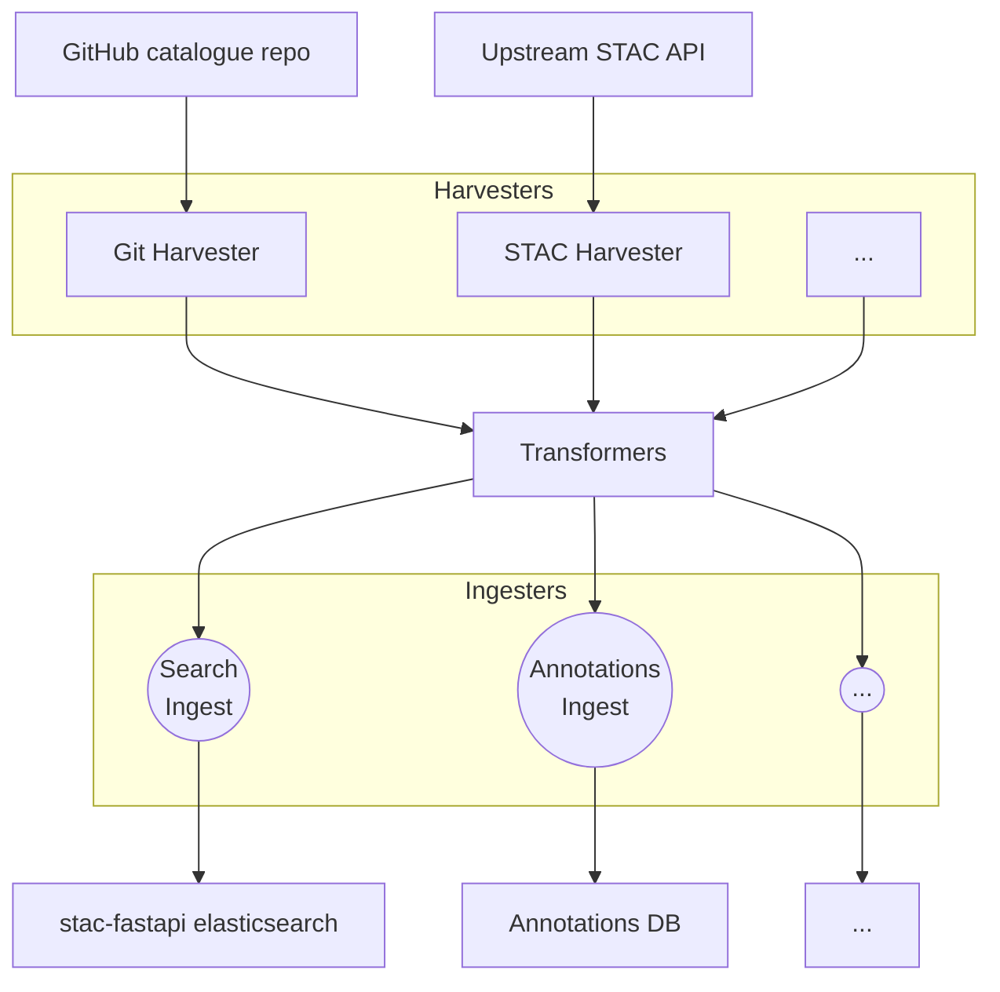
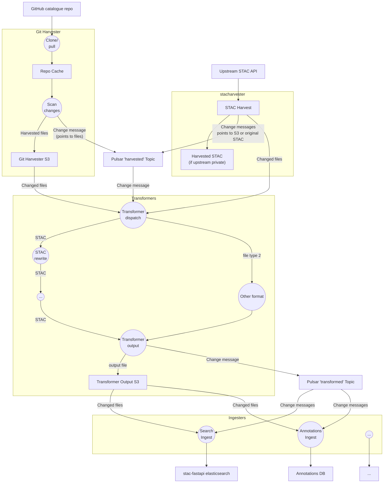
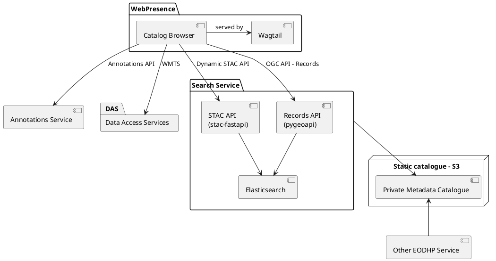
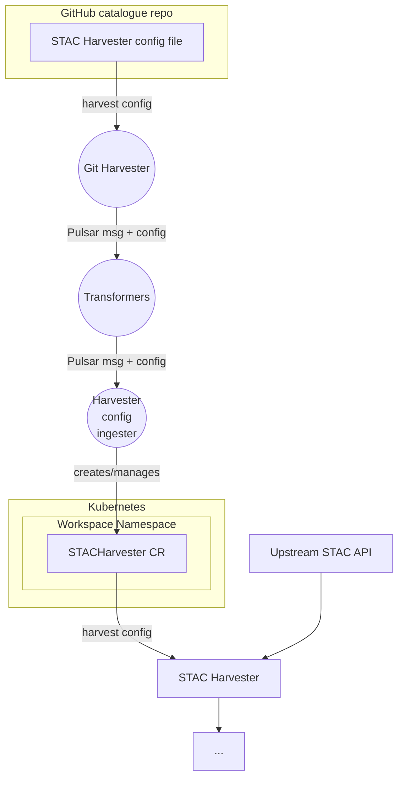

Overview diagram:

More detailed diagram:

### Services

### STAC Harvester configuration ingest

This configures persistent 'harvesters' into the system based on a configuration file in Git. The configuration is stored persistently in the form of a Kubernetes custom resource, STACHarvester.

