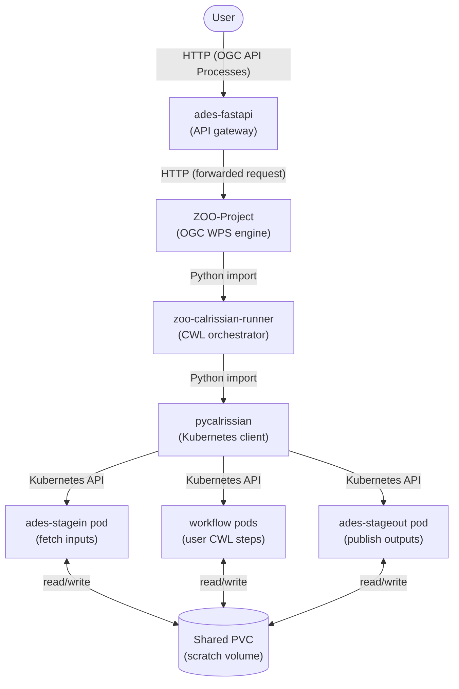

# Workflow Execution Internals

Explains the code-level component relationships that implement workflow execution — from the user's API call down to the Kubernetes pods that run the CWL steps.

**Architecture:** [Workflow Runner](../../architecture/architectural-design/workflow-runner.md) — the system-level view of this component.

**Reference:** [Workflow Runner service](../../reference/services/workflow-runner.md)

---

## Component stack

Six repositories contribute to every workflow execution. They form a strict call chain:



---

## What each component does

### ades-fastapi — API gateway

Sits in front of ZOO-Project and handles concerns that are EODH-specific rather than OGC-standard:

- Validates Bearer tokens (Keycloak).
- Checks OPA policy to determine whether the caller may execute the requested workflow.
- Resolves the calling, execution, and publishing workspace for each request (see [Workflow Runner §3.8.1](../../architecture/architectural-design/workflow-runner.md)).
- Forwards the request to ZOO-Project via its `ADESClient` HTTP client, enriching responses with workspace-scoped links.

### ZOO-Project — OGC WPS engine

The core OGC API Processes server. It:

- Manages the deploy/undeploy/execute/job-status lifecycle for CWL processes.
- Persists job state.
- Loads `zoo-calrissian-runner` as a Python plugin at execution time and delegates to it.
- Receives progress updates back from the runner via `zoo.update_status()`.

### zoo-calrissian-runner — CWL orchestrator

A Python library that ZOO-Project imports. Its `ZooCalrissianRunner.execute()` method:

1. Calls `pre_execution_hook()` (token injection, workspace config).
2. Wraps the user's CWL using `cwl_wrapper` — see [CWL wrapping](#cwl-wrapping) below.
3. Builds a `CalrissianContext` and calls `session.initialise()` to create the Kubernetes namespace.
4. Builds a `CalrissianJob` with the wrapped CWL and execution parameters.
5. Submits and monitors via `CalrissianExecution`.
6. Retrieves outputs, logs, and a resource-usage report from the shared volume.
7. Calls `post_execution_hook()` and `session.dispose()` to clean up the namespace.

### pycalrissian — Kubernetes client

A Python library used only by `zoo-calrissian-runner`. It owns all direct interaction with the Kubernetes API through three classes:

| Class | Responsibility |
|-------|---------------|
| `CalrissianContext` | Creates and owns the job's Kubernetes namespace: RBAC roles and bindings, the shared RWX PersistentVolume and PersistentVolumeClaim, ConfigMaps, image-pull secrets, and resource quotas. `dispose()` tears all of this down. |
| `CalrissianJob` | Builds the Kubernetes `Job` manifest. Mounts the wrapped CWL and parameter dictionaries as ConfigMaps. Sets resource limits (`max_cores`, `max_ram`). Configures the Calrissian container as the Job's main container. |
| `CalrissianExecution` | Submits the Job via `BatchV1Api`, polls status, and reads `output.json`, `report.json`, and container logs back from the shared volume once the Job completes. |

---

## CWL wrapping

The user's CWL workflow is never submitted to Calrissian as-is. `zoo-calrissian-runner` uses its `cwl_wrapper.Parser` to inject two extra steps around it before building the `CalrissianJob`:

```
stagein.yaml          ← injected by zoo-calrissian-runner
      ↓
maincwl.yaml          ← the user's original CWL workflow
      ↓
stageout.yaml         ← injected by zoo-calrissian-runner
```

The injected steps reference CWL template files whose paths are provided via environment variables (`WRAPPER_STAGE_IN`, `WRAPPER_STAGE_OUT`, `WRAPPER_MAIN`). Each template resolves to a CWL `CommandLineTool` that runs either the `ades-stagein` or `ades-stageout` container image.

---

## The shared PVC

The three pod types do not communicate directly. Instead they share a single RWX PersistentVolumeClaim created by `CalrissianContext.initialise()`:

- **Stage-in** writes a `catalog.json` (STAC Catalog) to the volume after downloading input assets from S3 or HTTP.
- **Workflow pods** read inputs from the volume and write output STAC items and any derived files back to it.
- **Stage-out** reads the workflow output STAC from the volume, uploads assets to the workspace object store, rewrites asset `href` fields to point at the new S3 location, and emits a Pulsar message to trigger catalogue harvesting.

`CalrissianExecution.get_output()` and `get_usage_report()` also read from this volume after execution ends, before `session.dispose()` removes it.

---

## Repository cross-reference

| Repository | Component |
|------------|-----------|
| `ades-fastapi` | Workflow API / gateway |
| `ZOO-Project` | ADES / OGC WPS engine |
| `zoo-calrissian-runner` | CWL orchestrator; ZOO → Calrissian bridge |
| `pycalrissian` | Kubernetes client (`CalrissianContext`, `CalrissianJob`, `CalrissianExecution`) |
| `ades-stagein` | Stage-in container image; fetches input STAC items onto PVC |
| `ades-stageout` | Stage-out container image; publishes PVC outputs to workspace S3 |
