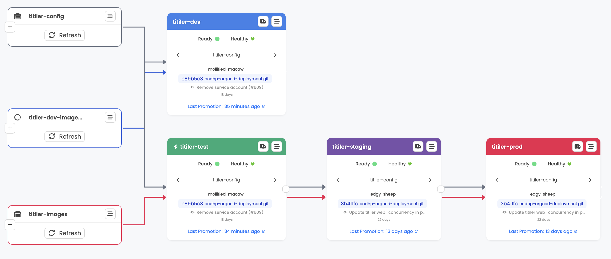

# Kargo and Argo CD — design on EO Data Hub

Understanding how **Kargo** and **Argo CD** integrate in **eodhp-argocd-deployment**, how artefacts flow through warehouses and stages, and what the shared `promote` task does — before changing apps or pipelines.

**Operational guide:** **[Kargo developer guide](../../how-to/kubernetes-gitops/kargo-developer-guide.md)** — quick deployments, onboarding apps, overlays.

**Branching conventions:** **[GitOps branching and Kargo promotion](gitops-branching-and-kargo-promotion.md)**.

## How Kargo and Argo CD fit together

### What each tool does

**Argo CD** is the GitOps deployment engine. It continuously syncs Kubernetes clusters to the desired state stored in Git. Argo CD handles rendering manifests (via Kustomize, Helm, or plugins like our `kustomize-gomplate` ConfigManagementPlugin) and applying them to the cluster. It monitors application health and detects drift from the declared state.

**Kargo** is the continuous promotion engine. It watches for new artifacts (container images, Helm charts, git commits, release tags), bundles them into immutable **Freight**, and orchestrates their movement through a pipeline of environments. Kargo updates Git -- the source of truth that Argo CD reads -- rather than applying anything to clusters directly.

**Key distinction:** Argo CD deploys what's in Git. Kargo decides *what goes into Git* and *when*.

### Kargo core concepts

| Concept | Description |
|---------|-------------|
| **Project** | Top-level grouping of all Kargo resources (one project per team/platform) |
| **Warehouse** | Watches one or more artifact sources and creates **Freight** when something new appears |
| **Freight** | An immutable bundle of artifact versions (image tags, chart versions, git commits) |
| **Stage** | Represents a deployment target environment; receives freight via promotion |
| **Promotion** | The act of moving a piece of freight into a stage |
| **PromotionTask** | A reusable sequence of steps that a promotion executes (git clone, image update, kustomize build, push, etc.) |
| **ProjectConfig** | Per-project settings: auto-promotion policies, webhook receivers |

---

### How they integrate in this repo

The integration works through four mechanisms:

1. **Argo CD ApplicationSet discovers apps.** The root ApplicationSet (`eodhp/base/apps.yaml`) uses a git directory generator with the pattern `apps/*/envs/<env>` to discover all applications for each environment.

2. **Each Application reads from a Kargo-managed branch.** Per-environment patches (in `eodhp/envs/<env>/kustomization.yaml`) set `targetRevision` to `kargo/{{app}}/<env>`. This means Argo CD reads pre-built manifests from a branch that Kargo writes to during promotions. The exception is **bootstrap** mode, where Argo CD reads from `main` directly until Kargo has created these branches (see [Platform deployment](../../how-to/deployments/platform-deployment.md)).

3. **Kargo is authorized to trigger syncs.** Each Application is annotated with `kargo.akuity.io/authorized-stage: "eodhp:{{app}}-<env>"`, which allows the Kargo stage to force an Argo CD sync after pushing new manifests.

4. **The `kustomize-gomplate` plugin renders final manifests.** Argo CD uses this ConfigManagementPlugin to run gomplate substitution on the pre-built manifests, replacing `${[.vars.*]}` placeholders with environment-specific values from `vars.yaml`.

### The promotion-to-deploy flow

End-to-end, a promotion flows through these systems:

1. A **Warehouse** detects a new artifact (image tag, chart version, git commit, release tag) and creates a **Freight** bundle
2. The Freight is promoted to a **Stage** (auto-promoted for test, manual for staging/prod)
3. The Stage runs the shared **PromotionTask** (`promote`), which:
   - Clones the deployment repo and checks out the target branch
   - Updates image references, chart versions, and/or release URLs in the source
   - Runs `kustomize build` to produce final manifests
   - Pushes the built manifests to the `kargo/<app>/<env>` branch
   - Calls `argocd-update` to force Argo CD to sync
4. **Argo CD** detects the new commit on the `kargo/<app>/<env>` branch, runs the `kustomize-gomplate` plugin to substitute environment variables, and applies the manifests to the cluster
5. **Kargo** monitors the Argo CD Application's health status to determine whether the Stage promotion succeeded

```
Warehouse ──detects──> Freight ──promotes──> Stage
                                               │
                                  PromotionTask runs:
                                  1. git-clone
                                  2. update images/charts
                                  3. kustomize-build
                                  4. git-push to kargo/<app>/<env>
                                  5. argocd-update
                                               │
                                               ▼
                                    Argo CD Application
                                  (reads kargo/<app>/<env> branch)
                                               │
                                  kustomize-gomplate plugin:
                                  gomplate renders vars.yaml
                                               │
                                               ▼
                                     Kubernetes Cluster
```

### Further reading

- [Argo CD integration guide](https://docs.kargo.io/user-guide/how-to-guides/argo-cd-integration/)
- [argocd-update step reference](https://docs.kargo.io/user-guide/reference-docs/promotion-steps/argocd-update/)

---

## EO Data Hub Kargo topology (`apps/kargo/`)

We run Kargo in a **hub-and-spoke** model across three clusters.

### Hub: prod cluster

- Runs the full Kargo **API server** (2 replicas) and **management controller**
- Hosts the Kargo UI at [kargo.eodatahub.org.uk](https://kargo.eodatahub.org.uk) (authenticated via Keycloak OIDC with admin role)
- Shard name: `prod-shard`

### Controllers: test and staging clusters

Each remote cluster runs only a lightweight Kargo **shard controller** -- no API, no webhooks, no UI.

| Cluster | Shard name |
|---------|-----------|
| test | `test-shard` |
| staging | `staging-shard` |

Remote controllers authenticate back to the prod cluster using ServiceAccount tokens stored as ExternalSecrets (pulled from AWS Secrets Manager). The base layer at `apps/kargo/base/controller-auth/` creates two ServiceAccounts (`kargo-controller-test`, `kargo-controller-staging`) with matching token secrets and a ClusterRoleBinding to `kargo-controller`.

### Directory layout

```
apps/kargo/
  base/
    kustomization.yaml          # namespace: kargo, sync-wave: -15
    values.yaml                 # shared Helm values
    controller-auth/            # ServiceAccounts, tokens, ClusterRoleBinding
  envs/           kargo-chart.yaml + values.yaml + prod-kubeconfig-secret.yaml
    test/         "
    staging/      "
    prod/         "  + secrets.yaml (admin creds ExternalSecret)
```

---

## The EODHP Kargo Helm project (`apps/kargo-eodhp-project/`)

This is a **data-driven Helm chart** that generates all Kargo resources for every application from a single `values.yaml`.

### Directory layout

```
apps/kargo-eodhp-project/
  base/
    Chart.yaml
    kustomization.yaml
    kargo-eodhp-project-chart.yaml   # HelmChartInflationGenerator
    values.yaml                       # <-- all app definitions live here
    templates/
      project.yaml            # Project, ProjectConfig, webhook ExternalSecret
      warehouses.yaml         # Warehouse resources (config, images, dev-images, releases)
      stages.yaml             # Stage resources (test, staging, prod, dev)
      promotiontasks.yaml     # The shared "promote" PromotionTask
      credentials-rbac.yaml   # Role + RoleBindings for credential access
      git-credentials.yaml    # ExternalSecret for git SSH key
      user-rbac.yaml          # ServiceAccount + RBAC for the kargo-developer group
      slack-webhook-secret.yaml # ExternalSecret for Slack notifications
  envs/
    prod/
      kustomization.yaml      # simple overlay: resources: [../../base]
```

The chart is rendered by Kustomize's `HelmChartInflationGenerator` and only deployed to the **prod** cluster (`stages: [prod]` in its own values entry).

### What each template generates

| Template | Resources | Purpose |
|----------|-----------|---------|
| `project.yaml` | Project, ProjectConfig, ExternalSecret | Creates the `eodhp` project with auto-promotion policies and GitHub webhook receiver |
| `warehouses.yaml` | Warehouse (up to 4 per app) | Watches git, images, charts, and releases |
| `stages.yaml` | Stage (per app per env) | Defines the promotion pipeline |
| `promotiontasks.yaml` | PromotionTask (`promote`) | Shared promotion steps for all apps |
| `credentials-rbac.yaml` | Role, RoleBindings | Lets remote shard controllers read secrets in the `eodhp` namespace |
| `git-credentials.yaml` | ExternalSecret | SSH key for Kargo to push to the deployment repo |
| `user-rbac.yaml` | ServiceAccount, Role, RoleBindings | RBAC for the global `kargo-developer` group (binds `kargo-promoter` plus an extra role for warehouse refresh and freight creation) |
| `slack-webhook-secret.yaml` | ExternalSecret | Slack webhook URL for promotion notifications (created when `slackNotifications: true`) |

---

## Warehouses

For each application in `values.yaml`, the chart generates up to four warehouses:

### `<app>-config` (always created)

Watches the git repository for changes under the application's path and the shared environment variables.

- **Subscription:** git, branch `main`
- **Include paths:** `glob:<app-path>/**` and `glob:eodhp/envs/*/vars.yaml`
- **Interval:** 24 hours (also triggered by GitHub webhooks)

### `<app>-images` (created when `images` or `charts` are defined)

Watches container image registries and Helm chart repositories for new semver versions.

- **Image subscriptions** use `constraint` for semver filtering (e.g. `>=0.5.3`)
- **Chart subscriptions** use `semverConstraint` for version range filtering
- Default `discoveryLimit: 5`

### `<app>-dev-images` (created when any image has `enableDevTags: true`)

Watches the same image repos but configured for dev/feature branch images.

- **`freightCreationPolicy: Manual`** -- freight is never auto-created; you must manually create it in the UI
- Images with `enableDevTags: true` use `imageSelectionStrategy: NewestBuild` and `discoveryLimit: 20`
- Images without `enableDevTags` keep their normal constraints (they still need to be selected when creating freight)
- Charts are included with their normal constraints

### `<app>-releases` (created when `releases` are defined)

Watches GitHub repositories for new semver release tags.

- **Subscription:** git with `commitSelectionStrategy: SemVer`
- Uses `semverConstraint` from the `constraint` field
- Default `discoveryLimit: 5`

---

## Stages and promotion pipeline

### Main pipeline

```
<app>-test  -->  <app>-staging  -->  <app>-prod
```

Each stage is linked to the previous via `requestedFreight.sources.stages`. The first stage in the chain uses `sources.direct: true` (takes freight directly from warehouses).

**Auto-promotion policy** (defined in `ProjectConfig`):

| Stage pattern | Auto-promote? |
|---------------|--------------|
| `*-test` | Yes |
| `*-staging` | No (manual) |
| `*-prod` | No (manual) |
| `*-dev` | No (manual) |

### Dev pipeline

```
<app>-dev  (separate, targets only the test environment)
```

- Only created for apps that have images with `enableDevTags: true`
- Takes freight **directly** from `<app>-config` and `<app>-dev-images` warehouses (not promoted through the main pipeline)
- Sets `isDevStage: "true"` which skips chart version updates, release URL updates, and the `argocd-update` step
- Uses `targetEnv: test` -- the promotion writes to the test environment overlay on a `kargo/<app>/test` branch



### Custom stages

If an app defines a `stages` list (e.g. `stages: [prod]`), only those environments get stages. The promotion chain follows the order in the array. For example, `stages: [test, prod]` would create `<app>-test` (direct) promoting to `<app>-prod`, skipping staging.

### Argo CD integration

Each environment's ApplicationSet is configured to read from a specific git source:
- **test/staging/prod:** Argo CD reads from the `kargo/<app>/<env>` branch, which contains pre-built manifests pushed by the promotion task
- **dev:** there is no separate dev ApplicationSet — the dev stage promotion writes to the `kargo/<app>/test` branch (it targets the test env overlay), so the **test** ApplicationSet picks it up

---

## Shared PromotionTask (`promote`)

A single shared PromotionTask named `promote` runs for every stage. It receives variables from the stage template and executes these steps:

### Step 1: `git-clone`

Checks out the deployment repo at the config warehouse's commit into `./src`. Creates or checks out the target branch `kargo/<appName>/<env>` into `./out`.

### Step 2: `git-clear`

Clears the `./out` directory to ensure a clean build.

### Step 3: `kustomize-set-image` (alias: `update-images`)

Updates container image references in `./src/<appPath>/envs/<env>` using the standard Kustomize image transformer. This handles images specified in deployment manifests.

### Step 4: Chart version updates (conditional, per app/chart)

For each app that defines `charts`, a `yaml-update` step updates the `version` field in the `HelmChartInflationGenerator` file(s). Skipped for dev stages (`isDevStage == "true"`). Handles both `generatorFile` (single) and `generatorFiles` (multiple).

### Step 5: Custom image path updates (conditional, per app/image)

For images with `customPath` defined (e.g. Keycloak's `spec.image`, Jupyter's `hub.image.tag`), a `yaml-update` step writes the new image reference to the specified file and key. Supports two `valueType` modes:
- `tag` -- writes just the image tag (e.g. `4.2.0-0.2.1`)
- `full` (default) -- writes the full image reference (e.g. `public.ecr.aws/eodh/eodh-keycloak:26.0.4-0.2.5`)

### Step 6: Release URL updates (conditional, per app/release)

For apps with `releases`, a `yaml-update` step constructs and writes release URLs into kustomization files. The URL is built as `<urlPrefix><tag><urlSuffix>`. Skipped for dev stages.

### Step 7: `kustomize-build` (alias: `build`)

Builds the full manifests from `./src/<appPath>/envs/<env>` and writes them to `./out/<appPath>/envs/<env>/manifests.yaml`.

### Step 8: Copy support files

Copies `.gomplate.yaml` and the environment's `vars.yaml` into `./out` so that Argo CD's `kustomize-gomplate` plugin can run gomplate substitution on the pre-built manifests.

### Step 9: `git-commit` + `git-push`

Commits all changes to the `kargo/<appName>/<env>` branch. The commit message uses the output from the `update-images` step, falling back to "Updated configuration".

### Step 10: `argocd-update`

Triggers an Argo CD sync for the application. **Skipped for dev stages** (`isDevStage == "true"`).

---
