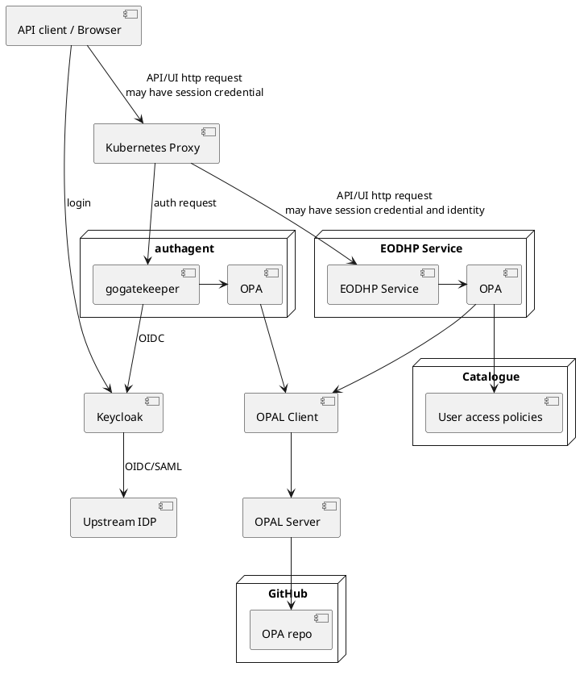
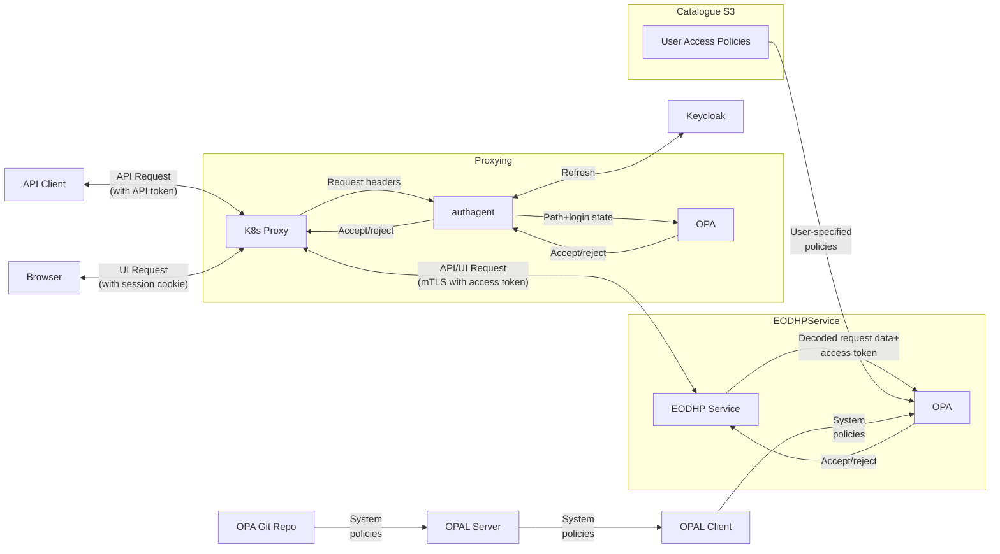
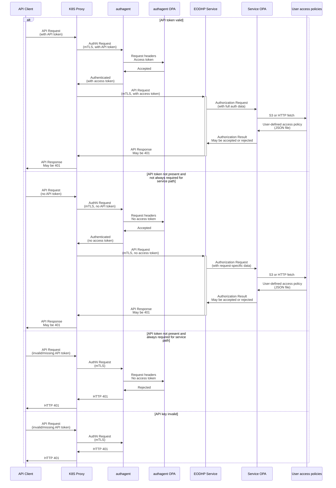
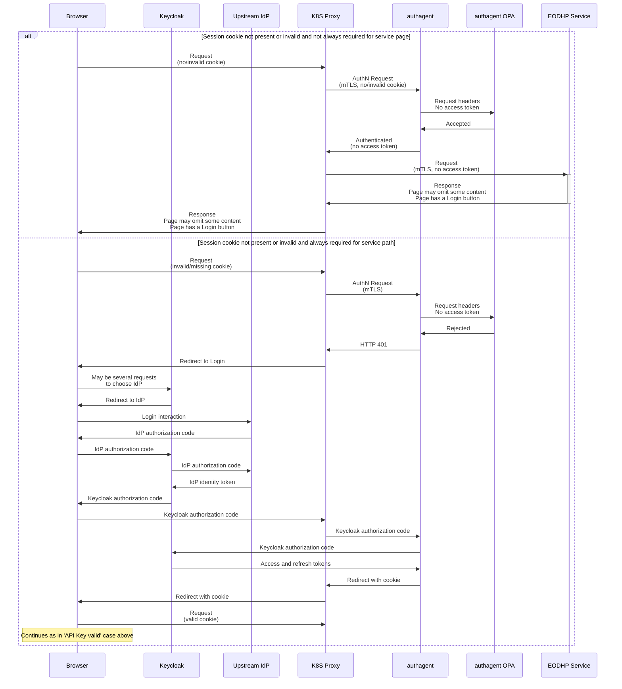
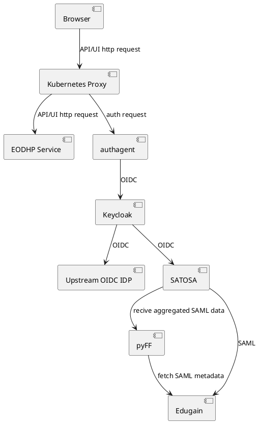

# IAM: Implementation Architecture Overview

# Overview

### Structure and Components

The mechanism for access control varies, for example between services running in the Kubernetes cluster and for download access directly to object stores. However, there are general patterns and common elements which are described here. The components are shown in this diagram (arrows indicate dependency):

User identities are maintained by Keycloak, which provides an OIDC service to the cluster and in turn acts as an OIDC and SAML client to upstream identity providers like GitHub and Edugain. Users must register with the platform using one of the upstream IdPs (and so be added to Keycloak) before they can use non-public parts of the it. Other system components do not interact directly with these upstream providers for IAM purposes. Keycloak also provides and validates access tokens when asked to do so by other parts of the platform, and provides claims such as user identity and group membership. These tokens and/or claims are used:
* when EODH services need to identify users and projects or to make authorization decisions,
* when EODH services (excluding those like notebooks running directly on behalf of a user) communicate internally, but only after a trust relationship has been established (eg, with mTLS or restricted-access Pulsar topics) so that the receiver can verify the sender's right to use the token,
* when platform users use an OAuth-based API as part of a '3-party' interaction, such as one where one platform user (eg, a human user) authorizes another platform user (eg, an app) to perform some interactions within a Project.

These tokens are used only indirectly in '2-party' interactions (see below), where '2-party' is used to mean an interaction directly between the hub user and hub (specifically, when the 'client' in OAuth terminology is provided and controlled by EODH or the end-user, rather than a third party).

Requests to EODHP Services arrive through the Kubernetes proxy and pre-authenticated and pre-authorized by authagent, which consists of GoGatekeeper and an OPA sidecar and policies. authagent then either allows the request to pass through to the service, rejects the request or requires a redirect to a Keycloak login page. authagent only authorizes based on limited request information, such as the path and user, and if necessary more fine-grained authorization (based on the decoded request and stored data) occurs when the request arrives at the target service. However, the authagent pre-authorization is always sufficient to detect when a browser-based request must be redirect for login. This means that other services do not need to be OIDC clients. After passing through the proxy layer, requests from authenticated users will always have a Keycloak token attached.

EODHP Services will also have their own OPA sidecars and policies for more fine-grained authorization, such as checking that this particular user can access this particular workflow. Services performing authorization will use the user identity, scopes and claims in request headers and/or retrieved from Keycloak's userinfo endpoint, request-specific information such as the target workflow decoded from the request, and any relevant user-specified authorization policies fetched from the catalogue - the first two will be provided to OPA by the service whereas the authorization policies can be fetched by the policies themselves from Rego (either with `http.send` or with an extension). OPA, running locally within services written in Go or as a sidecar for other languages, will then evaluate a policy and return an authorization decision. 

Authorization policies are distributed from a central points but their evaluation and enforcement is performed (primarily) at the target service of a request using an OPA sidecar. System-managed authorization policy is stored in the OPA Repo in GitHub and so provided centrally in the form of OPA Rego. It's then distributed using OPAL to the services which require it. However, users will also provide authorization policies, for example to limit access to their data or workflows. This will be in a simpler form, such as lists of permitted groups and users, and made available to EODHP services using a private object store managed by the catalogue. This simpler form is intended to be easier for users to write and easier to translate into UIs and error messages. Services obtain this information by directly fetching it from the object store.

For 2-party browser-based access, users will log in using Keycloak and their upstream IdP and be issued a cookie containing an encrypted access token by authagent (earlier versions of this document specified a session cookie with authagent storing the access token - this behaviour varies between underlying tool choices (GoGatekeepr vs oauth2-proxy, for example) and is not intended to be relied upon outside authagent in case it changes due to a change in tool choice or a problem with cookie sizes). Authagent will store and refresh the access token from Keycloak. GoGatekeeper will also add various headers to the request before it is forwarded to the underlying service, including the access token and claims about the user.

For 2-party API access, an offline access (refresh) token issued by Keycloak is provided to the user, described as an API token (and which could be provided encrypted using GoGatekeeper's token encryption key - this prevents it from being used with an internal API not meant to be called directly by users). When inbound requests pass through the proxy layer authagent will obtain and maintain the necessary access token, attaching it to the forwarded request. This provides a simpler interface for non-developer users compared to requiring them to follow a client credentials grant followed by token refreshes. This requires extending GoGatekeeper.

Note that the primary security purpose of refresh tokens in OAuth is to enforce a three-way binding between tokens, end-user identity and client identity, but this is not relevant in the 2-party case where there is no separate client identity. For this reason there is no or little security benefit to exposing the token refresh mechanism to users in this case.

In 3-party application access, a hub user ('end user' in OAuth2 terms) authorizes an application ('client') provided by a third-party to access the first hub user's resources in the hub. The third-party must also have an EODH account and the process uses the usual OAuth2 (and optionally OIDC) flows. In a typical use this allows the application to access the user's data stored and to run application-provided user services in the hub with the user being billed for them via EODH billing. A variety of other scenarios are also supported. This is described below in 'Application Integration'.

Native applications or scripts acting as API clients may sometimes be able to choose between 2-party and 3-party access. User-written scripts which run unattended are likely to use API tokens, but an interactive OGC services client could launch a browser and request an interactive login.
### Dynamic Structure - the Steps in a Typical Interaction

The data flow for the typical 2-party case with valid session credentials is shown in this data flow diagram:

This data flow diagram shows the data flow in a 2-party case in which:
* An API or UI user with a valid credential (API token or cookie) makes a call to an EODHP API running in the Kubernetes cluster, such as the workflow or catalogue APIs.
* The request goes first to the Kubernetes proxy, nginx, which first forwards the request headers to authagent.
* Authagent:
	* Authenticates the session by checking that the token or session is still valid.
	* Authorizes passing the request to the main service by querying OPA. This is not necessarily a complete authorization (it does not have full request information) but will be enough to detect if a login is required but not present.
	* Refreshes the session's access token, if necessary.
	* Returns a success response to nginx, including the access token and claims in headers.
* The proxy forwards the request to the underlying service in Kubernetes with the access token and claims included and the original credential removed.
* The service decodes the request and does any final authorization using its OPA sidecar. This may be based on information decoded from the request (like workflow identities). OPA does this using a system policy (the Rego that it will execute), and this Rego may use connect to a catalogue bucket containing user-provided access policies in order to do this. An example of a user-provided access policy would be a list of the groups allowed to run a workflow.
* The service processes the request and returns a response back through the proxy.

This is also shown as the first case in the interaction diagram below, which shows an API request for various cases of valid, invalid, optional and required API token authentication:

Where a browser is used and the browser already has a valid cookie the interaction is identical to that above (the cookie replaces the API key). Where a browser is calling API endpoints, for example from JavaScript, the interaction is identical in the other cases as well. For requests for pages where there is no valid cookie, the cases are shown below (service OPA step is omitted to reduce the size of the diagram but still occurs):

## Relationship to EOEPCA

The planned EOEPCA IAM architecture uses similar foundations to that here, particularly including Keycloak and OPA, enforcement of coarse-grained authorization during ingress and more fine-grained authorization once requests reach individual services. However, the new EOEPCA IAM framework will not be available until the autumn of 2024 and so is not available for integration as part of EODHP.

# Keycloak

Keycloak is used for identity federation and is the IdP to internal services, ie it's an OIDC provider available to the rest of the EODHP, brokering user identities from multiple upstream IdPs. Upstream IdPs may be OIDC, SAML (Edugain, but see below) or sometimes OAuth2 (GitHub).

We use a Keycloak identity (which may be linked to multiple federated identities) to identify users internally. The users, groups and roles in the [Model for Identities and Projects](./model-for-identities-and-projects.md) are implemented as Keycloak users, groups and roles and user account data with cluster-wide relevance is kept in Keycloak. Keycloak can also be used for manual management of user permissions, particularly for permissions used by service administrators.

In order to support Edugain, a SAML-based federation of federations of multiple thousand identity providers, Keycloak will also be a relying party on SATOSA. pyFF (Python federation feeder) will then be used to aggregate the Edugain providers' SAML metadata in order to maintain SATOSA's knowledge of the Edugain IdPs. Proxying identity via SATOSA is required for this case because, although Keycloak supports SAML, Keycloak is not able to effectively register and manage the thousands of Edugain SAML entities or to discover the frequent changes which occur in a federation of this size. SATOSA and pyFF are used and maintained by Edugain users and should have better interoperability with it.

Keycloak provides registration and login functionality. It's also used to issue identity tokens containing group and role claims which can be validated by other services in the cluster.

Unlike the default for EOEPCA, the authorization services in Keycloak are not used. There are two primary reasons reasons for this choice:
* There are numerous reports of poor performance with Keycloak authorization. OPA, by comparison, can operate in a distributed and low-latency manner.
* Keycloak expects authorization policy to be entered using its user interface, permitting either a limited range of methods to express policies or requires a JavaScript policy to be built into a JAR file installed on the Keycloak server. Using OPA provides a standardized way to express policies and more options for distributing it.

# Browser-based Access

Requests from outside to services inside the Kubernetes cluster pass through nginx which performs access control using its 'auth_request' functionality. This passes the request to a authN/authZ agent, here called authagent, and only forwards the request to the underlying service if it is accepted. authagent will consist of GoGatekeeper with an OPA sidecar.

authagent uses a simple mapping from paths and hosts to OPA policies and evaluates a policy against each request. Requests are either allowed, denied or redirected to Keycloak for login (authagent is an OIDC client/relying party to Keycloak). Redirect to login occurs when there is no current valid authentication, the request is to an endpoint designed for browser use and the OPA policy denies authorization.

The OPA policies only authorize requests to be passed to the upstream server - there may be cases when this is not a complete authorization. Examples of this are when the denial must be returned to the client using a particular pre-determined standardized API, if insufficient information for a complete decision is available to authagent or if a user interface needs to display a 'request access' box. Internal service endpoints must re-check policies in any case to ensure they're enforced when requests are made within the cluster using internal hostnames. The OPA policy here is typically specific to the target service but can be managed centrally and distributed to both service and authagent using OPAL.

Upon login authagent issues a cookie containing an encrypted access token which is used for ongoing authentication for browser-based requests and stores the refresh tokens. authagent will modify authenticated requests before they reach the upstream service by adding an unencrypted access token and decoded claims in custom headers. This mechanism and the choice of GoGatekeeper is intended to be replaceable, for example if the access tokens become too large. Another underlying tool could be used, such as oauth2-proxy which uses a random session cookie and stores the access token, or GoGatekeeper could be modified to use the same approach.

When requests arrive at services the service will validate the attached token - the presence of user code inside the cluster means that a relatively low-trust approach should be taken inside it. The service must then perform its own authorization but need only accept or deny, services will not perform redirects for browser-based login and will not be OIDC clients to Keycloak. This authorization can take into account the decoded request, information stored by the service such as the configured resources and access policies provided by users and stored in the catalogue. It can also use the claims and scopes in the access token and, if those claims are not sufficient, use the Keycloak userinfo API endpoint to fetch additional claims.

This authorization may also be via OPA, although more information may be available to the policy or a different (more specific) policy may be chosen compared to the policy used during ingress. This could happen when, for example, the specific target workflow in a WPS request is not known until it's decoded. This policy is likely to be written in a service-specific way and could, for example, check Project members, compare groups in an access policy to those in the token, etc. In other cases it may be a service-specific authorization mechanism in place of OPA, particularly for third-party software like Wagtail's content editing interface which has its own existing authorization system.

# External API-based Access

For API endpoints, an API token (an offline access token from Keycloak presented to the user through the web presence) can be used by the user. These can be created with limited scope and with an expiry date and included in the request as a bearer token. They could also be encrypted using GoGatekeeper's token encryption key to reduce the risk of them being misused if a user gains access to an internal API endpoint. authagent will need to recognize and validate these keys, swapping them for a header containing the same content - an access token - as is used for browser-based access. As offline access tokens are a type of refresh token, authagent must use Keycloak to maintain a valid access token, refreshing it when it expires.

This provides a familiar and simple mechanism for API users using 2-party access who do not need to use any API endpoints other than the one which provides the service they're using, nor do they need to periodically refresh a short-lived token.

API endpoints will also accept browser cookies as described above for browser-based access. This allows client-side scripting to use the APIs. An additional anti-CSRF token is also required, which can be added by authagent as a cookie and must be returned by the client-side scripts in a custom header (non-API endpoints must provide their own CSRF protection as, for example, Django and Wagtail do).

For 3-party access, as described in Application Integration, the API caller is a third-party that has registered as an OAuth client with the platform. Unlike the 2-party access case, such clients must use the refresh token directly to obtain an access token and must implement and participate in the OAuth flows. These will provide the OAuth access token as a bearer token which authagent will validate with Keycloak on each request by calling its userinfo endpoint. Before forwarding the request, authagent will add claims to custom headers so that the request is compatible with other requests. This allows the tokens to be opaque, preventing any information from leaking.

# External Access to Project Files

HTTP-based read-only access to files in Projects, whether published from another user's Project or access to a user's own Project, will be possible using the same cookie and API token-based authentication mechanisms described above. Access to public buckets will be possible in the same way without any authentication.

To ensure that access does not need to travel through the cluster and its proxies, CloudFront will be used in front of the S3 buckets. In the case of non-public buckets this requires the use of either Lambda@Edge or (less likely due to its millisend runtime restriction) CloudFront functions in order to authorize requests. These must fetch an OPA policy for their bucket and its paths from a trusted S3 bucket maintained by the workspace controllers, which will write generated OPA based on
Project configuration. For access to files in block storage the data must flow through the cluster network.

S3 access will be possible to public Project buckets and for access to private buckets when the user is a member of the Project. Two methods are possible within the architecture, with at least the first intended to be completed initially. In the first, Keycloak is linked to AWS as a federated identity provider, thus presenting EODH users to AWS as federated identities. These users can then obtain temporary AWS credentials for a Project-linked role using AWS's STS service (this same role is provided as a pod identity to notebook pods). These credentials can then be used for S3 access with S3 clients.

The second method is for a user to provide an AWS IAM principal ARN from their own AWS account which can then be granted access by configuring the bucket policies. This is particularly useful where the user is running their own service in AWS as it allows them to assign an instance or pod identity to their workload and avoid entirely having to manage credentials.

Access to Project files in block stores via sftp could also be supported, in which case an ssh public key would be added to the Project by its users. This could be done by the workspace controller fetching keys for each Project user from Keycloak custom attributes, with the web presence being used as an interface for managing this.

# Access from Projects

Projects contain services which run on behalf of users, including notebooks and workflows running user-originated code. These must access the API endpoints of the platform and its object stores, and they must do it without exiting the AWS VPC and incurring unnecessary data transfer, CloudFront or NAT charges. Where available, which should be at least where large transfers are expected, access to platform HTTP endpoints should also not cross availability zones (access directly to S3 does not incur cross-AZ transfer charges). This will involve serving different DNS responses inside the cluster to ensure this happens.

For access to platform services, Projects services (including user code in notebooks and workflows) will be provided with an API token from authagent, containing an offline access token. For notebooks and workflows this is a Kubernetes Secret mounted into the container. This can then be used in the same way as for external access.

S3 access requires AWS IAM credentials. For each Project there will be an AWS IAM role granted permissions to access Project object stores. These will be added to Project service pods as EKS pod identities. This results in credentials being mounted into the containers in a location which will be searched by default by S3 client tools.

Access to a Project's own block stores will be through the workspace controller mounting them to Project service pods. These mounts will use EFS access points and other AWS and Kubernetes functionality to limit access to certain UIDs/GIDs and roots within an underlying file system. This gives the appearance of having a private file system even if this is not the case underneath (due to AWS quotas on the number of file systems or, for file systems like Lustre, due to size allocations being possible only in large steps).

Project services in one Project can access files in other Projects providing the publishing Project has provided an access policy which allows this. Unlike requests from outside the platform, these requests should not travel through CloudFront due to the unnecessary data transfer charges this will incur. Instead, this access will be via an nginx proxy in front of the Project S3 stores (using a strategy similar to https://github.com/nginxinc/nginx-s3-gateway/) and in front of Project block stores. The OPA policy used for these URLs will come from the same trusted bucket as in the external access case.

# Intra-service Access

One service calling another on behalf of itself can authenticate in two ways: TLS client certificates issued by the cluster CA or by obtaining an access token for a specially created service identity from Keycloak. The latter case is most appropriate when a service also called directly by users is involved because the process of validating the token is similar for all callers.

If a service is calling on behalf of another user it should either forward the original user credentials in the request it received or use Keycloak impersonation from its own identity. It should preferably also supply a TLS client certificate in these cases as well.

Authorization is the same as for external browser-based and API-based access except that the application of OPA policies during ingress does not necessarily occur. This is one of the reasons services must reapply OPA on requests received. This access is never redirected to Keycloak for login so services do not need to be OIDC clients to Keycloak.

Communication using the messaging system should normally be used only where authorization has already occurred (so that unauthorized messages cannot be injected by users). Services must authenticate with the messaging system using mTLS and authorization of access to message topics should be restricted with Pulsar configuration.
# Authentication of Service Endpoints

So that callers can authenticate HTTP-based services they connect to, services within the cluster will use TLS with certificates signed by a cluster CA (and external URLs will use TLS certificates from Let's Encrypt).

# Application Integration

## Anticipated Integration Approaches

Applications are custom services provided by hub users to third-parties (who may themselves be hub users) called 'end users'. Several different methods of integration are anticipated:
* **Hub as computational back-end**: End users are not aware of EODH or vice versa.
* **Application as client only**: End users are also EODH users and authorize an application to use their EODH project.
* **Application as client and user service**: In addition to the previous case, the application provides a commercial user service and asks the end user for permission to call it.

### Hub as Computation Back-End

This is the simplest approach. The application provider provides a service to users, for example a SaaS service, which authenticates itself to EODH using a machine user within the application provider's project. This is no different to any other client calling EODH APIs. The application provider is responsible for registering, authenticating and if necessary billing end-users. Typically all access flows through the application provider's services, although some access may be direct, for example by providing pre-signed S3 URLs to end-users pointing to EODH object stores.

### Application as Client Only

In this scenario, the application is an OAuth and (optionally) OIDC client to EODH. The application may be a confidential or public client. The application provider must register as an OAuth client using the EODH UI or Keycloak client registration API. If the application is an OIDC client then end users log in using EODH and use their EODH identity within the application, otherwise they only authorize access to specific EODH resources like a Project store. 

This scenario could be used to read or write data, to provide services on top of user-provided data or to link EODH to other platforms. This could include native applications, such as a desktop application which launches a web browser to authenticate a user with EODH and obtain a token for API calls.

There's no mechanism for charging the end-user for use of the application and, if this is required, the application must do this independently.
### Application as Client and User Service

This scenario follows the Application as Client Only case but with the end-user being requested to authorize the application to call a user service published by the application provider. A user service is a workflow which executes in the application provider's project but which can be called by an unrelated user and project. This means that its resource use is billed to the application provider and the workflow steps can access the application provider's project stores, but the inputs and outputs to the workflow can come from the calling user/project's stores (and so the stage-out and stage-in steps, unlike the other workflow steps, are authorized to only access these stores). Since a user service can have pricing applied to it, the end-user's EODH account is then billed according to the application provider's pricing structure.

### Future Integration Option: AWS-Based

A potential future method of integration to be considered in the architecture is integration of applications running in other AWS accounts using AWS permissions and services. There are a variety of possible forms and levels of integration:
* A user or application provides an AWS IAM identity (ARN) to an EODH project and this ARN is granted access to the project object stores. This allows instance and pod identities to be used so that services running in the EODH user's AWS account can more easily and more securely access their EODH data.
* An EODH user grants their project EODH AWS IAM role access to stores in their own AWS account. EODH presents these as additional project stores, allowing the user to bring their own AWS storage to EODH.
* Integration with SNS and/or SQS so that an application can submit workflow executions and receive notifications. SNS and SQS further integrate with a variety of AWS services such as Lambdas and S3 (bucket notifications).

Note that data transfer charges are likely when data is transferred between the application and EODH, except when access is to S3. VPC peering with the application provider making a careful choice of availability zone may reduce these data transfer charges but would be relatively complex to set up. For this reason, this should only be explored if S3 access is not sufficient.

# Git Providers

Integrating with a Git service provider would allow EODHP to link repositories to Projects, integrating them with notebooks and harvesting in a better way than simply supplying ssh keys for Git access. This is done by creating an application (GitHub), plugin (GitLab) or similar and registering it with the service provider. Administrators of the account with the Git service then add the application to their organization/project in the Git provider, granting it access to enumerate and fetch repositories. When EODHP acts on its own behalf it can use credentials provided by the service provider when registering the app.

When EODHP acts on behalf of a Git users, for example to push changes made in a Notebook, it should Git credentials provided by or to the user (most likely ssh keys) and associated with the user's own account at the Git provider.

# Data Streams

The contents of this section will depend on the licence and billing model adopted. Bring-your-own licence (authorizing the use of a licence held at the data provider within the platform) may be very different to a model in which the platform bills the user for access to commercial data and then pays the data provider. For now, bring-your-own licence is considered the most likely case.

One possibility is:

- Users could use OAuth2 to authorize EODHP's use of a licence or account held at a data stream server. EODHP would obtain an offline access token/long-lived refresh token or OAuth client credentials (for the client credentials flow) and save this into a store (potentially a Keycloak attribute or AWS Secret, or, if licences are attached to Projects, a Kubernetes secret in a Project namespace).
- When a user uses an EODHP service which uses the licence then the service fetches the refresh token, obtains an access token and then uses this for data access. In cases where data is cached (eg, by a service providing an OGC API) the data stream may need to be notified of use for statistics or billing.
- When a user uses their own code in a Project service or workflow which requires the licence then the user uses an EODHP API and client library to request an access token. The refresh token itself is not provided.

This mechanism also works when the data is not commercial but access control is enforced by the data stream.

# Authorization in some Specific Services

## Catalogue

Catalogue entries can be configured with access control based on group membership. It's expected that most access will be to either public entries or to private entries accessible only to users of a single Project so these cases should be optimized-for.

The dynamic catalogue must filter search results based on group membership, using group membership claims in the token presented to it. Where possible, queries to Elasticsearch should be constructed to exclude results which are private to a Project the user is not a member of in order to reduce the amount of filtering.

The catalogue also has a static catalogue in S3 containing private metadata for internal use, such as access policies. Access to these is allowed only for internal EODHP services (and not Project services) and uses AWS pod identities, with associated AWS IAM roles and policies for authorization.
## Wagtail

Wagtail will be connected to Keycloak so that platform identities can be used for content editing (providing a relevant role has been added to a user). However, fine-grained access permissions for editing content will be managed inside Wagtail using its own permission model.
