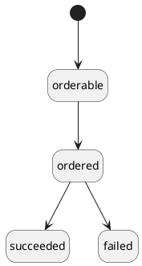

# Planet Adaptor

Reference for the Planet commercial data adaptor, which orders satellite imagery from the Planet Orders API and delivers it into an EO DataHub workspace. It runs as a short-lived Kubernetes pod orchestrated by a CWL workflow, and terminates after completing or failing each order batch.

**How-to:** [Test commercial data adaptor changes](../../how-to/data-and-catalogues/test-commercial-data-adaptor.md) · **Explanation:** [Commercial Data Purchasing Pipeline](../../explanation/architecture/commercial-data-purchasing.md)

## Execution Model

The CWL workflow (`planet.cwl`) wraps a single `CommandLineTool` step that pulls a Docker image and invokes `python -m planet_adaptor`. The CWL runner passes seven positional arguments and injects `CLUSTER_PREFIX` as an environment variable. The tool's output is the working directory (`.`), which contains the STAC records written during execution.

- **Container image:** `public.ecr.aws/eodh/planet-adaptor:0.1.8`
- **Source code:** [EO-DataHub/commercial-data-adaptors](https://github.com/EO-DataHub/commercial-data-adaptors)

## Inputs

| Parameter | Description |
|---|---|
| `workspace` | Workspace identifier within the platform |
| `workspace_bucket` | S3 bucket where workspace STAC records are stored |
| `commercial_data_bucket` | S3 bucket where Planet delivers order files |
| `pulsar_url` | Apache Pulsar broker URL for downstream event messaging |
| `cluster_prefix` | Platform environment prefix (injected as `CLUSTER_PREFIX`) |
| `product_bundle` | Named bundle controlling image processing: `Visual`, `General Use`, `Analytic`, or `Basic` |
| `coordinates` | Area of interest coordinates (JSON-stringified) |
| `stac_key` | Directory containing one or more STAC catalogs describing items to order |

## Processing Pipeline

For each STAC item found in the input catalogs, the adaptor executes the following steps in sequence, aborting the item and writing a failure record on any error:

1. **Authenticate** — Retrieves an OTP key from the Kubernetes Secret `otp-planet` in the workspace namespace, fetches the corresponding encrypted API key from AWS Secrets Manager (secret ID `ws-<workspace>-<CLUSTER_PREFIX>`, key `planet`), and decrypts it using XOR One-Time Pad. The plaintext key is passed to the Planet Python SDK as the API credential.

2. **Resolve product bundle** — Looks up the product bundle name(s) for the item's `item_type` (derived from `properties.item_type` in the STAC item) and the requested bundle category. Raises an error if either the item type or bundle name is not in the supported set.

3. **Check for existing order** — Queries the Planet Orders API for an existing order whose name matches `<item_id>-<workspace>`. If an order is in `queued` or `running` state, the adaptor fails immediately without consuming quota. If the order has already `succeeded`, the submission step is skipped and the existing order ID is reused.

4. **Retrieve S3 delivery credentials** — Reads a dedicated set of AWS credentials from Kubernetes Secrets in the `ws-planet` namespace (`planet-aws-access-key-id` and `planet-aws-secret-access-key`). These are distinct from the API authentication credentials and are passed to Planet to authorise direct delivery to the commercial data bucket.

5. **Submit order** — Uses the Planet Python SDK to POST an order to the Planet Orders API. The order specifies the item ID, item type, product bundle, delivery target (`planet/commercial-data/orders` prefix in the commercial data bucket), and — if coordinates are provided and the bundle supports it — an AOI clip tool. Basic PSScene bundles do not support clipping and request the full image. Bundles with a fallback (e.g. `analytic_8b_sr_udm2` falling back to `analytic_sr_udm2`) are specified using the SDK's `fallback_bundle` parameter. If a 400 error is returned and the item timestamp is less than 12 hours old, the error is surfaced as "assets not yet available" without consuming quota.

6. **Publish "ordered" status** — Updates the STAC item with `order:status = ordered` and `order:id`, writes it to two S3 paths in the workspace bucket (a raw path and a `transformed/catalogs/…` path), then sends a Pulsar message on the `transformed` topic to notify downstream catalog ingestion services.

7. **Poll S3 for delivery** — Polls the commercial data bucket for up to 24 hours (every 60 seconds) until Planet deposits a `manifest.json` file at `planet/commercial-data/orders/<order_id>/manifest.json`. The manifest's presence indicates the full order has been delivered.

8. **Download assets** — Downloads all files under the `planet/commercial-data/orders/<order_id>/` prefix from S3 into a local directory named after the order ID. Any `.zip` files are extracted in place and the archive removed.

9. **Publish "succeeded" status** — Walks the local order directory, classifies each file by regex into asset roles (manifest, metadata, UDM, primaryAsset), adds them to the STAC item's `assets` map with inferred MIME types, updates `order:status = succeeded`, and writes a local STAC catalog/collection/item bundle as the CWL output directory.

On failure at any step, the adaptor writes `order:status = failed` and an `order_failure_reason` string to the STAC record before exiting.

## STAC Order State Machine

State transitions use the [STAC Order extension](https://github.com/stac-extensions/order) fields (`order:status`, `order:id`, `order:date`):

## Product Bundles

Bundle names map to Planet bundle identifiers per item type. Where two names are listed, the second is a fallback used if the primary is unavailable.

### PSScene

| Bundle | Planet Bundle(s) | AOI Clipping |
|---|---|---|
| `Visual` | `visual` | yes |
| `General Use` | `analytic_8b_sr_udm2` / `analytic_sr_udm2` | yes |
| `Analytic` | `analytic_8b_sr_udm2` / `analytic_sr_udm2` | yes |
| `Basic` | `basic_analytic_8b_udm2` / `basic_analytic_udm2` | no |

### SkySatCollect

| Bundle | Planet Bundle | AOI Clipping |
|---|---|---|
| `Visual` | `visual` | yes |
| `General Use` | `pansharpened_udm2` | yes |
| `Analytic` | `analytic_sr_udm2` | yes |
| `Basic` | `analytic_udm2` | yes |

## Configuration — Kubernetes Secrets

Two separate sets of credentials are required, mounted from Kubernetes Secrets:

**API authentication** — Secret `otp-planet` in the workspace namespace (`ws-<workspace>`):

| Key | Purpose |
|---|---|
| `otp` | Base64-encoded One-Time Pad key used to decrypt the Planet API key stored in AWS Secrets Manager (secret ID `ws-<workspace>-<CLUSTER_PREFIX>`, key `planet`) |

**S3 delivery** — in the `ws-planet` namespace:

| Key | Purpose |
|---|---|
| `planet-aws-access-key-id` | AWS access key ID passed to Planet to authorise delivery into the commercial data bucket |
| `planet-aws-secret-access-key` | Corresponding AWS secret access key |

## Key Dependencies

| Package | Role |
|---|---|
| `planet` | Planet Python SDK for order submission and status queries (async) |
| `boto3` | S3 read/write and AWS Secrets Manager access |
| `kubernetes` | Reading OTP keys and delivery credentials from Kubernetes Secrets |
| `pulsar-client` | Pulsar producer for downstream event notification |
