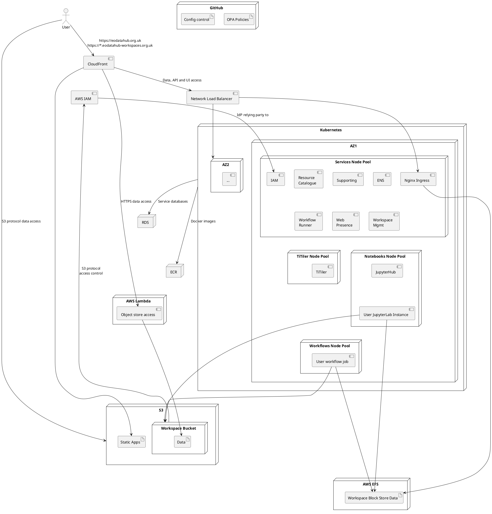

## 4. CLOUD ARCHITECTURE

The EO Data Hub Platform is hosted in Amazon Web Services (AWS). One AWS account is used for development and another for staging (user acceptance testing) and production. 

### 4.1 Choice of AWS-Proprietary Services vs Open-Source

In some cases AWS services can be used to speed up the development of the platform or provide a better service. However, this may also have some disadvantages due to them being proprietary or due to cost. In making a decision between a proprietary AWS service and an open-source or self-hosted alternative, several things must be considered: 

- Differences in development and hosting cost, development schedule and service reliability. 
- Differences in functionality. 
- Any benefits from AWS services being integrated with each other, for example with AWS IAM or by opening integration opportunities for EODH users who are also using AWS. 
- Whether using AWS services hinders collaboration or reuse with EOEPCA, stac-fastapi or other open-source projects. In particular, whether reused software must be forked without it being possible to contribute changes upstream. 

There is no intent to be able to easily move the entire EODHP to an alternative cloud provider without extensive reconfiguration, but reusable and reused components should not become unusable in other hosting environments where this is avoidable. 

This means that in most cases an AWS proprietary service is going to be preferred, especially when it provides a standardised interface (S3, EKS, RDS), where a standardised interface can be put on top of it through existing software (Route53 via external-dns), where the dependency is primarily through configuration (CloudFront, load balancers) or where the EODHP component involved is not reusable (Web Presence). 

An example of an AWS service not being used is SQS, with Pulsar used instead. This is because of functional differences (messaging vs event streaming) and the level of integration required into software components, including EOEPCA components. 

### 4.2 Cloud Platform

**Figure 4-1 AWS Deployment Overview** 

The platform uses AWS’s Elastic Kubernetes Service (EKS), within which all EODHP server-side software components run except for data access Lambdas, and AWS Controllers for Kubernetes (ACK). This provides a Kubernetes cluster, including a managed control plane and managed node groups with autoscaling. EKS and ACK provide integrations with AWS services such as linking Kubernetes Service Accounts to AWS IAM Roles and allowing the management of AWS resources using custom resources in Kubernetes. This increases the amount of infrastructure that can be managed by ArgoCD beyond just that inside Kubernetes to also include S3 buckets, IAM roles, EFS stores, etc. 

As shown in the diagram, four node groups are used within each availability zone. Core services are separated from user workloads to reduce the risk of user workloads leaving them unschedulable or causing a node failure. TiTiler is also separated because of its large memory requirements – each instance is allocated all of the available memory for the nodes in its node group. 

AWS’s CloudFront is used in front of the service, allowing both edge caching of cacheable content and the directing of requests to either Kubernetes services or the S3 buckets used for hosting data and static assets like client-side JavaScript apps. An AWS network load balancer in front of the Kubernetes directs requests to Nginx ingress instances in two AWS availability zones. 

Most disk space provided to Kubernetes clusters uses GP2 or GP3 EBS block stores, but where shared storage is required AWS EFS is used. This is an elastic NFS service and is needed for user workspace block storage and for some core services. 

AWS Aurora (part of RDS) provides a serverless PostgreSQL service used for cluster services’ SQL databases. Each service uses and manages a separate database. Each cluster uses a separate schema within the database with the associated users configured to default to that schema. Non-SQL data stores (other than EFS and object store) are stored in cluster volumes, including Elasticsearch stores for the Elastic Stack and stac-fastapi and message storage for Pulsar. 

AWS’s Route53 is used to host the DNS zones required for the platform with entries managed by Terraform. 

A public AWS ECR repository is used to store EODH container images containing open source EODH components. This provides higher-performance access from EKS than other services like Dockerhub. In the future it may be necessary to use private repositories to store user images for workflows (currently users must provide their own image repository and images must be public). 

Whilst compute costs will dominate during development we anticipate that data storage and transfer costs will dominate operational cloud costs in a mature system, although this does depend on usage patterns. Given the UK-focus, using a UK region should mitigate or eliminate the performance loss whilst reducing costs. The CloudFront price class 100 is 
also be used so that the higher cost edge locations are not used. 

### 4.3 GitOps Cloud Deployment

Developed code is in repositories in the EO-DataHub Organization in GitHub with a BSD licence applied (except for open-source forks where the upstream licence must be kept). Code repositories use their languages usual tools for dependency management so that upstream dependencies’ and their security status can be identified and updated automatically: pyproject.toml and pip-compile for Python, package.json and npm for JavaScript and the built-in tools for Go. GitHub Actions are used to run linters, tests and packaging and to deploy built software artefacts to their artefact repositories: AWS’s ECR for Docker images and an S3 bucket for JavaScript bundles. Whilst development versions may be tagged (Docker) or named (S3) using their branch name, all deployments to non development clusters use tags/names which match Git tags. The build process automatically detects the correct name based on the Git commit being built. 

Kubernetes clusters and many cloud resources, such as DNS entries and load balancers, are managed using Terraform, so that cloud-level infrastructure using an infrastructure-as code (IaC) approach. The Terraform configuration is stored in a Git repository and its state into S3. Where a choice is available resources are managed using ArgoCD instead as this enable continuous reconciliation and the avoidance of doubt on current correct cluster state. 

Once a cluster is available, ArgoCD is installed onto it and it begins to reconcile Kubernetes cluster state with a dedicated Git repository. This must happen in a particular order which is defined using ArgoCD sync waves, for example so that AWS IAM roles are created before the services which need to use them to modify AWS configuration. 

Two types of difference between clusters must be managed in the ArgoCD configuration: differences inherent to the cluster (like hostnames) and differences due to position in the release pipeline (like software upgrades on test but not yet staging). ArgoCD overlays are used for the first type and branches for the second. 

Finally, OPAL reads OPA policies from an authorization policy Git repository and these are distributed to OPA instances. 

Integration tests can be defined as Argo Workflows applied to the cluster by ArgoCD. These then show as successful or degraded resources in ArgoCD. 

Four types of cluster are used based on position in the deployment pipeline: dev, test, staging and production. Dev and test are owned by developers and may be broken at any time. They are distinct because dev is used for work-in-progress whereas test contains only code which is complete and has passed developer peer-review. After peer-review and testing in test, the development team will decide when to release changes to staging for customer review. After customer agreement they are moved to the production cluster.
