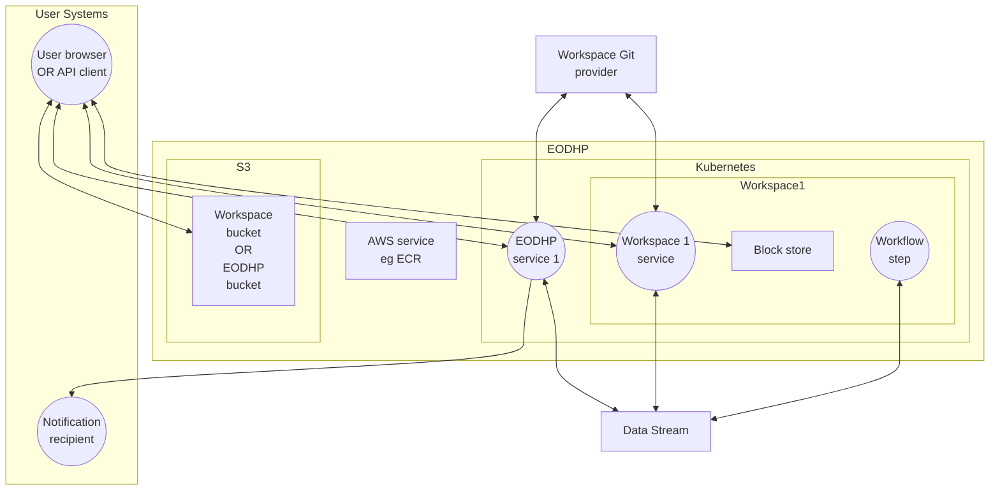
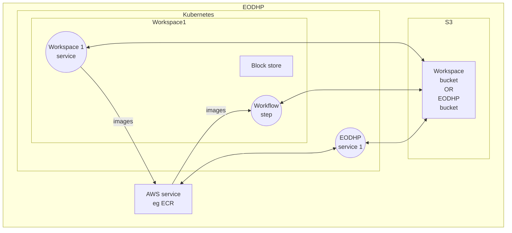
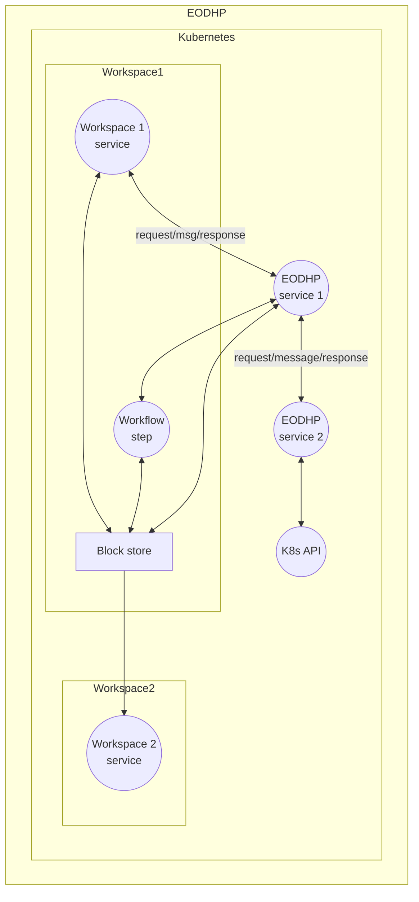

This section is designed as an analysis tool for deriving parts of the security architecture by systematically identifying all cases which must be covered. This includes the IAM and may later be useful for threat modelling. If you are trying to understand the architecture, rather than validate it, then the diagrams here may be useful but the previous section will be more readable.
# Data Flow Mapping 
Access control - the enforcement of the authorization policies of the platform - and security controls in general must occur whenever data crosses privilege domains, ie whenever it flows from a process or store with one set of privileges to one with another. To identify those locations these flows are mapped here. Each one is then analysed to describe the authentication and authorization methods required. 
 
These diagrams aim to show general classes of component and communication and do not include every individual one. 
 
Note that *missing* arrows are as important as included ones as they may represent a requirement that two processes should be prevented from communicating. 
 
External <-> EODHP communications 

 
 
Kubernetes <-> non-Kubernetes EODHP communication: 

 
 

 
* EODHP service: any of a wide variety of EODHP server-side components, eg, Wagtail, EOXVS, ADES, ENS, ..., excluding those which are specifically workspace services. 
* Workspace service: software components which run in a workspace or associated workflow namespace and exclusively on behalf of the workspace, eg JupyterLab instances and user code in them. 
* Workspace and EODHP buckets have a similar distinction. EODHP buckets most particularly include the catalogue storage. 
* A workspace external resource is defined in the identity and workspaces model. Aside from data stream licences (already shown) these may be resources in a Git provider. These could later be broadened to other resources, eg external compute capacity. 
* 'Transport' infrastructure, such as proxies and messaging systems, is not shown. 
* Security infrastructure itself is not shown. 
* Nodes with an 'OR' should be treated as two nodes with the same communication pathways. They are joined to simplify the diagram. 
 
 
# Communication Paths and Authorization and Authentication Controls 
 
From these diagrams the communications paths and required security controls can be identified. Some security controls are assumed: 
* All communication over HTTP uses TLS and a server certificate trusted by the client, including internal communication. 
* Requests entering the Kubernetes cluster will be rejected or (for browsers) redirected for login if they contain an invalid identity token. Recipients of identity tokens will also validate them where this is possible. 
 
Outstanding questions: 
* How do we distribute OPA policies? OPAL? HTTP? Kubernetes resources? 
* Do we use one shared file system per workspace? There are constraints on sizes, some FSs can only go in steps of ~1TB. Or do we share FSs and use file permissions? Or can we reliably mount sub-directories into pods and prevent breaking out of the chroot? 
 
Below, '**token**' should be taken to mean one of: 
* ~~an OIDC identity token as a cookie (browser case),~~ 
* ~~an OIDC identity token as a bearer token (API case),~~ 
* a session cookie, or 
* a long-lasting API key (a Keycloak offline access token). 
 
## External communications paths 
 
* **Client to/from EODHP services and workspace services.** Connections are always inwards to the service and typically only HTTP responses flow back (with JupyterLab's websocket connections being an exception). 
	* **Client**: 
		* Authentication of the service is via TLS certificates. 
		* Client performs no authorization of the service. 
	* **EODHP service** 
		* Authentication of the client is via token. 
		* Service typically authorizes the request using OPA. In some cases this will be different, for example third-party software with its own framework we want to use (like Wagtail page editor permissions) or a catalogue search which filters others' private entries at the query level. 
* **Client to/from workspace block store.** This covers two cases: a user accessing private data (either read/write in their own workspace or read-only in another workspace where it has been made available to limited users) or accessing public data. 
	* **Client:** 
		* Authentication of the service is via TLS certificates where the mechanism is HTTP (nginx proxy for download, custom web service for read/write, WebDAV for read/write should that ever be supported). If the mechanism is SFTP then via ssh server key. 
		* Client performs no authorization of the service. 
	* **Workspace block store**: 
		* Authentication of the client is via token (HTTP) or ssh key (SFTP) or does not occur at all (public data via HTTP). 
		* Authorization with HTTP is via OPA. The OPA policy is generated to know which paths are public and which paths are accessible to which groups. 
		* Authorization with SFTP is performed by ensuring that an ssh key is only valid for accessing a user's own workspaces. 
* **Client to/from workspace bucket.** Again, this may be private data (read-write in the user's own workspaces or read-only for other workspaces where access is granted) or public data. Access may be plain HTTP or S3. 
	* HTTP: 
		* **Client**: 
			* Authentication is via TLS certificate. This requires that CloudFront or similar is put in front of S3 so that an EODH URL is used. 
			* No authorization. 
		* **Workspace bucket**: 
			* Authentication is via token for non-public locations. 
			* Authorization for non-public buckets uses either: 
				* Lambda@Edge, which will fetch an an access policy (OPA or a group list) from a service or special bucket and apply that either using a JWT or a call to a service, 
				* CloudFront functions with CloudFront KeyValueStore to store mappings between paths and policies (OPA or group lists). 
	* S3: Most likely supported only for access to public buckets or to buckets where a workspace owner has added an IAM principal to the workspace configuration. 
		* **Client** 
			* Authentication is via Amazon's TLS certificate for the bucket URL. 
			* No authorization of server by client. 
		* **Workspace bucket:** 
			* AuthZ and AuthN is handled by AWS using the usual access key mechanism. For non-public buckets the user must provide the ARN of an AWS principal to EODHP and this will be added to the bucket policy. Alternatively, EODHP users could be exposed to AWS by linking IAM to Keycloak as an OIDC IdP. Then, the platform could offer users keys for their own identity. 
* **Client to/from EODHP bucket (if these exist).** These will be public read-only or restricted read-only (eg, access-restricted STAC catalogs if these are available as static catalogs with direct access). Access is HTTP only for restricted buckets and either HTTP or S3 for public ones, but otherwise this is the same as for workspace buckets. 
* **EODHP Service or Workspace Service to/from Git Provider**. This is several cases. Use of the Git provider as an IdP is not covered here. 
	* EODHP acts on its own behalf to enumerate repositories, fetch catalogue configuration repos and similar. 
		* Authentication is via an app secret provided by the Git provider when the app is registered. 
		* The user must add an EODH app to their organization Git provider's Organization/Project and authorize the access requested. 
	* EODHP acts on behalf of a user, for example to commit changes from JupyterLab. This might not be one of the Git providers with an EODH app. 
		* User is given an ssh public key and the workspace service authenticates with the private key. 
		* User must add the public key to the git provider authorize access. 
	* Git provider notifies EODHP of commits via webhook. 
		* Authentication is via a secret included in the call (EODHP authenticating Git provider) and via the TLS certificate (Git provider authenticating EODHP). 
		* Notification is authorized providing the secret and repository are for the same workspace. 
* **EODHP Service (ENS) to Notification Recipient.** This could be email, webhook, AWS SNS or another option. For webhooks: 
	* **ENS** 
		* Authenticates recipient by requiring a TLS certificate. 
		* Authorizes recipient via OPA (user configuring the webhook must have read access to the subject of the event (eg public data or own workflow) and this is authorized on each event). 
	* **Notification recipient** 
		* Authenticates ENS by the ENS supplying a secret provided to the user via a UI (OR a signature algorithm could be used). 
		* Authorization is up to the user to design. 
* **EODHP Service (not on behalf of a specific user/workspace) to/from Data Stream.** This could be a metadata or data retrieval, or other accesses such as reporting the use of cached data. 
	* **EODHP Service** 
		* Authenticates the data stream by requiring a TLS certificate matching a domain name registered for the data stream. 
		* Authorization has multiple cases: 
			* Fetching data: no authorization of the response required (except that it should match what was requested) 
			* Harvesting metadata: may need to authorize (or simply filter or replace data) based on, say, correctly declaring the publisher or not including any special fields like any for holding independent QA results. 
			* May be other cases, like authorizing a charge to a user account based on it matching the declared pricing or the user having agreed to the provider's terms. 
	* **Data Stream** 
		* Authentication TBD - could supply a secret, could sign requests, could use OAuth2 client credentials flow 
		* Authorization is for the data stream to determine. 
* **Workflow Step, EODHP Service (on behalf of a user/workspace) or Workspace Service to Data Stream**. This could be a data retrieval using a user's licence or a request to authorize the use of data cached in EODHP. This could be user code running in a notebook using a licence attached to the workspace. It could also be a user authorizing EODHP to use an existing licence from the data stream provider. 
	* **Workflow or Service** 
		* Authenticates the data stream by requiring a TLS certificate matching a domain name registered for the data stream. 
		* No authorization of the response required? 
	* **Data Stream**. There are multiple cases and multiple possible mechanisms (depending on what agreement can be reached with data providers). 
		* User is bringing an existing licence to data stream data into the platform: A workspace user must be known already to the data provider. OAuth2 is used to obtain an offline access token (ie, long-lived refresh token) from the data stream provider and this is saved into a Kubernetes secret in the workspace. 
		* User is using data which requires a workspace licence within EODHP-provided code: EODHP service fetches the refresh token and obtains an access token for access. 
		* User is requesting data using a workspace licence from user-provided code such as a notebook or workflow: EODHP either provides a Python API for obtaining access tokens or provides an access token in a file. It does not provide the refresh token. 
		* User is agreeing to being billed for licence costs via the platform's billing mechanism: TBD. Not known if this is required or what interactions with the data provider are necessary. It may be the same as the existing licence case. 
 
 
## Intra-AWS communications paths 
 
* **Workspace Service or Workflow Step to/from Workspace Bucket or EODHP Bucket.*** This includes user code running in notebooks. 
	* **S3:** As above for client to/from workspace bucket except that AWS IAM user credentials will be provided to the service via EKS Pod Identities. These credentials will be for an IAM role or role session specific to both the workspace and user. For workflows these credentials should be invalidated on workflow completion if this is possible. 
	* **HTTP:** In this case the DNS in-cluster responses must be altered to direct the user to an in-cluster proxy. This is to avoid traffic existing the cluster other than via an S3 service endpoint in the VPC and incurring data transfer charges and latency. 
		* Authentication is by either 1) a credential (a JWT issued to the workspace session (ie, specific to workspace and user)) supplied to the service in a file or environment variable and included in the request in the same way that API keys usually are, or 2) to allow code to run inside and outside the workspace, an API key (but this should be discouraged). 
		* Authorization is by the proxy using the same OPA or group list as in the client to/from bucket case. 
* **Workspace Service to AWS Service (eg ECR)**. This includes pushing workflow step Docker images to ECR. Other potential uses are not known at this point. 
	* Authentication is by attaching an IAM role to workspace pods, which injects AWS credentials into them. 
	* Authorization is by creating per-workspace IAM users and attaching policies to the user and/or service. For example, the IAM user may have permission to push to ECR and individual ECR repositories have policies allowing pushes from specific users. ECR repositories must be pre-created by an EODHP service before user access is possible, so only this service can be authorized to create them. Repositories are workspace-specific and tagged with the workspace. 
* **AWS Service (ECR) to Workflow Step.** This particularly includes fetching images containing workflow steps into Kubernetes to be run as pods. 
	* Authentication is by the EKS nodes having an IAM identity. 
	* Authorization has three parts: 
		* The IAM identity must be allowed access to ECR. 
		* Every ECR repository must have a policy allowing this principal to pull images. 
		* The workflow runner components must authorize the use of a particular image in a workflow before creating any pods (ECR policies cannot do this in any form as cached images can be used by any pod). Image creators must specify the workspaces allowed access and only workspaces with access may define workflows using the image. The workflow invoker must have access to the workflow but it's not necessary to have access to the image. 
* **EODHP Service to AWS Service or Workspace Bucket or EODHP Bucket.** 
	* **When operating on behalf of a specific user** the same IAM principal as in the workspace service case must be used. The service must assume the workspace IAM role first to do this. 
	* **When operating on behalf of the platform** the service must be provided a dedicated role using EKS pod identities. 
 
## Intra-Kubernetes communications paths 
 
* **Workspace Service or Workflow Step to/from EODHP Service***. It's assumed here that Workspace Services call EODHP Services but not vice versa, and that workspace services have no access to the messaging system so that all calls are over HTTP APIs. 
	* **Workspace Service** 
		* The workspace service authenticates the EODHP service via its hostname and TLS certificate. To avoid exiting the cluster and incurring charges, this requires that a cluster CA certificate is trusted by workspace services and the DNS inside the cluster returns internal addresses. 
		* There's no special authorization of the EODHP service by the workspace service. 
	* **EODHP Service or Workflow Step** 
		* The workspace service must authenticate by presenting either 1) a credential (a JWT issued to the workspace session (ie, specific to workspace and user)) supplied to the service in a file or environment variable and included in the request in the same way that API keys usually are, or 2) to allow code to run inside and outside the workspace, an API key (but this should be discouraged). The browser-based mechanism, OIDC login and session cookie, is not accepted. 
		* Authorization is the same as the client to/from EODHP service. 
* **Workspace Service or Workflow Step to/from Block Store.** Within-workspace access does not cross a privilege domain so no authentication or authorization is required beyond the platform ensuring that workspace block stores are only attached to the same workspace's services. 
* **Workspace 2 Service to/from workspace 1 Block Store.*** Access to other workspaces' block stores is as in the client to/from workspace block store except that in place of a token the service present the a workspace JWT. 
* **EODHP Service to/from workspace Block Store.** Uncertain if this is required. Potentially, the service will need to launch a temporary pod with an EKS pod identity and the filesystem mounted, just as in the workspace service case. 
* **EODHP Service 1 to/from EODHP Service 2.** Assuming here a request or message from service 1 to service 2. 
	* When using HTTP APIs 
		* **EODHP Service 1 (caller)** 
			* The calling service authenticates the called service via its hostname and a TLS certificate signed by the cluster CA. 
			* No special authorization of the called service by the calling service. 
		* **EODHP Service 2 (callee)** 
			* When the caller is calling on its own behalf: 
				* The calling service must authenticate to the called service with either a TLS client certificate issued by the cluster CA or by obtaining an identity token for a service identity from Keycloak. The latter case is appropriate when calling a service which is also called directly by users. 
			* When the caller is calling on behalf of a user: 
				* The calling service must provide a JWT for the user (typically the one received in an incoming call) AND must supply a TLS client certificate to authenticate itself as the service. Keycloak token exchange could later be used to limit the value of forwarded tokens but will not be used initially. 
			* Authorization is as in the client to EODHP services case (typically OPA). 
	* When using the messaging system 
		* The sender and receiver authenticate to the messaging system and vice versa with mTLS (server-side TLS and OIDC token or JWT is also possible). Individual messages are not further authenticated, ie end-to-end encryption isn't being used. 
		* Pulsar clients are authorized (using the built-in access control) to access only specific topics. User tokens won't be included in messages, at least typically. Authorization of user requests should usually completely happen before internal messaging. 
* **EODHP Service to/from K8s API.** This is via Kubernetes service accounts added to pods.
