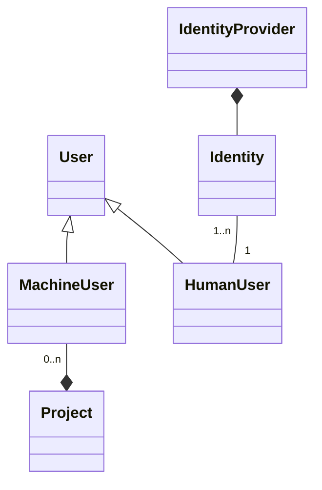
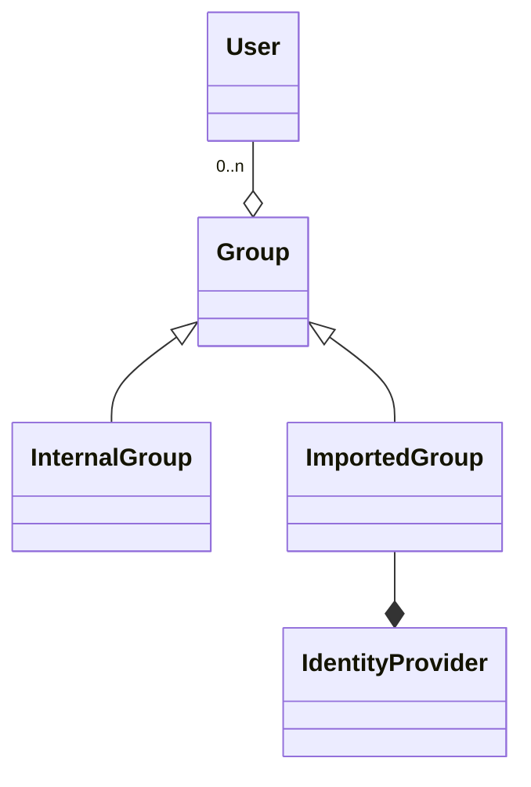
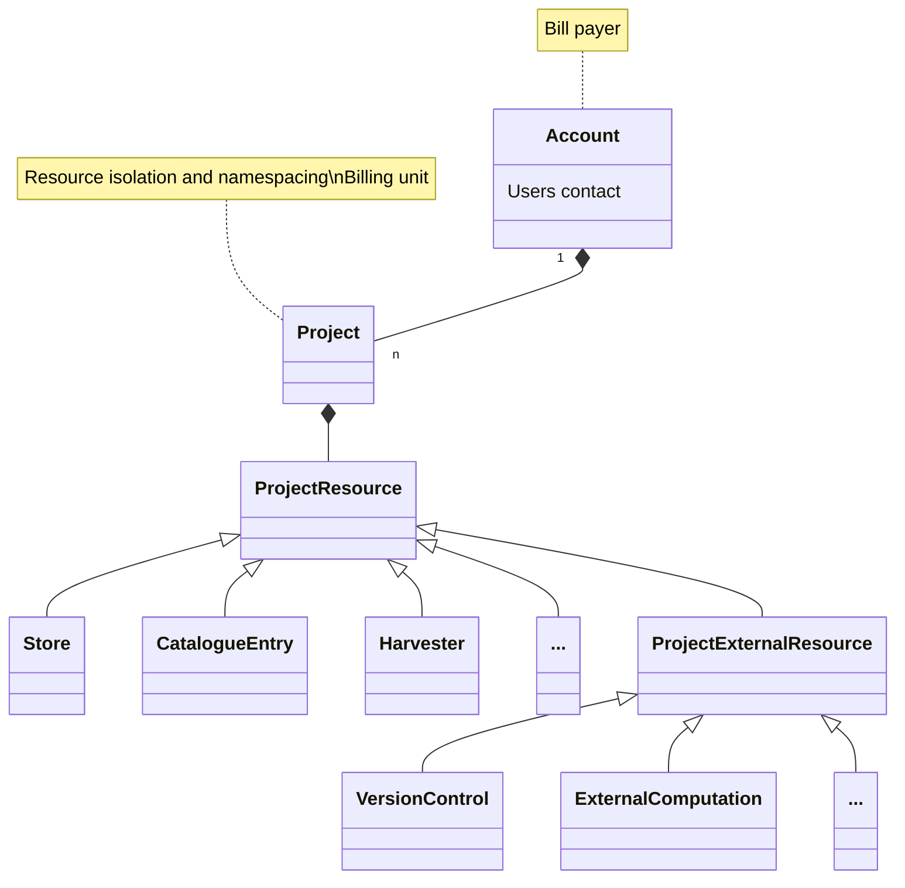
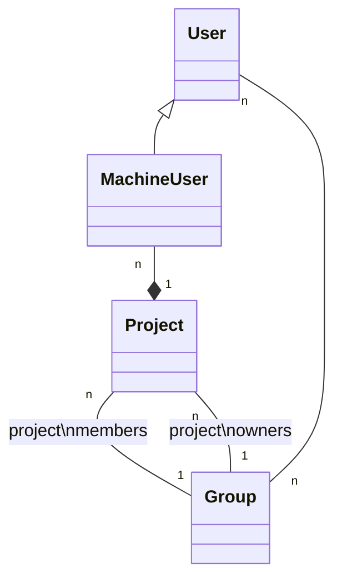

# IAM: Model for Identities and Projects 
 
This section describes the concepts used in EODH identities and tenancies in an implementation-neutral way - these concepts could persist even if implementation changes. Information on the specific choices of tools, standards and protocols is given in  [02. Implementation Architecture Overview](./implementation-architecture-overview.md).
## Identities 
 
Users will use external identities in the platform, including at least GitHub and Edugain identities but it's expected there will be many more. Identity providers are not fixed and may be added or removed. Identities are linked to EODH (Keycloak) users and multiple federated identities may be linked to a single user.

Machine identities will also exist, for example for use when workflows are triggered by events. These identities will either be internal identities used by EODHP software components or will be linked to the Project responsible for them. Users with sufficient privileges can create machine identities and assign privileges to them but they will always remain scoped to a specific Project and unable to act outside it.

 
Users can belong to one or more groups. Some of these groups will be imported from the identity provider where there is a natural way to do this and where this provides useful and reliable claims about which resources the user should have access to. For example, a user `github:eodhp-user` may be a member of the groups `github:github-org-name` and `github:github-org-name:github-team-name`. The remaining groups will be managed through the platform itself, in some cases created by the platform in response to other actions and in some cases created explicitly by service administrators. 
 

 
Roles will be used, defined as collections of privileges, with Groups and Users having roles associated with them. These will be used to define, for example, whether a user is allowed to create machine identities or Projects. 

Projects, defined below, can also be used as part of the identity with which an action is performed. This allows an allocation of costs to projects. It can also be used in authorization decisions, such as always allowing a Project's notebook to run the same project's Workflows and not any other project's (private) workflows, or denying an action due to the account not having a billing arrangement or being suspended.

## Projects and Accounts 
 
A logical view of these concepts is shown below:

 
### Accounts

An Account represents a legal relationship between an EODH customer and the platform in which the account-holder agrees to be responsible for the use of the platform within the Projects it owns, often including paying for resource use. Each account has one or more users as designated contacts who are responsible for agreeing to the EODH terms and conditions on behalf of their organization, ensuring payment and managing Projects. A more complex system with, for example, billing and technical contacts could be used later. Any systems for collecting payments will also be configured here.

Individual charges applied to accounts will always relate to a specific Project. An Account exists as a separate concept to a Project to allow a single invoice to be issued and a single account balance to be maintained for a customer organization with multiple projects whilst still allowing individual project costs to be allocated to different budgets.

An Account does not necessarily represent a billing arrangement and an Account may existing without an agreement to pay. This will result in a more limited account and Projects, for example only being able to perform actions with no cost, like adding catalogue entries, or having very limited resource use intended for system exploration only. This situation can also occur if a billing arrangement fails or is withdrawn.

Individual Users will be allocated an individual Account if they create a Project for their own personal use. This could be presented differently (for example, hiding the distinction between 'User' and 'Account') but would operate no differently. Simplifying the interface may help create an easy way for users to explore the platform or follow tutorials, especially if a limited amount of access to notebooks, workflows and storage is granted for free (or granted to a subset of users like UK academic users) in the future.

As an alternative or to further support exploration (not necessarily in the initial platform), Accounts could be extended to allow some users to create Projects themselves without an Account contact creating it for them. An organization could then create an Account which permits anyone registered with their IdP or in a particular Group to create Projects with particular initial limits.
### Projects and their Resources

A Project is a set of resources within the platform, such as storage, notebooks and CPU time, to which one or more users have access. These resources are strongly isolated from those in other Projects in terms of both access control and namespacing. For example, two file stores may have the same name and mount location as long as they are in different Projects, technical measures such as networking restrictions will separate resources in different Projects and access control measures will prevent cross-Project access except where explicit data publishing has been used. A Project is also used at the user-interface level --- users will need to choose an active Project before they can manage and access their resources.

Projects are created by the Account contacts, who can also configure their owners, members and quotas or resource limits.

All users attached to the Project have an equal level of access to these resources, at least for the initial platform. However, some users may be designated Project owners, meaning that they serve as a point of contact and that they can manage Project access. For example, they would be able to invite additional users or attach external resources.

Each Project is associated with a Group whose membership defines whether a user has access to the Project or not. This may be an existing Group, including a Group imported from an external identity provider, or a dedicated Group created at the same time as the Project. Use of an imported group allows group membership to be managed externally - for example, adding a user to a GitHub team or GitLab group may grant that user Project access, reducing the number of places where membership must be updated. GitHub and GitLab can also further integrate with organizational identity providers. Where no existing group is specified, a group will be created for the Project and project owners will be able to add and remove users.

All user-defined or billable actions occur in a Project. For example, workflow executions are always attached to a Project, either as a call by a Project User or a User Service in which a Project publishes a service that can be called by other Users. All published data hosted by the platform will also be in Projects and special-purpose Projects for publishing officially supported data may be used for this.
 
All actions by Project resources, including anything done by code running in notebooks and workflows, will use identities composed of both the Project and the invoking User (which may be a Machine User). This has the following motivations:
* It allows for intra-Project access to be authorized based on the Project whilst still recording a responsible individual or process. This allows for a model in which Project resources are equally accessible to all Project users. This simplifies implementation, particularly in relation to resources like object stores which are authorized via AWS IAM Roles and block stores authorized using POSIX file permissions.
* It allows any calls outside the Project which are authorized based on individual user access rights to be recorded as coming from the Project.
* It allows for any related charges to be billed to the Project and for quotas and similar to be managed per-Project.
* It allows for actions by a Project which are not easily assignable to a specific human user. Configuration changes made using an attached Git repository are an example.
* It allows for use-cases such as a development and production Project where, despite the same users being attached to both, actions such as modifying public catalogue entries or replacing data used in production services can be refused if they originate from the development Project.

Some examples of authorization based on Project and user might be:
* Access to files using POSIX access or objects in non-public buckets using S3: always allowed as long as the Project of the request matches the Project owning the store
* Calling a Workflow created within the Project with default access permissions: always allowed as long as the Project matches
* Creating a catalogue entry: allowed as long as the Project is allowed to publish to the target catalogue subtree
* Access to files published by another Project: allowed as long as either the requesting Project or the requesting User has been granted access to the files.
* Access to commercial data: allowed if the Project has access (Project's Account will be billed)
* Attach a Git repo to a Project and allow it to define Harvesters, catalogue entries, etc: allowed for Project owners only

A particularly complicated case is the User Service. A User Service is a type of Workflow with a defining Project (which created the Workflow definition), a publishing Project (which published the Workflow as a User Service) and an invoking User and Project. The User Service runs stage-in and stage-out with the permissions of the invoking user and workflow steps with the permissions of the publishing Project.

Projects may also be linked to external resources, particularly including those in Git service providers used for storing and version controlling notebooks, workflow definitions, catalog entry and harvesting configuration, and similar. This could also later include an AWS IAM user in a user's AWS account or an account in an external computing platform which could be used to provide additional compute resources for the Project.

Linking a Project to a Git service provider is provider-specific but typically involves installing an EODH app into the provider's Organization (GitHub), Group (GitLab) or equivalent. This grants the platform permission to perform certain actions under the app's identity such as monitoring and reading repositories or user permission changes. A Git repository could also be a repository in a Project store in which case no special integration is necessary. If the Git provider is also used to create an imported group for access control to the Project (implying that Project users must also use it as an identity provider) then this could provide additional integration but is not necessary for attaching the provider to the Project. An example of this additional integration might be that a GitHub Team is used to define project membership and then notebook integration with repositories is automatically set up, including determining the available repositories and configuring a user's ability to push under their own identity.

### Choice of Names

The term 'Account' is chosen because this corresponds to the legal customer-supplier relationship and is the level at which payments, charges and debts are accounted for. 'Organization' is not used because an individual could also create an account. 'Tenancy' is not used here because, when used in the context of a multitenancy system, this usually implies isolation of data and technical resources.

'Project' is similar to, for example, a Jira Project or a Google Earth Engine project. 'Tenant' is not used because, although this is a good description for software engineers who understand multitenancy and represents technical isolation well, it may be less meaningful to people who are not software engineers.

'Workspace' is not used. This word is sometimes used within EO computing systems to mean a storage allocation with file-based access. However, it's more rarely used this way outside this niche and has a wide variety of meanings, usually broader, as in a Jira Workspace, GitLab Workspace, BitBucket Workspace, Google Workspace, etc. These usually incorporate more resource types and higher-level concepts than simple file access and are often also a user-interface concept for a container within which related tasks can be completely performed. 'Store' (and 'File store' and 'Object store') and 'Stores' should be widely understood. Conversely, using 'Workspace' to refer to anything other than storage may be confusing for those who work more exclusively with particular EO exploitation platforms.
