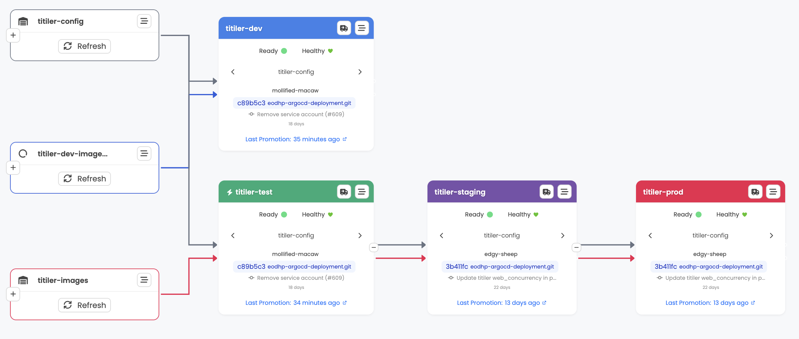

# Kargo Developer Guide

## TL;DR -- Quick Deployment Guide

### Config change

1. Commit to `main` (edit files under `apps/<app>/` or `eodhp/envs/*/vars.yaml`)
2. `<app>-config` warehouse detects the change and creates freight automatically
3. Auto-promotes to **test**
4. Manually promote **staging** then **prod** in the [Kargo UI](https://kargo.eodatahub.org.uk)

### New semver image

1. Push a semver-tagged image to ECR (e.g. `accounting-service:0.6.0`)
2. `<app>-images` warehouse detects the new tag (must match the `constraint`)
3. Auto-promotes to **test**
4. Manually promote **staging** then **prod** in the Kargo UI

### Dev / feature image

1. Push your image with any tag to ECR
2. In the Kargo UI, navigate to the `<app>-dev-images` warehouse
3. Refresh the warehouse, then click **Create Freight** -- you must **select image tags for ALL images** in the warehouse, not just the one you changed
4. Promote the freight to the `<app>-dev` stage
5. The image deploys to the **test** environment

---

## 1. Kargo and ArgoCD: How They Work Together

### What each tool does

**ArgoCD** is the GitOps deployment engine. It continuously syncs Kubernetes clusters to the desired state stored in Git. ArgoCD handles rendering manifests (via Kustomize, Helm, or plugins like our `kustomize-gomplate` ConfigManagementPlugin) and applying them to the cluster. It monitors application health and detects drift from the declared state.

**Kargo** is the continuous promotion engine. It watches for new artifacts (container images, Helm charts, git commits, release tags), bundles them into immutable **Freight**, and orchestrates their movement through a pipeline of environments. Kargo updates Git -- the source of truth that ArgoCD reads -- rather than applying anything to clusters directly.

**Key distinction:** ArgoCD deploys what's in Git. Kargo decides *what goes into Git* and *when*.

### Kargo core concepts

| Concept | Description |
|---------|-------------|
| **Project** | Top-level grouping of all Kargo resources (one project per team/platform) |
| **Warehouse** | Watches one or more artifact sources and creates **Freight** when something new appears |
| **Freight** | An immutable bundle of artifact versions (image tags, chart versions, git commits) |
| **Stage** | Represents a deployment target environment; receives freight via promotion |
| **Promotion** | The act of moving a piece of freight into a stage |
| **PromotionTask** | A reusable sequence of steps that a promotion executes (git clone, image update, kustomize build, push, etc.) |
| **ProjectConfig** | Per-project settings: auto-promotion policies, webhook receivers |

---

### How they integrate in this repo

The integration works through four mechanisms:

1. **ArgoCD ApplicationSet discovers apps.** The root ApplicationSet (`eodhp/base/apps.yaml`) uses a git directory generator with the pattern `apps/*/envs/<env>` to discover all applications for each environment.

2. **Each Application reads from a Kargo-managed branch.** Per-environment patches (in `eodhp/envs/<env>/kustomization.yaml`) set `targetRevision` to `kargo/{{app}}/<env>`. This means ArgoCD reads pre-built manifests from a branch that Kargo writes to during promotions. The exception is the dev environment, which reads from `main` directly.

3. **Kargo is authorized to trigger syncs.** Each Application is annotated with `kargo.akuity.io/authorized-stage: "eodhp:{{app}}-<env>"`, which allows the Kargo stage to force an ArgoCD sync after pushing new manifests.

4. **The `kustomize-gomplate` plugin renders final manifests.** ArgoCD uses this ConfigManagementPlugin to run gomplate substitution on the pre-built manifests, replacing `${[.vars.*]}` placeholders with environment-specific values from `vars.yaml`.

### The promotion-to-deploy flow

End-to-end, a promotion flows through these systems:

1. A **Warehouse** detects a new artifact (image tag, chart version, git commit, release tag) and creates a **Freight** bundle
2. The Freight is promoted to a **Stage** (auto-promoted for test, manual for staging/prod)
3. The Stage runs the shared **PromotionTask** (`promote`), which:
   - Clones the deployment repo and checks out the target branch
   - Updates image references, chart versions, and/or release URLs in the source
   - Runs `kustomize build` to produce final manifests
   - Pushes the built manifests to the `kargo/<app>/<env>` branch
   - Calls `argocd-update` to force ArgoCD to sync
4. **ArgoCD** detects the new commit on the `kargo/<app>/<env>` branch, runs the `kustomize-gomplate` plugin to substitute environment variables, and applies the manifests to the cluster
5. **Kargo** monitors the ArgoCD Application's health status to determine whether the Stage promotion succeeded

```
Warehouse ──detects──> Freight ──promotes──> Stage
                                               │
                                  PromotionTask runs:
                                  1. git-clone
                                  2. update images/charts
                                  3. kustomize-build
                                  4. git-push to kargo/<app>/<env>
                                  5. argocd-update
                                               │
                                               ▼
                                    ArgoCD Application
                                  (reads kargo/<app>/<env> branch)
                                               │
                                  kustomize-gomplate plugin:
                                  gomplate renders vars.yaml
                                               │
                                               ▼
                                     Kubernetes Cluster
```

### Further reading

- [ArgoCD integration guide](https://docs.kargo.io/user-guide/how-to-guides/argo-cd-integration/)
- [argocd-update step reference](https://docs.kargo.io/user-guide/reference-docs/promotion-steps/argocd-update/)

---

## 2. EODH Kargo Architecture (`apps/kargo/`)

We run Kargo in a **hub-and-spoke** model across four clusters.

### Hub: prod cluster

- Runs the full Kargo **API server** (2 replicas) and **management controller**
- Hosts the Kargo UI at [kargo.eodatahub.org.uk](https://kargo.eodatahub.org.uk) (authenticated via Keycloak OIDC with admin role)
- Shard name: `prod-shard`

### Controllers: test and staging clusters

Each remote cluster runs only a lightweight Kargo **shard controller** -- no API, no webhooks, no UI.

| Cluster | Shard name |
|---------|-----------|
| test | `test-shard` |
| staging | `staging-shard` |

Remote controllers authenticate back to the prod cluster using ServiceAccount tokens stored as ExternalSecrets (pulled from AWS Secrets Manager). The base layer at `apps/kargo/base/controller-auth/` creates two ServiceAccounts (`kargo-controller-test`, `kargo-controller-staging`) with matching token secrets and a ClusterRoleBinding to `kargo-controller`.

### Directory layout

```
apps/kargo/
  base/
    kustomization.yaml          # namespace: kargo, sync-wave: -15
    values.yaml                 # shared Helm values
    controller-auth/            # ServiceAccounts, tokens, ClusterRoleBinding
  envs/           kargo-chart.yaml + values.yaml + prod-kubeconfig-secret.yaml
    test/         "
    staging/      "
    prod/         "  + secrets.yaml (admin creds ExternalSecret)
```

---

## 3. The EODHP Kargo Project (`apps/kargo-eodhp-project/`)

This is a **data-driven Helm chart** that generates all Kargo resources for every application from a single `values.yaml`.

### Directory layout

```
apps/kargo-eodhp-project/
  base/
    Chart.yaml
    kustomization.yaml
    kargo-eodhp-project-chart.yaml   # HelmChartInflationGenerator
    values.yaml                       # <-- all app definitions live here
    templates/
      project.yaml            # Project, ProjectConfig, webhook ExternalSecret
      warehouses.yaml         # Warehouse resources (config, images, dev-images, releases)
      stages.yaml             # Stage resources (test, staging, prod, dev)
      promotiontasks.yaml     # The shared "promote" PromotionTask
      credentials-rbac.yaml   # Role + RoleBindings for credential access
      git-credentials.yaml    # ExternalSecret for git SSH key
  envs/
    prod/
      kustomization.yaml      # simple overlay: resources: [../../base]
```

The chart is rendered by Kustomize's `HelmChartInflationGenerator` and only deployed to the **prod** cluster (`stages: [prod]` in its own values entry).

### What each template generates

| Template | Resources | Purpose |
|----------|-----------|---------|
| `project.yaml` | Project, ProjectConfig, ExternalSecret | Creates the `eodhp` project with auto-promotion policies and GitHub webhook receiver |
| `warehouses.yaml` | Warehouse (up to 4 per app) | Watches git, images, charts, and releases |
| `stages.yaml` | Stage (per app per env) | Defines the promotion pipeline |
| `promotiontasks.yaml` | PromotionTask (`promote`) | Shared promotion steps for all apps |
| `credentials-rbac.yaml` | Role, RoleBindings | Lets remote shard controllers read secrets in the `eodhp` namespace |
| `git-credentials.yaml` | ExternalSecret | SSH key for Kargo to push to the deployment repo |
| `github-actions-rbac.yaml` | Role, RoleBinding | Lets the `ci-promoters` group create promotions (for GitHub Actions) |

---

## 4. Warehouses

For each application in `values.yaml`, the chart generates up to four warehouses:

### `<app>-config` (always created)

Watches the git repository for changes under the application's path and the shared environment variables.

- **Subscription:** git, branch `main`
- **Include paths:** `glob:<app-path>/**` and `glob:eodhp/envs/*/vars.yaml`
- **Interval:** 24 hours (also triggered by GitHub webhooks)

### `<app>-images` (created when `images` or `charts` are defined)

Watches container image registries and Helm chart repositories for new semver versions.

- **Image subscriptions** use `constraint` for semver filtering (e.g. `>=0.5.3`)
- **Chart subscriptions** use `semverConstraint` for version range filtering
- Default `discoveryLimit: 5`

### `<app>-dev-images` (created when any image has `enableDevTags: true`)

Watches the same image repos but configured for dev/feature branch images.

- **`freightCreationPolicy: Manual`** -- freight is never auto-created; you must manually create it in the UI
- Images with `enableDevTags: true` use `imageSelectionStrategy: NewestBuild` and `discoveryLimit: 20`
- Images without `enableDevTags` keep their normal constraints (they still need to be selected when creating freight)
- Charts are included with their normal constraints

### `<app>-releases` (created when `releases` are defined)

Watches GitHub repositories for new semver release tags.

- **Subscription:** git with `commitSelectionStrategy: SemVer`
- Uses `semverConstraint` from the `constraint` field
- Default `discoveryLimit: 5`

---

## 5. Stages & Promotion Pipeline

### Main pipeline

```
<app>-test  -->  <app>-staging  -->  <app>-prod
```

Each stage is linked to the previous via `requestedFreight.sources.stages`. The first stage in the chain uses `sources.direct: true` (takes freight directly from warehouses).

**Auto-promotion policy** (defined in `ProjectConfig`):

| Stage pattern | Auto-promote? |
|---------------|--------------|
| `*-test` | Yes |
| `*-staging` | No (manual) |
| `*-prod` | No (manual) |
| `*-dev` | No (manual) |

### Dev pipeline

```
<app>-dev  (separate, targets only the test environment)
```

- Only created for apps that have images with `enableDevTags: true`
- Takes freight **directly** from `<app>-config` and `<app>-dev-images` warehouses (not promoted through the main pipeline)
- Sets `isDevStage: "true"` which skips chart version updates, release URL updates, and the `argocd-update` step
- Uses `targetEnv: test` -- the promotion writes to the test environment overlay on a `kargo/<app>/test` branch



### Custom stages

If an app defines a `stages` list (e.g. `stages: [prod]`), only those environments get stages. The promotion chain follows the order in the array. For example, `stages: [test, prod]` would create `<app>-test` (direct) promoting to `<app>-prod`, skipping staging.

### ArgoCD integration

Each environment's ApplicationSet is configured to read from a specific git source:
- **test/staging/prod:** ArgoCD reads from the `kargo/<app>/<env>` branch, which contains pre-built manifests pushed by the promotion task
- **dev:** The dev ApplicationSet reads from `kargo/<app>/test` (the dev stage promotion writes to the `kargo/<app>/test` branch which targets the test env overlay)

---

## 6. The PromotionTask (`promote`)

A single shared PromotionTask named `promote` runs for every stage. It receives variables from the stage template and executes these steps:

### Step 1: `git-clone`

Checks out the deployment repo at the config warehouse's commit into `./src`. Creates or checks out the target branch `kargo/<appName>/<env>` into `./out`.

### Step 2: `git-clear`

Clears the `./out` directory to ensure a clean build.

### Step 3: `kustomize-set-image` (alias: `update-images`)

Updates container image references in `./src/<appPath>/envs/<env>` using the standard Kustomize image transformer. This handles images specified in deployment manifests.

### Step 4: Chart version updates (conditional, per app/chart)

For each app that defines `charts`, a `yaml-update` step updates the `version` field in the `HelmChartInflationGenerator` file(s). Skipped for dev stages (`isDevStage == "true"`). Handles both `generatorFile` (single) and `generatorFiles` (multiple).

### Step 5: Custom image path updates (conditional, per app/image)

For images with `customPath` defined (e.g. Keycloak's `spec.image`, Jupyter's `hub.image.tag`), a `yaml-update` step writes the new image reference to the specified file and key. Supports two `valueType` modes:
- `tag` -- writes just the image tag (e.g. `4.2.0-0.2.1`)
- `full` (default) -- writes the full image reference (e.g. `public.ecr.aws/eodh/eodh-keycloak:26.0.4-0.2.5`)

### Step 6: Release URL updates (conditional, per app/release)

For apps with `releases`, a `yaml-update` step constructs and writes release URLs into kustomization files. The URL is built as `<urlPrefix><tag><urlSuffix>`. Skipped for dev stages.

### Step 7: `kustomize-build` (alias: `build`)

Builds the full manifests from `./src/<appPath>/envs/<env>` and writes them to `./out/<appPath>/envs/<env>/manifests.yaml`.

### Step 8: Copy support files

Copies `.gomplate.yaml` and the environment's `vars.yaml` into `./out` so that ArgoCD's `kustomize-gomplate` plugin can run gomplate substitution on the pre-built manifests.

### Step 9: `git-commit` + `git-push`

Commits all changes to the `kargo/<appName>/<env>` branch. The commit message uses the output from the `update-images` step, falling back to "Updated configuration".

### Step 10: `argocd-update`

Triggers an ArgoCD sync for the application. **Skipped for dev stages** (`isDevStage == "true"`).

---

## 7. Developer Workflows

### Deploying a configuration change

1. Make your changes in `apps/<app>/` (manifests, values, patches) or in `eodhp/envs/*/vars.yaml`
2. Commit and push to `main`
3. The `<app>-config` warehouse detects the new commit and creates freight
4. The `<app>-test` stage auto-promotes the freight
5. Verify in the test environment
6. In the Kargo UI, promote the freight to `<app>-staging`, then `<app>-prod`

### Deploying a new semver image

1. Tag and push your image with a semver tag (e.g. `public.ecr.aws/eodh/accounting-service:0.6.0`)
2. The tag must match the `constraint` in `values.yaml` (e.g. `>=0.5.3`)
3. The `<app>-images` warehouse detects the new tag and creates freight
4. The `<app>-test` stage auto-promotes
5. Verify, then manually promote through staging and prod

### Deploying a dev/feature branch image

1. Push your image with any tag to ECR (e.g. `my-feature-branch`, `fix-123`, etc.)
2. Open the [Kargo UI](https://kargo.eodatahub.org.uk) and navigate to the `eodhp` project
3. Find the `<app>-dev-images` warehouse
4. Click **Refresh** to pick up the new tag
5. Click **Create Freight** -- **important:** you must select image tags for **every** image in the warehouse, not just the one you changed. The UI shows a dropdown per image subscription.
6. Promote the new freight to the `<app>-dev` stage
7. The image is deployed to the **dev** environment on the test cluster

> **Why manual?** Dev images use `freightCreationPolicy: Manual` and `imageSelectionStrategy: NewestBuild` to avoid auto-detecting every push. This gives you explicit control over which image combination to deploy.

---

## 8. Adding a New Application

### Step 1: Create the app directory structure

```
apps/<app-name>/
  base/
    kustomization.yaml    # namespace, resources, generators, patches
    namespace.yaml        # Namespace resource
    deployment.yaml       # (or other manifests)
    ...
  envs/
    dev/
      kustomization.yaml  # resources: [../../base]
    test/
      kustomization.yaml  # resources: [../../base]
    staging/
      kustomization.yaml  # resources: [../../base]
    prod/
      kustomization.yaml  # resources: [../../base]
```

See [Section 10: Environment Overlays](#10-environment-overlays-kustomize) for details on the kustomization files.

### Step 2: Add an entry to `apps/kargo-eodhp-project/base/values.yaml`

Add your application to the `applications` list:

```yaml
applications:
  # ...existing apps...

  - name: my-app
    path: apps/my-app
```

### All available options

```yaml
- name: my-app                    # (required) Application name; used in warehouse/stage names
  path: apps/my-app               # (required) Path to app directory in this repo
  stages:                         # (optional) Limit to specific environments
    - test                         #   Defaults to all environments if omitted
    - staging                      #   Order determines promotion chain
    - prod

  images:                          # (optional) Container images to track
    - repoURL: public.ecr.aws/eodh/my-image   # (required) Full image repo URL (no tag)
      constraint: ">=1.0.0"        # (optional) Semver constraint for the images warehouse
      semverConstraint: ">=1.0.0"  # (optional) Alias for constraint
      enableDevTags: true          # (optional) Create a dev-images warehouse subscription
                                   #   and a <app>-dev stage; default: false
      imageSelectionStrategy: Semver  # (optional) see https://docs.kargo.io/user-guide/how-to-guides/working-with-warehouses/#image-selection-strategies
      allowTags: "^v\\d+\\.\\d+$"  # (optional) Regex to filter discovered tags
      ignoreTags:                  # (optional) List of tags to exclude
        - latest
        - dev
      strictSemvers: true          # (optional) Only match strict semver tags
      discoveryLimit: 10           # (optional) Max tags to discover; default: 5
      customPath:                  # (optional) For CRDs or non-standard image fields
        file: base/values.yaml     #   File path (relative to app path) containing the image ref
        key: hub.image.tag         #   YAML key path to update
        valueType: tag             #   "tag" = write just the tag
                                   #   "full" (default) = write <repoURL>:<tag>

  charts:                          # (optional) Helm charts to track
    - name: my-chart               # (optional) Chart name; required for non-OCI repos
      repoURL: https://charts.example.com  # (required) Helm repo or OCI registry URL
      constraint: "^1.0.0"        # (optional) Semver constraint
      allowTags: "^v\\d+"         # (optional) Tag filter regex
      ignoreTags:                 # (optional) Tags to exclude
        - beta
      strictSemvers: true         # (optional) Strict semver matching
      discoveryLimit: 5           # (optional) Max versions to discover
      generatorFile: base/my-chart.yaml           # (option A) Single HelmChartInflationGenerator file
      generatorFiles:                              # (option B) Multiple generator files
        - base/my-chart-platform.yaml
        - base/my-chart-workspaces.yaml

  releases:                        # (optional) GitHub release tags to track
    - name: my-release             # (required) Release name identifier
      repoURL: https://github.com/org/repo.git   # (required) Git repo URL
      constraint: "^1.9.0"        # (optional) Semver constraint on release tags
      updates:                     # (required) How to update files when a new release is found
        - file: base/kustomization.yaml    # File to update (relative to app path)
          key: resources.1                  # YAML key path to update
          urlPrefix: "https://raw.githubusercontent.com/org/repo/"   # URL prefix before tag
          urlSuffix: "/manifests/install.yaml"                       # URL suffix after tag
```

### Examples from existing apps

**Simple image-only app** (e.g. `auth-agent`):
```yaml
- name: auth-agent
  path: apps/auth-agent
  images:
    - repoURL: public.ecr.aws/eodh/eodhp-auth-agent
      constraint: ">=0.5.2"
      enableDevTags: true
```

**Chart-only app** (e.g. `nginx`):
```yaml
- name: nginx
  path: apps/nginx
  charts:
    - name: nginx-ingress
      repoURL: https://helm.nginx.com/stable
      constraint: ^2.1.0
      generatorFile: base/nginx-ingress-chart.yaml
```

**Images with custom paths** (e.g. `jupyter`):
```yaml
- name: jupyter
  path: apps/jupyter
  images:
    - repoURL: public.ecr.aws/eodh/eodh-jupyter-hub
      constraint: ^4.2.0-0.2.0
      enableDevTags: true
      customPath:
        file: base/values.yaml
        key: hub.image.tag
        valueType: tag
    - repoURL: public.ecr.aws/eodh/eodh-default-notebook
      enableDevTags: true
      customPath:
        file: base/values.yaml
        key: singleuser.image.tag
        valueType: tag
  charts:
    - name: jupyterhub
      repoURL: https://hub.jupyter.org/helm-chart/
      constraint: ^4.1.0
      generatorFile: base/jupyterhub-chart.yaml
```

**GitHub releases** (e.g. `argo-events`):
```yaml
- name: argo-events
  path: apps/argo-events
  releases:
    - name: argo-events
      repoURL: https://github.com/argoproj/argo-events.git
      constraint: "^1.9.0"
      updates:
        - file: base/kustomization.yaml
          key: resources.1
          urlPrefix: "https://raw.githubusercontent.com/argoproj/argo-events/"
          urlSuffix: "/manifests/install.yaml"
```

**Prod-only app** (e.g. `kargo-eodhp-project`):
```yaml
- name: kargo-eodhp-project
  path: apps/kargo-eodhp-project
  stages: [prod]
```

**Environment-specific chart paths** (e.g. `stac-fastapi-2`):
```yaml
- name: stac-fastapi-2
  path: apps/stac-fastapi-2
  charts:
    - name: elasticsearch
      repoURL: https://helm.elastic.co
      constraint: ^8.5.1
      generatorFile: envs/{{env}}/elasticsearch-chart.yaml   # {{env}} is replaced per environment
```

---

## 9. Environment Overlays (Kustomize)

Each application uses [Kustomize overlays](https://kubectl.docs.kubernetes.io/references/kustomize/glossary/#overlay) to configure environments separately. The shared configuration lives in `apps/<app>/base/`, and each environment extends it with an overlay in `apps/<app>/envs/<env>/`.

The base `kustomization.yaml` declares the namespace, resources, generators, and patches that are common to all environments. Each environment overlay pulls in the base and can add environment-specific customisations -- image tag overrides, JSON patches, extra resources, or different Helm chart values.

A minimal overlay just inherits the base with no changes:

```yaml
# apps/<app>/envs/dev/kustomization.yaml
apiVersion: kustomize.config.k8s.io/v1beta1
kind: Kustomization

resources:
  - ../../base
```

To customise a specific environment, add `images`, `patches`, `generators`, or additional `resources` to that overlay's `kustomization.yaml`. This keeps environment differences isolated and explicit -- you can see exactly what differs between dev, test, staging, and prod by looking at their respective overlay files.

Values that vary by environment (domains, AWS account IDs, database URLs) are handled separately via gomplate variables (`${[.vars.<path>]}`), which are substituted at deploy time from `eodhp/envs/<env>/vars.yaml`.

### Helm charts via HelmChartInflationGenerator

Applications that use Helm charts render them through Kustomize's `HelmChartInflationGenerator` rather than having ArgoCD manage them as a separate Helm source. This lets us treat chart-rendered manifests the same as any other Kustomize resource -- they can be patched, combined with plain YAML resources, and processed through the same overlay pipeline. Chart definitions are listed under `generators` in the `kustomization.yaml` and point to a `*-chart.yaml` file:

```yaml
# apps/<app>/base/my-chart.yaml
apiVersion: builtin
kind: HelmChartInflationGenerator
metadata:
  name: my-chart
name: my-chart
repo: https://charts.example.com
version: 1.2.3                    # updated by Kargo promotions
releaseName: my-chart
namespace: my-app
valuesFile: values.yaml
```

For environment-specific chart configuration, place both the chart definition and values file in `envs/<env>/` instead of `base/`.
