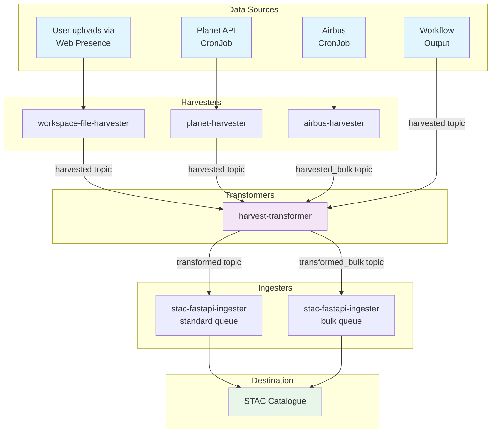

# Resource Catalogue

## Summary

The resource catalogue contains services relating to data access and harvesting from source, along with transformations applied to the data and ordering data from commercial sources.

This service ensures that data provided to the catalogue is complete and correct. Ingestion and access to the catalogue is provided by the [stac-fastapi](stac-fastapi.md) service.

The resource catalogue currently supports the following data sources:

- STAC catalogues
- Airbus
- Planet

### Code Repositories and Artifacts

The resource catalogue service consists of multiple sub-services, each with their own repositories and artifacts.
- Deployment for each component is configured in https://github.com/EO-DataHub/eodhp-argocd-deployment repository, apps/resource-catalogue directory

#### FastAPI
- API to allow users to perform EODH-specific actions within the catalogue. Allows for interactions such as ordering commercial data via [data adaptors](data-adaptors.md).
- Code available in https://github.com/EO-DataHub/resource-catalogue-fastapi repository
- Container image published to public.ecr.aws/eodh/resource-catalogue-fastapi AWS ECR

#### Data sources

Raw data from several data sources is converted into STAC by harvesters. which run regularly to ensure that the EODH catalogue is kept up to date with changes to upstream data.

##### SPDX harvester
- The SPDX harvester runs monthly via a cron job to maintain a collection of SPDX licences. It first checks for a valid SPDX license identifier. If one is found, it creates two different license links using the transformer code repository, which then become part of the collection. Currently, the licenses are stored in an SPDX S3 bucket for each environment, which is hosted using CloudFront.
- Code available in https://github.com/EO-DataHub/eodhp-spdx-change-scanner repository
- Container image published to public.ecr.aws/eodh/eodhp-spdx-change-scanner AWS ECR

##### Airbus harvester
- Harvests data from Airbus Optical and SAR archives, and converts to STAC format
- Code available in https://github.com/EO-DataHub/airbus-harvester repository
- Container image published to public.ecr.aws/eodh/airbus-harvester AWS ECR

##### Planet harvester
- Harvests data for Planet collections (only) and converts to STAC format
- Code available in https://github.com/EO-DataHub/planet-harvester repository
- Container image published to public.ecr.aws/eodh/planet-harvester AWS ECR

##### Planet proxy
- Proxy for Planet to access items and assets converted to STAC format
- Code available in https://github.com/EO-DataHub/stac-planet-api repository
- Container image published to public.ecr.aws/eodh/stac-planet-api AWS ECR

##### STAC harvester
- Harvests STAC data from external STAC catalogues as specified in the stac harvester configuration repository
- The STAC harvester is configured in the https://github.com/EO-DataHub/stac-harvester-configurations repository. 
- Stac harvesters are created in the environment for each specified catalogue by the stac harvester ingester. Code available in the https://github.com/EO-DataHub/stac-harvester-ingester repository.
- STAC harvester ingester container image published to public.ecr.aws/eodh/stac-harvester-ingester AWS ECR
- STAC harvester code available in the https://github.com/EO-DataHub/stac-harvester repository
- STAC harvester ingester container image published to public.ecr.aws/eodh/stac-harvester AWS ECR

##### Workspace file harvester
- Harvests user-supplied files into the user data directory
- Code available in https://github.com/EO-DataHub/workspace-file-harvester repository
- Container image published to public.ecr.aws/eodh/workspace-file-harvester AWS ECR

#### Transformers

Once raw input data is harvested, it often is sent to a transformer via Pulsar to ensure that the STAC data is ready for the EODH catalogue. Transformed data is then ingested into the catalogue via a pulsar message sent to [STAC FastAPI](stac-fastapi.md)

##### Harvest
- Transforms STAC content into a standardised EODH format, ensuring correct links, summaries, and extensions where applicable.
- Code available in https://github.com/EO-DataHub/harvest-transformer repository
- Container image published to public.ecr.aws/eodh/harvest-transformer AWS ECR

##### Annotations
- Handles annotations data to be ingested into the the resource catalogue
- Code available in https://github.com/EO-DataHub/annotations-transformer repository
- Container image published to public.ecr.aws/eodh/annotations-transformer AWS ECR

### Pipeline overview
This is a brief overview of the steps required to harvest different data sources into the resource catalogue. For more information about the individual processes, refer to documentation within each repository.

#### Pipeline Flow Diagram

The following diagram shows how data flows from various sources through the harvest pipeline to the STAC catalogue:

#### Pipeline Components

- [**workspace-file-harvester**](https://github.com/EO-DataHub/workspace-file-harvester): Scans S3 bucket for changes and publishes to `harvested` topic
- [**planet-harvester**](https://github.com/EO-DataHub/planet-harvester): Collects data from Planet API and converts to STAC format
- [**airbus-harvester**](https://github.com/EO-DataHub/airbus-harvester): Collects data from Airbus and converts to STAC format
- [**stac-harvester**](https://github.com/EO-DataHub/stac-harvester): Harvests STAC data from external catalogues
- [**configuration-harvester**](https://github.com/EO-DataHub/eodhp-git-change-scanner): Scans stac-harvester-configurations repository
- [**stac-harvester-ingester**](https://github.com/EO-DataHub/stac-harvester-ingester): Creates Kubernetes resources for STAC harvesters
- [**harvest-transformer**](https://github.com/EO-DataHub/harvest-transformer): Transforms raw STAC data into standardized EODH format
- [**stac-fastapi-ingester**](https://github.com/EO-DataHub/stac-fastapi-ingester/tree/main/stac_fastapi_ingester): Performs final ingestion into the resource catalogue

#### Pulsar Topics

- `harvested`: Standard queue for workspace uploads, workflow outputs, and Planet harvests
- `transformed`: Standard queue for transformed messages from `harvested` topic
- `harvested_bulk`: Bulk queue for large harvests (Airbus, STAC catalogues)
- `transformed_bulk`: Bulk queue for transformed messages from `harvested_bulk` topic
- `harvested_stac`: Queue for STAC harvester configuration messages
- `transformed_stac`: Queue for transformed STAC harvester configuration messages

#### Workflow data
1. A pulsar message is generated as part of a workflow or similar on the `harvested` topic.
2. The pulsar message is passed through the [STAC harvest transformer](https://github.com/EO-DataHub/harvest-transformer) which generates messages on the `transformed` topic.
3. The pulsar message is passed to the [stac-fastapi-ingester](https://github.com/EO-DataHub/stac-fastapi-ingester/tree/main/stac_fastapi_ingester) which ingests the messages into the catalogue.

#### User data
1. A user uploads data via the web presence metadata loader. Data is placed in an S3 bucket as part of this process.
2. When triggered by the user, the [workspace-file-harvester](https://github.com/EO-DataHub/workspace-file-harvester) looks for added, updated or deleted files and generates a pulsar message with these details on the `harvested` topic
3. The pulsar message is passed through the [STAC harvest transformer](https://github.com/EO-DataHub/harvest-transformer) which generates messages on the `transformed` topic.
4. The pulsar message is passed to the [stac-fastapi-ingester](https://github.com/EO-DataHub/stac-fastapi-ingester/tree/main/stac_fastapi_ingester) which ingests the messages into the catalogue.

#### Planet catalogue
The Planet catalogue is too big to fully harvest and most of the Planet catalogue is available via the [Planet proxy](https://github.com/EO-DataHub/stac-planet-api). Instead, harvesting for Planet data only takes place at the catalogue and collection level. Note that very few files are expected to be updated during a Planet harvest so the standard queue is used rather than the bulk queue as it is expected to be less busy.
1. A CronJob runs which collects data from Planet and arranges it into the STAC format. Pulsar messages are generated as part of this process and are sent with the `harvested` topic.
2. The pulsar message is passed through the [STAC harvest transformer](https://github.com/EO-DataHub/harvest-transformer) which generates messages on the `transformed` topic.
3. The pulsar message is passed to the [stac-fastapi-ingester](https://github.com/EO-DataHub/stac-fastapi-ingester/tree/main/stac_fastapi_ingester) which ingests the messages into the catalogue.

#### STAC catalogue from API or git repository
1. A catalogue (or collection) is defined in [stac-harvester-configurations](https://github.com/EO-DataHub/stac-harvester-configurations). 
2. This is ingested via the [configuration-harvester](https://github.com/EO-DataHub/eodhp-git-change-scanner) CronJob which generates a pulsar messages on the `harvested_stac` topic when it runs.
3. The pulsar message is passed through the [STAC harvest transformer](https://github.com/EO-DataHub/harvest-transformer) which generates a message on the `transformed_stac` topic. 
4. The [stac-harvester-ingester](https://github.com/EO-DataHub/stac-harvester-ingester) then receives the message and creates a [STACHarvester](https://github.com/EO-DataHub/eodhp-argocd-deployment/blob/main/apps/resource-catalogue/base/git-harvester/crds.yaml), a [sensor](https://argoproj.github.io/argo-events/concepts/sensor/) and an [event source](https://argoproj.github.io/argo-events/concepts/event_source/). The STACHarvester is a Custom Resource which contains fields for the provided catalogue's URL, source and target. This can be accessed by other kubernetes resources.
5. When the event is triggered on schedule, a [stac-harvester](https://github.com/EO-DataHub/stac-harvester) job runs which harvests from the catalogue defined in the corresponding STACHarvester CRD. Pulsar messages are generated as part of this process and are sent with the `harvested_bulk` topic.
6. The pulsar message is passed through the [STAC harvest transformer](https://github.com/EO-DataHub/harvest-transformer) which generates messages on the `transformed_bulk` topic.
7. The pulsar message is passed to the [stac-fastapi-ingester](https://github.com/EO-DataHub/stac-fastapi-ingester/tree/main/stac_fastapi_ingester) which ingests the messages into the catalogue.

#### Airbus catalogues
Airbus catalogues share much of the pipeline above. Steps are as follows:
1. A CronJob runs which collects data from Airbus and arranges it into the STAC format. Pulsar messages are generated as part of this process and are sent with the `harvested_bulk` topic.
2. The pulsar message is passed through the [STAC harvest transformer](https://github.com/EO-DataHub/harvest-transformer) which generates messages on the `transformed_bulk` topic.
3. The pulsar message is passed to the [stac-fastapi-ingester](https://github.com/EO-DataHub/stac-fastapi-ingester/tree/main/stac_fastapi_ingester) which ingests the messages into the catalogue.

### Dependent Services

The elasticsearch ingester takes inputs from the harvest transformer. 

To generate an API key for elasticsearch, as required by the workspace file harvester:

- Go to https://logs.eodatahub.org.uk
- Click `Elasticsearch`
- Click `Endpoints & API keys` (top right)
- Click on the `API key` tab
- Create an API key and add it to the `resource-catalogue.workspaces.elasticsearch.api_key` entry in Secrets Manager
- If necessary, restart the `workspace-file-harvester` pod

## Operation

The service runs as a Kubernetes deployment under the `rc` namespace.

### Configuration

The resource catalogue is configured as part of the [ArgoCD deployment repo](https://github.com/EO-DataHub/eodhp-argocd-deployment) in the apps/resource-catalogue directory.

Harvesters, transformers, and the stac-fastapi ingestor can be configured to use different pulsar queues. This can be used to ensure that some data is quickly ingested through the pipeline without becoming blocked by long-poll harvests, which can run in a bulk queue.

### Control

To restart services run `kubectl rollout restart -n rc deployment <service-name>` for Kubernetes cluster or use ArgoCD UI to restart.

Harvesters are produced on schedule - to rerun, set the scheduled time to be in the future and ensure the time has updated in ArgoCD.

To stop services, the service must be removed from ArgoCD configuration.

### Dependencies

There are many dependencies on external data for the resource catalogue, particularly for Planet, which requires the data to be present via the Planet API as and when required by the user. For individual dependencies, check the individual code repositories provided above.

### Backups

All processed files are saved to the `catalogue-population-eodhp` bucket. These can be backed up using the S3 backup procedure if additional backups are required. 

## Development

The resource code is version controlled in the repositories stated above.

New versions should be released by creating a new release using GitHub web UI with a version tag following the pattern v1.2.3. The commit tag will trigger the GitHub action release process.

Alternately, releases may be published directly from the code repository with `make publish version=v1.2.3`, but this should only be used for test releases as the Git commit will not be properly tagged.
